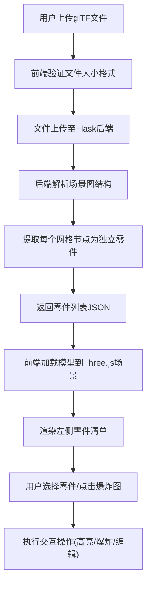

## 1. 产品概述

3D模型爆炸图展示工具，帮助产品设计师直观展示复杂机械结构的内部细节与装配关系。用户上传glTF模型后，系统自动分割零件并生成可交互的爆炸图，支持零件高亮、材质编辑、动画控制等功能。

- **核心价值**：解决传统3D查看器难以呈现复杂装配体内部结构和零件关系的痛点
- **目标用户**：产品设计师、机械工程师、技术文档编写人员
- **市场定位**：轻量化、Web端的专业3D装配展示工具

## 2. 核心功能

### 2.1 用户角色

| 角色 | 注册方式 | 核心权限 |
|------|----------|----------|
| 访客用户 | 无需注册 | 上传模型、查看爆炸图、导出截图 |

### 2.2 功能模块

1. **模型上传模块**：点击/拖拽上传glTF文件，显示缩略图和文件名，大小限制30MB
2. **零件清单模块**：左侧面板列出所有零件，支持颜色色块、隐藏/显示切换
3. **3D场景模块**：Three.js渲染场景，支持旋转、缩放、平移，零件选择与高亮
4. **属性编辑模块**：右侧面板显示选中零件材质属性，支持实时修改
5. **爆炸图模块**：一键生成爆炸动画，距离可调，显示装配连接线
6. **视图控制模块**：隐藏其他零件、重置视角、显示全部等功能

### 2.3 页面详情

| 页面名称 | 模块名称 | 功能描述 |
|----------|----------|----------|
| 主页面 | 顶部工具栏 | 上传按钮、生成爆炸图、隐藏其他、显示全部、重置视角 |
| 主页面 | 左侧零件清单 | 零件列表、颜色色块、可见性切换、搜索过滤 |
| 主页面 | 中央3D场景 | 模型渲染、零件交互、爆炸动画、连接线显示 |
| 主页面 | 右侧属性面板 | 材质属性编辑、零件信息展示、宽度拖拽调整 |
| 主页面 | 状态指示器 | FPS计数器、操作提示、加载进度 |

## 3. 核心流程

## 4. 用户界面设计

### 4.1 设计风格

- **主色调**：背景色 `#1a1a2e`（深蓝紫深色科技感）
- **辅助色**：高光蓝 `#00d4ff`、零件高亮黄 `#ffd700`、连接线浅灰 `#888888`
- **按钮风格**：圆角8px，图标+文字，悬停浅蓝渐变过渡200ms
- **字体**：标题使用 `Orbitron` 科技感字体，正文使用 `Inter` 清晰易读
- **布局风格**：三栏布局，左侧毛玻璃面板，中央3D场景，右侧卡片式属性面板
- **视觉效果**：背景噪点纹理、毛玻璃模糊 `backdrop-filter: blur(12px)`、柔和阴影

### 4.2 页面设计概览

| 页面名称 | 模块名称 | UI元素 |
|----------|----------|--------|
| 主页面 | 顶部工具栏 | 上传按钮(带拖拽区)、功能按钮组、爆炸距离滑块 |
| 主页面 | 左侧零件清单 | 搜索框、零件项(颜色块+名称+眼睛图标)、滚动容器、毛玻璃背景 |
| 主页面 | 3D场景 | WebGL画布、浮动信息标签(圆角阴影)、虚线连接线、网格地面 |
| 主页面 | 右侧属性面板 | 可拖拽分隔条、材质属性卡片、颜色选择器、数值输入框 |
| 主页面 | 状态层 | 右下角FPS计数器、左下角呼吸动画操作提示 |

### 4.3 响应式设计

- 桌面端优先设计，支持1280px以上分辨率
- 平板端：左右面板可折叠收起
- 移动端：单栏布局，面板改为底部抽屉

### 4.4 3D场景指导

- **环境光照**：半球光(天空 `#ffffff` 地面 `#444444`) + 2盏方向光(主光+补光) + 环境贴图
- **相机设置**：PerspectiveCamera(50, aspect, 0.1, 1000)，初始位置 `(0, 2, 5)`，看向原点
- **控制器**：OrbitControls，阻尼系数0.05，启用自动旋转(可选)
- **后处理**：轻微抗锯齿(MSAA)，无Bloom以保证性能
- **地面**：半透明网格 `GridHelper`，颜色 `#333366`，弱化显示
- **性能优化**：FrustumCulling开启，几何体合并，LOD策略(零件数>100时启用)

## 5. 性能指标

- 模型加载后帧率 ≥ 30fps
- 零件数 ≤ 200时帧率 ≥ 50fps
- 文件上传限制 30MB
- 爆炸动画流畅度 60fps目标
- 交互响应时间 < 100ms
