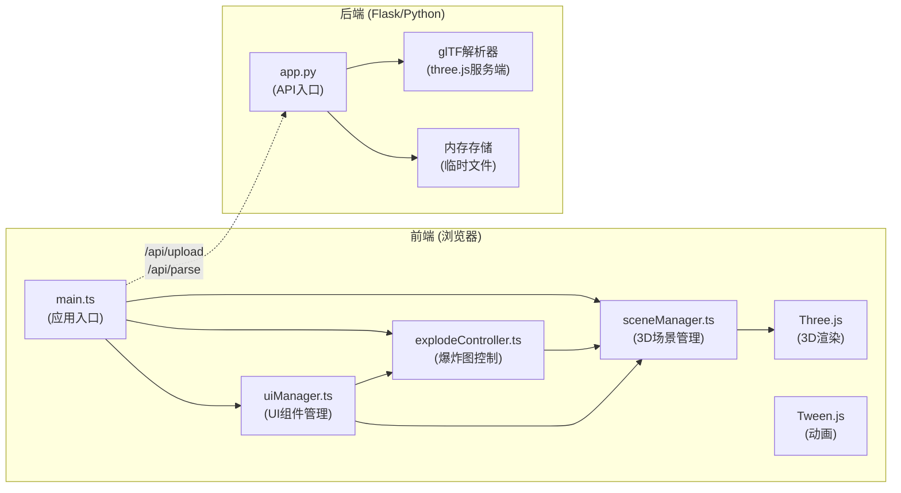
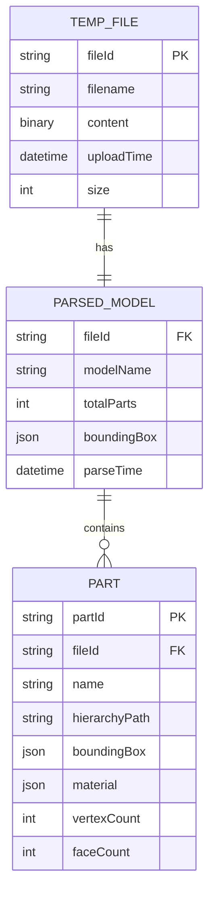

## 1. 架构设计



## 2. 技术栈描述

- **前端框架**：TypeScript 5.x + Vite 5.x
- **3D引擎**：Three.js 0.160.x + @types/three
- **动画库**：@tweenjs/tween.js 21.x
- **HTTP客户端**：Axios 1.x
- **调试工具**：dat.gui 0.7.x
- **后端框架**：Flask 3.x (Python 3.10+)
- **后端3D解析**：three.js (Node.js服务端版本) 或 trimesh Python库

## 3. 目录结构

```
auto80/
├── package.json
├── tsconfig.json
├── vite.config.js
├── index.html
├── src/
│   ├── main.ts              # 应用入口
│   ├── sceneManager.ts      # 场景管理
│   ├── explodeController.ts # 爆炸图控制
│   ├── uiManager.ts         # UI管理
│   └── types/               # 类型定义
└── backend/
    └── app.py               # Flask后端
```

## 4. API定义

### 4.1 类型定义

```typescript
interface PartInfo {
  id: string;
  name: string;
  hierarchyPath: string;
  boundingBox: {
    min: { x: number; y: number; z: number };
    max: { x: number; y: number; z: number };
    size: { x: number; y: number; z: number };
    center: { x: number; y: number; z: number };
  };
  material: {
    name: string;
    color: { r: number; g: number; b: number; hex: string };
    metalness: number;
    roughness: number;
    opacity: number;
  };
  vertexCount: number;
  faceCount: number;
}

interface ParseResponse {
  success: boolean;
  modelName: string;
  totalParts: number;
  parts: PartInfo[];
  boundingBox: {
    min: { x: number; y: number; z: number };
    max: { x: number; y: number; z: number };
    center: { x: number; y: number; z: number };
  };
}
```

### 4.2 接口定义

| 方法 | 路径 | 描述 | 请求格式 | 响应格式 |
|------|------|------|----------|----------|
| POST | `/api/upload` | 上传glTF文件 | `multipart/form-data` (file字段) | `{ fileId: string, filename: string, size: number }` |
| POST | `/api/parse` | 解析模型零件结构 | `{ fileId: string }` | `ParseResponse` |

## 5. 数据模型



## 6. 核心模块设计

### 6.1 SceneManager (场景管理器)

**职责**：
- 初始化Three.js场景、相机、渲染器、控制器
- 加载和解析glTF模型
- 管理所有零件对象(Mesh)
- 处理零件选择、高亮、隐藏/显示
- 维护零件原始位置和变换信息

**核心方法**：
```typescript
class SceneManager {
  init(container: HTMLElement): void
  loadGLTFModel(buffer: ArrayBuffer, filename: string): Promise<void>
  parseParts(): PartInfo[]
  selectPart(partId: string | null): void
  setPartVisibility(partId: string, visible: boolean): void
  hideOtherParts(partId: string): void
  showAllParts(): void
  updatePartMaterial(partId: string, materialProps: Partial<MaterialInfo>): void
  resetView(): void
  getPartInfo(partId: string): PartInfo | null
}
```

### 6.2 ExplodeController (爆炸图控制器)

**职责**：
- 计算每个零件的爆炸方向向量(法线方向或中心向外)
- 管理爆炸动画(Tween.js)
- 生成和更新装配连接线
- 响应距离滑块变化

**核心方法**：
```typescript
class ExplodeController {
  constructor(sceneManager: SceneManager)
  setExplodeDistance(multiplier: number): void
  explode(duration: number = 2000): Promise<void>
  reset(duration: number = 1000): Promise<void>
  createConnectionLines(): void
  updateConnectionLines(): void
  removeConnectionLines(): void
  isExploded: boolean
  currentMultiplier: number
}
```

### 6.3 UIManager (UI管理器)

**职责**：
- 创建左侧零件清单面板
- 创建右侧属性编辑面板
- 创建顶部工具栏
- 监听用户交互事件并分发命令
- 更新UI状态(选中、可见性等)

**核心方法**：
```typescript
class UIManager {
  constructor(container: HTMLElement)
  setSceneManager(sceneManager: SceneManager): void
  setExplodeController(controller: ExplodeController): void
  updatePartsList(parts: PartInfo[]): void
  updateSelectedPart(part: PartInfo | null): void
  updatePartVisibility(partId: string, visible: boolean): void
  showUploadDialog(): void
  showLoading(show: boolean, message?: string): void
  showError(message: string): void
  
  // 事件回调
  onPartSelect: (partId: string | null) => void
  onPartVisibilityToggle: (partId: string, visible: boolean) => void
  onMaterialChange: (partId: string, props: any) => void
  onExplode: () => void
  onReset: () => void
  onHideOthers: () => void
  onShowAll: () => void
}
```

## 7. 性能优化策略

1. **几何体优化**：使用BufferGeometry，启用顶点缓存
2. **材质优化**：共享材质实例，避免重复创建
3. **剔除优化**：frustumCulling开启，视锥剔除
4. **LOD策略**：零件数>100时启用距离分层
5. **渲染优化**：按需渲染，非交互时降低帧率
6. **内存管理**：模型切换时及时dispose几何体和材质
7. **WebGL优化**：启用antialias，合理设置pixelRatio(Math.min(window.devicePixelRatio, 2))
8. **动画优化**：使用Tween.js统一管理动画，避免多处requestAnimationFrame

## 8. 安全考虑

1. **文件上传验证**：检查文件扩展名(.glb, .gltf)、MIME类型、大小限制
2. **内存限制**：临时文件30分钟后自动清理
3. **XSS防护**：所有用户输入(文件名、零件名)进行HTML转义
4. **CORS配置**：后端配置适当的跨域策略
5. **错误处理**：API响应统一错误格式，前端友好提示
