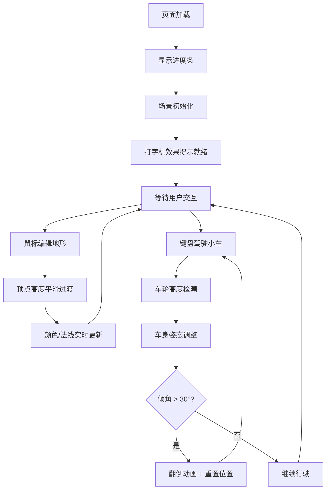

## 1. 产品概述

本项目是一个基于 WebGL 的 3D 沙盒地形编辑器与物理驾驶模拟游戏。用户可以通过鼠标点击和拖拽实时生成起伏地形，并操控六轮小车在自定义地形上行驶，提供类似沙盒游戏的创作和探索体验。

- **核心目标**：结合地形编辑与物理驾驶，创造沉浸式的 3D 交互体验
- **目标用户**：对 3D 图形、物理模拟感兴趣的爱好者和开发者
- **产品价值**：展示 WebGL 实时渲染、物理引擎和交互设计的综合应用

## 2. 核心功能

### 2.1 功能模块
1. **地形编辑模块**：16x16 网格地形，支持隆起/凹陷操作，平滑高度过渡，动态颜色渐变
2. **车辆物理模块**：六轮小车模型，实时地形高度检测，车身姿态调整，翻倒检测与重置
3. **场景渲染模块**：动态光照、雾气效果、太阳光旋转
4. **交互控制模块**：鼠标地形编辑（Shift+左键隆起，左键凹陷），键盘 WASD 驾驶控制
5. **UI 仪表模块**：操作提示面板、加载动画、速度仪表盘、倾斜角度仪表盘

### 2.2 页面详情
| 页面名称 | 模块名称 | 功能描述 |
|-----------|-------------|---------------------|
| 主场景 | 地形网格 | 16x16 可编辑绿色草地，顶点缓冲区管理 |
| 主场景 | 地形编辑 | 半径 3 格隆起/凹陷，平滑插值过渡，颜色渐变（隆起棕色、凹陷暗绿） |
| 主场景 | 车辆系统 | 六轮小车，独立轮高检测，俯仰侧倾调整，30° 翻倒重置 |
| 主场景 | 环境效果 | 淡蓝色雾气、动态旋转太阳光 |
| HUD | 操作提示 | 左上角半透明面板，磨砂玻璃效果 |
| HUD | 加载提示 | "地形已就绪"打字机效果，渐入动画 |
| HUD | 仪表盘 | 右下角速度表（指针匀速旋转）、倾斜表（随倾角摆动） |

## 3. 核心流程

用户打开页面 → 显示加载进度条 → 场景初始化完成 → 打字机效果显示"地形已就绪" → 用户可进行：
- 按住 Shift + 左键点击/拖拽：地形隆起
- 左键点击/拖拽：地形凹陷
- WASD 键：控制小车前后移动和左右转向
- 小车倾斜超过 30°：自动翻倒并重置到初始位置

## 4. 用户界面设计

### 4.1 设计风格
- **主题配色**：深蓝色太空主题，主色 `#0a1628`，辅助色 `#1e3a5f`，高亮色 `#4fc3f7`
- **视觉效果**：磨砂玻璃毛玻璃效果（backdrop-filter: blur），半透明面板
- **字体**：现代无衬线字体，数字表盘使用等宽字体
- **动画风格**：平滑缓动过渡，打字机效果，指针旋转动画

### 4.2 页面设计概述
| 页面名称 | 模块名称 | UI 元素 |
|-----------|-------------|-------------|
| 主场景 | 3D 视口 | 全屏 Canvas，深蓝色背景，淡蓝色雾气 |
| HUD 左上角 | 操作提示 | 半透明玻璃面板，圆角 12px，显示按键说明 |
| HUD 底部中央 | 加载提示 | 打字机效果文字 "地形已就绪"，渐入动画 |
| HUD 右下角 | 仪表盘 | 两个圆形表盘，速度表指针匀速旋转，倾斜表指针随倾角摆动 |

### 4.3 3D 场景指导
- **环境氛围**：深蓝色太空主题，淡蓝色指数雾气（FogExp2）
- **光照设置**：环境光 + 方向光（太阳光），太阳光绕场景缓慢旋转
- **相机设置**：透视相机，初始位置俯视场景，跟随小车模式
- **材质效果**：地形使用顶点颜色，车身使用标准材质，轮子使用金属质感
- **后期效果**：抗锯齿，色调映射

### 4.4 性能要求
- 交互帧率不低于 45 FPS
- 地形顶点实时更新优化
- 合理使用缓冲区和几何体更新策略
