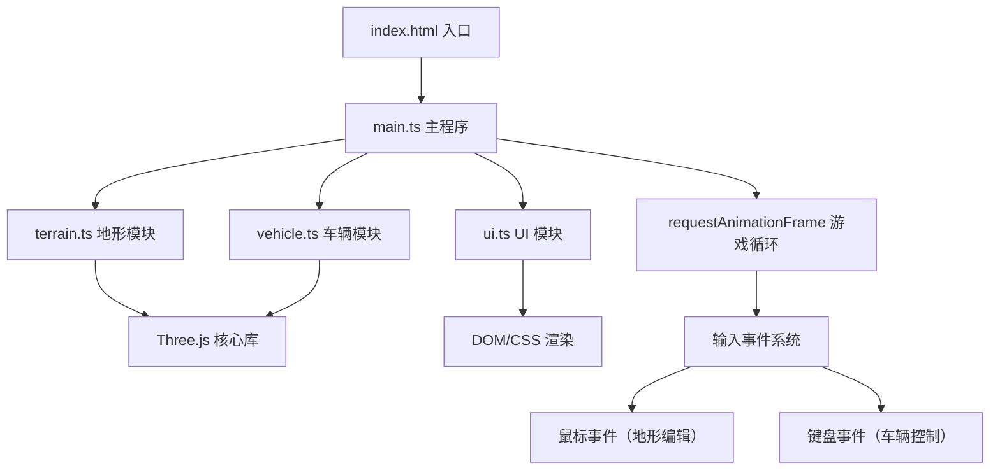

## 1. 架构设计

本项目采用模块化架构，将 3D 场景、地形编辑、车辆物理和 UI 渲染分离为独立模块，通过主程序协调各模块交互。



## 2. 技术描述

- **前端框架**：原生 TypeScript + Three.js（无需 React/Vue，专注 3D 渲染性能）
- **构建工具**：Vite 5.x，端口 3000，支持路径别名
- **核心依赖**：
  - `three`：Three.js 3D 渲染引擎
  - `@types/three`：Three.js TypeScript 类型定义
  - `three-stdlib`：Three.js 标准库扩展
  - `typescript`：TypeScript 5.x 严格模式
  - `vite`：构建工具和开发服务器

## 3. 技术选型说明

根据用户需求，本项目不使用 React/Vue 框架，原因如下：
1. 项目核心是 3D 渲染和物理模拟，UI 层较薄（仅 HUD 元素）
2. 原生 TypeScript + Three.js 可获得最佳性能，满足 45+ FPS 要求
3. 减少框架层开销，代码更简洁直接

## 4. 目录结构

```
auto85/
├── index.html                 # 入口页面，包含加载进度条样式
├── package.json               # 依赖配置，npm run dev 启动
├── vite.config.js             # Vite 构建配置，端口 3000
├── tsconfig.json              # TypeScript 严格模式配置
└── src/
    ├── main.ts                # 场景初始化、渲染循环、事件管理
    ├── terrain.ts             # 地形网格创建、隆起凹陷、颜色法线更新
    ├── vehicle.ts             # 六轮小车模型、物理系统、姿态调整
    └── ui.ts                  # HUD 元素：操作提示、加载动画、仪表盘
```

## 5. 核心模块设计

### 5.1 terrain.ts - 地形模块

**核心类**：`Terrain`

| 方法/属性 | 类型 | 说明 |
|-----------|------|------|
| `gridSize` | number = 16 | 网格大小（16x16） |
| `cellSize` | number = 1 | 单元格尺寸 |
| `mesh` | THREE.Mesh | 地形网格对象 |
| `heights` | number[][] | 顶点高度缓存 |
| `create()` | method | 创建 PlaneGeometry，初始化顶点缓冲区 |
| `deform(centerX, centerZ, radius, direction)` | method | 以点击点为中心，半径内顶点隆起/凹陷 |
| `updateColors()` | method | 根据高度更新顶点颜色（隆起棕色，凹陷暗绿） |
| `getHeightAt(x, z)` | method | 获取指定位置的地形高度（双线性插值） |
| `updateNormals()` | method | 更新几何体法线以保证光照正确 |

**平滑过渡算法**：使用余弦插值实现高度变化的平滑过渡，避免生硬边缘。

### 5.2 vehicle.ts - 车辆模块

**核心类**：`Vehicle`

| 方法/属性 | 类型 | 说明 |
|-----------|------|------|
| `group` | THREE.Group | 车辆组对象 |
| `wheels` | THREE.Mesh[] | 六个轮子数组 |
| `wheelRadius` | number = 0.3 | 轮子半径 |
| `speed` | number | 当前速度 |
| `tiltAngle` | number | 当前倾斜角度 |
| `create()` | method | 创建长方体车身 + 六个圆柱轮子 |
| `update(terrain, deltaTime)` | method | 每帧更新：检测轮高、调整姿态、移动 |
| `getWheelHeight(wheelIndex)` | method | 获取单个轮子下方地形高度 |
| `adjustAttitude()` | method | 根据四轮平均高度调整俯仰和侧倾 |
| `checkFlip()` | method | 检测倾斜是否超过 30°，触发翻倒重置 |
| `reset()` | method | 重置车辆到初始位置和姿态 |

**物理系统**：每个轮子独立射线检测下方顶点高度，车身根据四个角轮子的高度差计算俯仰角和侧倾角。

### 5.3 ui.ts - UI 模块

**核心类**：`UI`

| 方法/属性 | 类型 | 说明 |
|-----------|------|------|
| `createControlPanel()` | method | 创建左上角操作提示面板（磨砂玻璃效果） |
| `showLoadingComplete()` | method | 打字机效果显示"地形已就绪" |
| `createGauges()` | method | 创建右下角速度和倾斜仪表盘 |
| `updateGauges(speed, tilt)` | method | 每帧更新仪表盘指针 |
| `updateFPS(fps)` | method | 更新帧率显示 |

**视觉效果**：
- 磨砂玻璃：`backdrop-filter: blur(10px)` + 半透明背景
- 打字机效果：逐字显示 + 光标闪烁
- 仪表盘：Canvas 2D 绘制，指针使用 CSS transform 旋转

### 5.4 main.ts - 主程序

**核心职责**：
1. 初始化 Three.js 场景、相机、渲染器
2. 设置光照（环境光 + 方向光）、雾气效果
3. 创建地形、车辆、UI 实例
4. 管理游戏主循环（requestAnimationFrame）
5. 处理鼠标事件（Raycaster 拾取地形）
6. 处理键盘事件（WASD 控制车辆）
7. 性能监控（FPS 统计）

**事件系统**：
- 鼠标按下/移动：检测 Shift 键状态，调用地形 deform 方法
- 键盘按下/释放：维护按键状态映射，传递给车辆控制
- 窗口大小变化：更新相机和渲染器尺寸

## 6. 性能优化策略

1. **缓冲区管理**：使用 `BufferGeometry`，标记 `needsUpdate` 仅在需要时更新
2. **顶点更新优化**：仅更新半径内的顶点，而非整个网格
3. **高度查询优化**：预计算网格高度数组，使用双线性插值快速查询
4. **渲染优化**：开启抗锯齿，使用合适的像素比，避免过度绘制
5. **帧率监控**：实时计算 FPS，确保不低于 45 FPS

## 7. 配置文件说明

### package.json
- 依赖：`three`, `typescript`, `vite`, `@types/three`, `three-stdlib`
- 脚本：`npm run dev` 启动开发服务器

### vite.config.js
- 端口：3000
- 路径别名：`@` → `./src`
- 服务器配置：开启热更新

### tsconfig.json
- 严格模式：`strict: true`
- 目标：ES2020
- 模块：ES2020
- 路径别名映射

### index.html
- 加载进度条 CSS 样式
- 全屏 Canvas 容器
- HUD 元素容器
