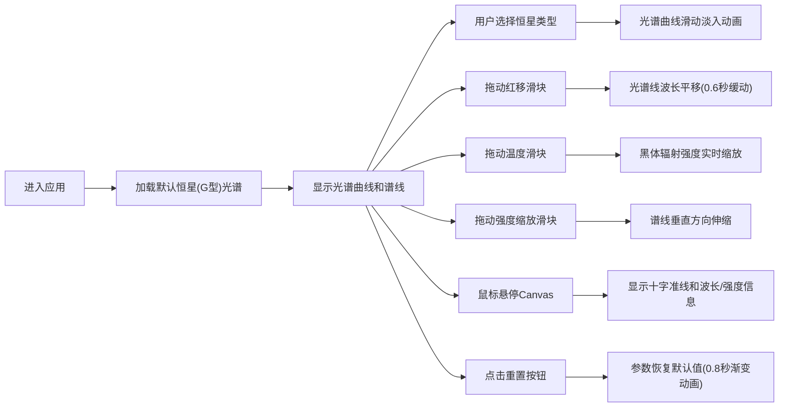

## 1. 产品概述

在线交互式天体光谱分析展示应用，为天文爱好者和学生提供直观的恒星光谱可视化体验。用户可以浏览不同类型恒星的光谱数据，通过调整物理参数实时观察光谱变化，理解红移、温度等天体物理概念。

### 核心价值
- 沉浸式学习天体光谱学基础知识
- 直观展示红移效应对光谱线的影响
- 可视化黑体辐射与温度的关系
- 提供交互式操作，增强学习体验

## 2. 核心功能

### 2.1 功能模块
1. **主界面**：光谱Canvas绘制区域、控制面板、恒星选择器
2. **光谱可视化**：连续谱曲线绘制、特征谱线标注、波长/强度坐标轴
3. **参数控制**：红移量滑块、温度滑块、谱线强度缩放滑块
4. **交互功能**：鼠标悬停十字准线、实时数据显示、重置按钮
5. **动画效果**：恒星切换动画、红移缓动动画、重置渐变动画

### 2.2 页面详情

| 页面名称 | 模块名称 | 功能描述 |
|-----------|-------------|---------------------|
| 主界面 | 恒星选择器 | 下拉菜单切换O型、G型、M型恒星，切换时光谱曲线从右向左滑动淡入 |
| 主界面 | 光谱Canvas | 使用HTML5 Canvas绘制光谱曲线、谱线标记、坐标轴、十字准线和信息框 |
| 主界面 | 控制面板 | 三个滑块分别控制红移量(0-5)、温度(3000-30000K)、谱线强度缩放(0.1-2.0) |
| 主界面 | 重置按钮 | 恢复所有参数到默认值，带有按压缩放反馈动画 |
| 主界面 | 星空背景 | CSS动画实现5个随机闪烁的星点，营造深空氛围 |

## 3. 核心流程

### 用户操作流程

## 4. 用户界面设计

### 4.1 设计风格
- **主题**：深空暗色主题，背景色 `#0a0e27`
- **主色调**：深蓝 `#1a237e`、紫色 `#4a148c`、青色 `#4fc3f7`
- **文字颜色**：白色 `#ffffff`，次要文字 `#b0bec5`
- **顶部标题栏**：从深蓝 `#1a237e` 到紫色 `#4a148c` 的线性渐变
- **按钮/滑块**：青色 `#4fc3f7` 轨道，淡青色 `#e0f7fa` 旋钮
- **圆角**：统一 4px
- **阴影**：卡片阴影 `0 2px 8px rgba(0,0,0,0.5)`
- **过渡动画**：所有状态变更 0.3 秒，`ease-in-out` 缓动

### 4.2 字体
- **标题字体**：Orbitron（科技感无衬线字体）
- **正文字体**：Roboto Mono（等宽字体，适合数据显示）
- **字号层级**：标题 24px、标签 14px、数值 16px

### 4.3 页面布局

| 区域 | 布局说明 | 宽度 |
|------|---------|------|
| 顶部标题栏 | 全屏宽度，渐变背景，居中标题 | 100% |
| 左侧控制面板 | 固定宽度，竖向排列滑块和下拉菜单 | 200px |
| 中央Canvas区域 | 自适应高度，带边框和星空背景 | 80% |
| 右下角重置按钮 | 绝对定位，带按压缩放动画 | 固定大小 |

### 4.4 响应式设计
- **桌面端（>768px）**：左侧控制面板 + 中央Canvas的两栏布局
- **移动端（≤768px）**：控制面板折叠到顶部为横向滑块条，Canvas宽度 100%
- **触控优化**：滑块增加触控区域，按钮最小尺寸 44×44px

### 4.5 动画效果
- **恒星切换**：曲线从右向左滑动淡入，持续 0.3 秒
- **红移调整**：`requestAnimationFrame` 实现 0.6 秒缓动动画
- **温度调整**：连续谱颜色渐变条峰值位置同步更新
- **重置动画**：0.8 秒渐变恢复初始状态
- **按钮反馈**：点击时 0.1 秒内缩小至 0.95 再恢复
- **星空粒子**：5个小白点随机闪烁，CSS `@keyframes` 实现
