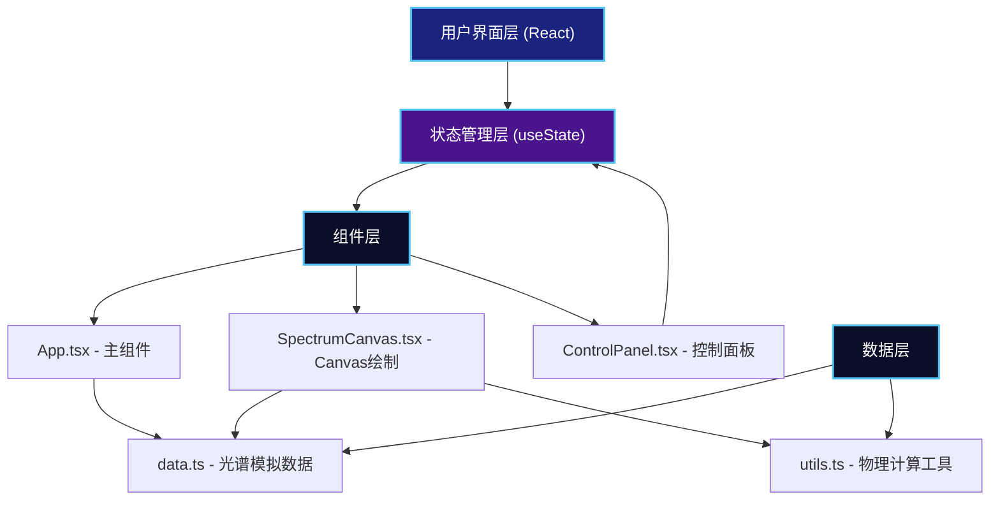

## 1. 架构设计



## 2. 技术描述

### 2.1 技术栈
- **前端框架**：React 18 + TypeScript 5
- **构建工具**：Vite 5
- **状态管理**：React Hooks (useState, useEffect, useRef)
- **图形渲染**：HTML5 Canvas 2D API
- **动画实现**：requestAnimationFrame + CSS Transitions

### 2.2 项目初始化
- 使用 `vite-init` 脚手架创建 React + TypeScript 项目
- 包管理器：npm
- 开发服务器端口：3000

### 2.3 文件结构

```
auto86/
├── index.html                    # 入口HTML
├── package.json                  # 项目配置和依赖
├── vite.config.js                # Vite构建配置
├── tsconfig.json                 # TypeScript配置
└── src/
    ├── App.tsx                   # 主应用组件
    ├── SpectrumCanvas.tsx        # Canvas光谱绘制组件
    ├── ControlPanel.tsx          # 滑块控制面板组件
    ├── data.ts                   # 光谱数据模拟模块
    └── utils.ts                  # 物理计算辅助函数
```

### 2.4 依赖列表

| 包名 | 版本 | 用途 |
|------|------|------|
| react | ^18.2.0 | UI框架 |
| react-dom | ^18.2.0 | React DOM渲染 |
| typescript | ^5.0.0 | 类型系统 |
| vite | ^5.0.0 | 构建工具 |
| @types/react | ^18.2.0 | React类型定义 |
| @types/react-dom | ^18.2.0 | React DOM类型定义 |

## 3. 数据模型

### 3.1 类型定义

```typescript
// 光谱数据点
interface SpectrumPoint {
  wavelength: number;  // 波长 (Å)
  intensity: number;   // 相对强度 (0-1)
}

// 特征谱线
interface SpectralLine {
  wavelength: number;  // 静止波长 (Å)
  element: string;     // 元素标签
  intensity: number;   // 相对强度 (0-1)
}

// 恒星光谱数据
interface StarSpectrum {
  type: string;               // 光谱类型 (O/G/M)
  name: string;               // 恒星名称
  temperature: number;        // 表面温度 (K)
  continuum: SpectrumPoint[]; // 连续谱数据
  lines: SpectralLine[];      // 特征谱线列表
}

// 控制参数
interface ControlParams {
  redshift: number;        // 红移量 (0-5)
  temperature: number;     // 温度 (3000-30000K)
  lineScale: number;       // 谱线强度缩放 (0.1-2.0)
}

// 鼠标位置信息
interface MouseInfo {
  x: number;               // Canvas X坐标
  y: number;               // Canvas Y坐标
  wavelength: number;      // 对应波长
  intensity: number;       // 对应强度
}
```

### 3.2 预设恒星数据

| 光谱类型 | 代表恒星 | 温度 (K) | 颜色特征 |
|---------|---------|---------|---------|
| O型 | 参宿一 | 30000 | 蓝白色，电离氦线强 |
| G型 | 太阳 | 5778 | 黄色，氢线中等，钙线强 |
| M型 | 比邻星 | 3000 | 红色，分子带强，氢线弱 |

### 3.3 特征谱线列表

| 波长 (Å) | 元素 | 谱线名称 |
|---------|------|---------|
| 3934 | Ca II | H线 |
| 3968 | Ca II | K线 |
| 4340 | H | H-γ |
| 4861 | H | H-β |
| 5890 | Na I | D线 |
| 6563 | H | H-α |

## 4. 核心算法

### 4.1 红移计算
```
λ' = λ × (1 + z)
其中 λ' 为观测波长，λ 为静止波长，z 为红移量
```

### 4.2 黑体辐射普朗克定律
```
B_λ(T) = (2hc²/λ⁵) × 1/(e^(hc/(λkT)) - 1)
用于计算不同温度下的连续谱强度分布
```

### 4.3 波长-像素坐标映射
```
像素X = (波长 - 最小波长) / (最大波长 - 最小波长) × Canvas宽度
像素Y = (1 - 强度) × (Canvas高度 - 边距) + 边距
```

### 4.4 缓动函数
```typescript
// ease-in-out 缓动
function easeInOut(t: number): number {
  return t < 0.5 ? 2 * t * t : 1 - Math.pow(-2 * t + 2, 2) / 2;
}
```

## 5. 性能优化策略

### 5.1 Canvas绘制优化
- 使用 `requestAnimationFrame` 同步屏幕刷新率
- 离屏Canvas缓存静态元素（坐标轴、刻度）
- 仅在参数变化时重绘，避免不必要的渲染
- 光谱数据点降采样，平衡精度和性能

### 5.2 动画优化
- 红移动画使用增量插值，避免全量重计算
- 使用 CSS transforms 实现硬件加速动画
- 避免在动画回调中创建新对象

### 5.3 响应式优化
- Canvas使用设备像素比 (DPR) 适配，避免模糊
- ResizeObserver 监听容器尺寸变化
- 触摸事件增加被动监听，提升滚动性能

## 6. 质量标准

### 6.1 性能指标
- Canvas绘制帧率 ≥ 55 FPS
- 滑块响应延迟 < 16ms
- 动画无闪烁、无卡顿
- 内存无泄漏

### 6.2 代码规范
- TypeScript 严格模式 (`strict: true`)
- 组件单一职责，单文件 ≤ 300 行
- 命名规范：PascalCase组件，camelCase函数/变量
- 无 `any` 类型，完整类型定义

### 6.3 浏览器兼容
- Chrome/Edge 最新版
- Firefox 最新版
- Safari 最新版
