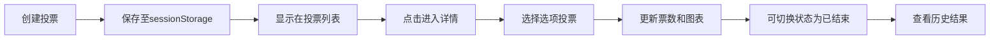

## 1. 产品概述

实时投票决策看板应用，解决团队协作中投票决策效率低下的问题，提供轻量级工具快速创建和统计匿名投票。

- 核心功能：支持多轮投票、匿名投票、结果统计和动态图表展示
- 目标用户：团队协作场景下需要快速决策的各类人群
- 产品价值：提高团队决策效率，匿名投票保证结果公正性

## 2. 核心功能

### 2.1 用户角色

| 角色 | 注册方式 | 核心权限 |
|------|----------|----------|
| 普通用户 | 无需注册，匿名访问 | 创建投票、参与投票、查看结果、管理投票状态 |

### 2.2 功能模块

1. **投票创建模块**：创建包含标题、多个选项的投票，支持单选/多选模式
2. **投票列表模块**：展示所有投票卡片，显示状态和参与人数
3. **投票详情模块**：投票交互区域，展示选项和结果图表
4. **状态管理模块**：投票状态切换（进行中/已结束），数据持久化

### 2.3 页面详情

| 页面名称 | 模块名称 | 功能描述 |
|-----------|-------------|---------------------|
| 主页面 | 投票创建表单 | 输入标题、动态添加/删除选项、选择投票类型 |
| 主页面 | 投票列表 | 卡片式展示所有投票，支持点击进入详情 |
| 详情页面 | 投票交互区 | 选项列表、投票提交、状态切换按钮 |
| 详情页面 | 结果图表区 | 柱状图展示得票比例，票数和百分比显示 |

## 3. 核心流程

用户创建投票 → 投票自动保存并显示在列表 → 用户点击进入投票详情 → 选择选项提交投票 → 实时更新票数和图表 → 可切换投票状态结束投票 → 查看历史结果

## 4. 用户界面设计

### 4.1 设计风格

- **主色调**：深蓝色（#1e3a5f）和白色搭配
- **辅助色**：蓝色渐变用于柱状图（根据得票高低渐变）
- **按钮风格**：圆角按钮，选中时有0.3秒颜色填充动画
- **字体**：现代无衬线字体，清晰可读
- **布局风格**：卡片式布局，带圆角和阴影，悬浮时阴影加深并上移
- **动画效果**：卡片插入动画、柱状图高度缓动效果（0.5秒）

### 4.2 页面设计概述

| 页面名称 | 模块名称 | UI元素 |
|-----------|-------------|-------------|
| 主页面 | 投票创建表单 | 居中布局、标题输入框、动态选项行（加减按钮）、类型选择、提交按钮 |
| 主页面 | 投票列表 | 网格布局卡片、标题、状态标签、参与人数、悬浮动效 |
| 详情页面 | 投票交互区 | 左侧选项列表、圆角选择按钮、提交按钮、状态切换按钮 |
| 详情页面 | 结果图表区 | 右侧柱状图、柱条顶部显示票数和百分比、颜色渐变 |

### 4.3 响应式

- **桌面端**：详情页左右分栏布局，表单顶部居中
- **移动端**：小屏幕下分栏变上下排列，字体和按钮适度放大
- **触摸优化**：按钮最小44px可点击区域，滑动手势支持

## 5. 性能约束

- 单次投票提交后界面更新响应时间 ≤ 100毫秒
- 支持100项投票数据渲染无明显卡顿
- 动画流畅度 ≥ 60fps
