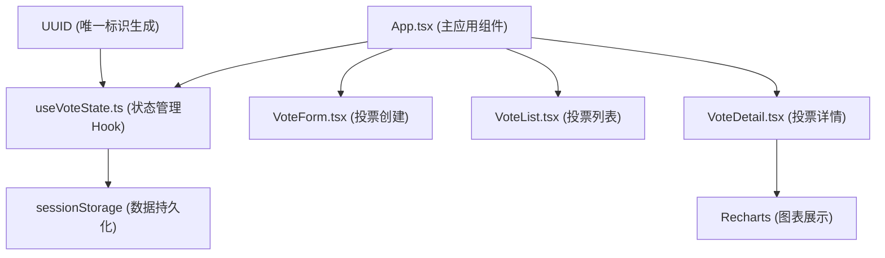

## 1. 架构设计



## 2. 技术描述

- **前端框架**：React 18 + TypeScript
- **构建工具**：Vite 5
- **图表库**：Recharts 2
- **唯一标识**：UUID 9
- **状态管理**：React Hooks (useState, useEffect, useCallback) + 自定义Hook
- **数据持久化**：sessionStorage
- **样式方案**：CSS Modules / 内联样式 + CSS 动画

## 3. 数据模型

### 3.1 类型定义

```typescript
interface VoteOption {
  id: string;
  text: string;
  votes: number;
}

interface Vote {
  id: string;
  title: string;
  options: VoteOption[];
  type: 'single' | 'multiple';
  status: 'active' | 'ended';
  createdAt: number;
  voters: string[];
}

interface VoteState {
  votes: Vote[];
  selectedVoteId: string | null;
  currentUserId: string;
}
```

### 3.2 数据流向

1. **创建投票**：VoteForm → onSubmit回调 → App.tsx → useVoteState.createVote → sessionStorage
2. **投票列表**：App.tsx → props传递 → VoteList → 渲染卡片 → 点击触发onSelect
3. **投票详情**：App.tsx → voteId传递 → VoteDetail → 从useVoteState获取数据 → 渲染选项和图表
4. **提交投票**：VoteDetail → onVote回调 → useVoteState.submitVote → 更新状态和sessionStorage
5. **状态切换**：VoteDetail → onToggleStatus → useVoteState.toggleVoteStatus → 更新状态

## 4. 目录结构

```
e:\solo\SoloAutoDemo\tasks\auto9\
├── .trae\documents\
│   ├── PRD.md
│   └── architecture.md
├── src\
│   ├── components\
│   │   ├── VoteForm.tsx       # 投票创建表单
│   │   ├── VoteList.tsx       # 投票列表
│   │   └── VoteDetail.tsx     # 投票详情与图表
│   ├── hooks\
│   │   └── useVoteState.ts    # 投票状态管理Hook
│   ├── types\
│   │   └── index.ts           # TypeScript类型定义
│   ├── App.tsx                # 主应用组件
│   ├── main.tsx               # 应用入口
│   └── index.css              # 全局样式
├── index.html                 # HTML入口
├── package.json               # 依赖配置
├── tsconfig.json              # TypeScript配置
└── vite.config.js             # Vite配置
```

## 5. 关键技术点

### 5.1 性能优化
- 使用React.memo优化组件重渲染
- 列表渲染使用稳定key（投票ID）
- 状态更新使用functional update避免闭包问题
- 图表动画使用CSS transition实现60fps流畅度

### 5.2 数据持久化
- 使用sessionStorage存储投票数据
- 应用初始化时从sessionStorage恢复数据
- 每次状态变更自动同步到sessionStorage

### 5.3 动画实现
- 卡片插入：CSS animation + keyframes
- 柱状图高度变化：CSS transition (0.5s ease)
- 按钮选中效果：CSS transition (0.3s ease)
- 悬浮动效：transform + box-shadow transition

### 5.4 响应式设计
- 使用CSS Grid和Flexbox布局
- 媒体查询适配移动端（<768px）
- 相对单位（rem/em）确保字体缩放
