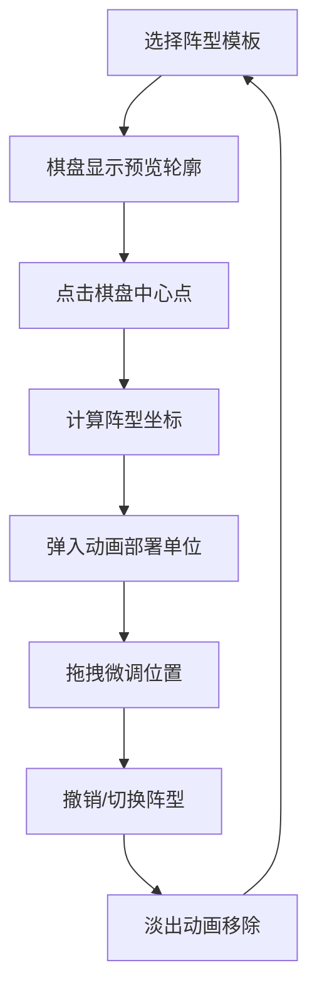

## 1. 产品概述
战棋类游戏智能军团部署模拟应用，通过预设阵型模板实现快速部队部署，解决战斗前手动拖拽部署的枯燥问题，提供动态、高效的部署体验。
- 面向战棋游戏玩家，提供方阵、锋矢阵、雁行阵三种经典阵型的一键部署
- 提升游戏体验，减少繁琐操作，支持拖拽微调，兼顾策略深度与操作便捷性

## 2. 核心功能

### 2.1 用户角色
无角色区分，面向所有游戏玩家。

### 2.2 功能模块
1. **六边形棋盘渲染**：7x9六边形网格棋盘，支持悬停高亮、点击选中、Canvas高性能渲染
2. **阵型模板选择**：三种预设阵型（方阵、锋矢阵、雁行阵）缩略图展示与选择
3. **智能部署填充**：根据中心点自动计算阵型位置，填充不同兵种单位（骑兵红、步兵蓝、弓兵绿）
4. **拖拽微调**：已部署单位可拖拽移动到相邻空闲格子
5. **阵型切换与撤销**：切换阵型时淡出动画过渡，支持撤销最后一步部署

### 2.3 页面详情
| 页面名称 | 模块名称 | 功能描述 |
|-----------|-------------|---------------------|
| 主页面 | 棋盘区域 | 7x9六边形网格Canvas渲染，支持悬停、点击、拖拽交互 |
| 主页面 | 右侧面板 | 阵型模板缩略图展示、已部署单位统计、撤销按钮 |
| 主页面 | 预览功能 | 选中阵型后在棋盘上显示半透明预览轮廓 |

## 3. 核心流程
用户选择阵型模板 → 鼠标悬停棋盘显示预览轮廓 → 点击格子作为中心点 → 系统计算位置并弹入动画部署单位 → 可拖拽微调单位位置 → 可撤销或切换新阵型。

## 4. 用户界面设计

### 4.1 设计风格
- 主色调：深蓝色(#1A2B4C)背景，与浅色网格形成对比
- 网格描边：浅蓝色(#D4E6F1)，默认填充浅灰色(#E8E8E8)
- 悬停色：浅蓝色(#B0D4E8)，点击高亮：蓝色(#6BAED6)
- 兵种配色：骑兵红色、步兵蓝色、弓兵绿色圆形头像
- 卡片风格：面板内模板卡片悬停上浮带阴影(box-shadow: 0 4px 12px rgba(0,0,0,0.15))
- 字体：采用现代无衬线字体，标题加粗，正文清晰可读
- 布局：左侧棋盘65%宽度，右侧面板35%宽度，面板圆角8px浅灰色背景

### 4.2 页面设计概述
| 页面名称 | 模块名称 | UI元素 |
|-----------|-------------|-------------|
| 主页面 | 棋盘区域 | Canvas六边形网格、兵种圆形头像、预览轮廓、拖拽放大效果 |
| 主页面 | 右侧面板 | 阵型模板卡片(缩略图+名称)、单位统计信息、撤销按钮(圆形带返回箭头) |
| 主页面 | 动画效果 | 部署弹入(0.4s)、淡出(0.3s)、拖拽放大(1.1倍)、ease-in-out缓动 |

### 4.3 响应式
- 桌面优先设计，宽度≥1024px时左侧棋盘65%+右侧面板35%布局
- 宽度<1024px时，右侧面板收起为底部可展开抽屉式面板
- 触摸优化，支持移动端拖拽操作

### 4.4 性能要求
- 所有计算和渲染在16ms内完成，保证60FPS流畅体验
- 拖拽响应延迟≤50ms
- Canvas绘制优化，避免不必要的重绘
