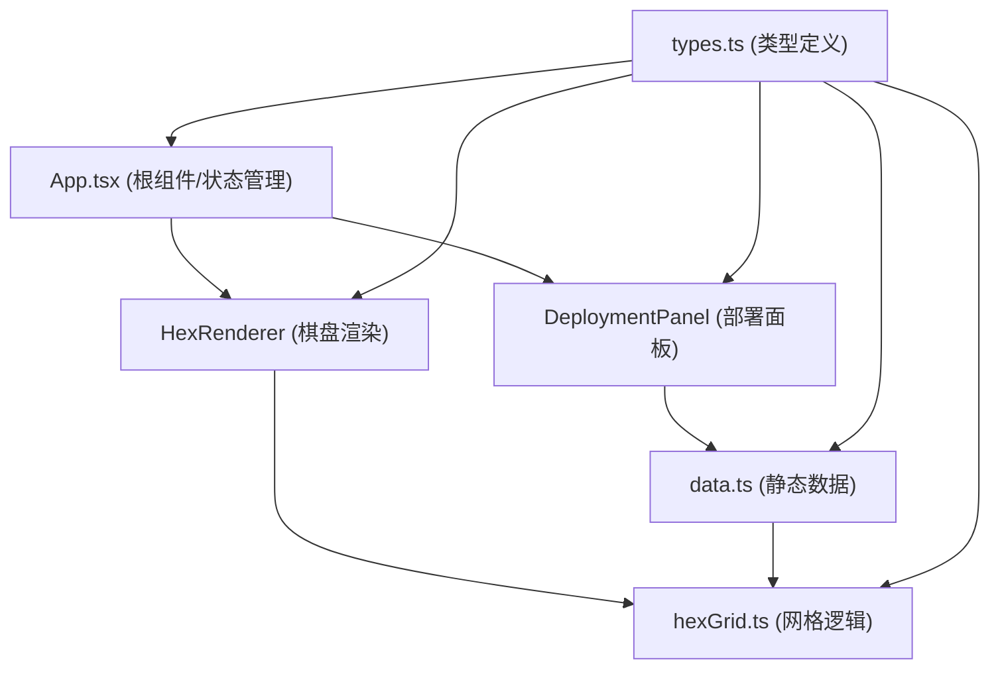
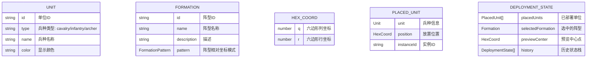

## 1. 架构设计



## 2. 技术描述
- 前端：React@18 + TypeScript + Vite
- 状态管理：React useState/useReducer 管理本地状态
- 渲染：HTML5 Canvas 2D API 实现六边形网格绘制
- 构建工具：Vite 5.x，端口3000
- 样式：原生CSS + CSS变量，无额外UI框架
- 数据源：静态JSON格式兵种和阵型数据

## 3. 项目结构与调用关系

| 文件 | 职责 | 调用关系 |
|------|------|----------|
| `package.json` | 项目依赖配置 | 包含react, react-dom, typescript, vite等 |
| `vite.config.js` | 构建配置 | 端口3000，开发服务器配置 |
| `tsconfig.json` | TypeScript配置 | 严格模式 |
| `index.html` | 入口页面 | 挂载React应用 |
| `src/App.tsx` | 根组件 | 管理全局状态，调用DeploymentPanel和HexRenderer |
| `src/types.ts` | 类型定义 | 定义Unit, Formation, HexCoord等类型，被所有模块导入 |
| `src/data.ts` | 静态数据 | 提供兵种列表和阵型模板，被deploymentPanel和hexGrid导入 |
| `src/hexGrid.ts` | 网格核心逻辑 | 根据阵型和中心坐标计算位置，输出坐标数组给HexRenderer |
| `src/deploymentPanel.tsx` | 部署面板组件 | 从data.ts获取模板，传递阵型名称给hexGrid.ts，显示统计信息 |
| `src/hexRenderer.tsx` | 棋盘渲染组件 | 接收hexGrid.ts坐标列表，Canvas绘制网格和单位 |

## 4. 路由定义
| 路由 | 用途 |
|-------|---------|
| / | 主页面，包含棋盘和部署面板 |

## 5. 数据模型

### 5.1 数据模型定义



### 5.2 核心类型定义

```typescript
// 六边形坐标（轴向坐标系）
interface HexCoord {
  q: number; // 列
  r: number; // 行
}

// 兵种类型
type UnitType = 'cavalry' | 'infantry' | 'archer';

// 兵种单位
interface Unit {
  id: string;
  type: UnitType;
  name: string;
  color: string;
}

// 阵型中的单个位置
interface FormationPosition {
  offset: HexCoord; // 相对于中心点的偏移
  unitType: UnitType; // 该位置放置的兵种类型
}

// 阵型模板
interface Formation {
  id: string;
  name: string;
  description: string;
  pattern: FormationPosition[]; // 阵型的相对坐标模式
  thumbnailPattern: HexCoord[]; // 缩略图显示用的坐标
}

// 已部署的单位实例
interface PlacedUnit {
  instanceId: string;
  unit: Unit;
  position: HexCoord;
  animationState: 'idle' | 'entering' | 'exiting' | 'dragging';
}

// 部署状态
interface DeploymentState {
  placedUnits: PlacedUnit[];
  timestamp: number;
}
```

### 5.3 六边形网格算法说明

1. **轴向坐标系(Offset Coordinates)**：使用even-r偏移坐标系，偶数行向右偏移半个格子
2. **像素坐标转换**：
   - 六边形宽度：`size * 2`
   - 六边形高度：`size * Math.sqrt(3)`
   - 水平间距：`size * 1.5`
   - 垂直间距：`size * Math.sqrt(3)`
3. **相邻格子计算**：偶数行和奇数行的相邻方向偏移不同
4. **阵型坐标计算**：`绝对坐标 = 中心坐标 + 阵型偏移坐标`，需验证边界有效性
