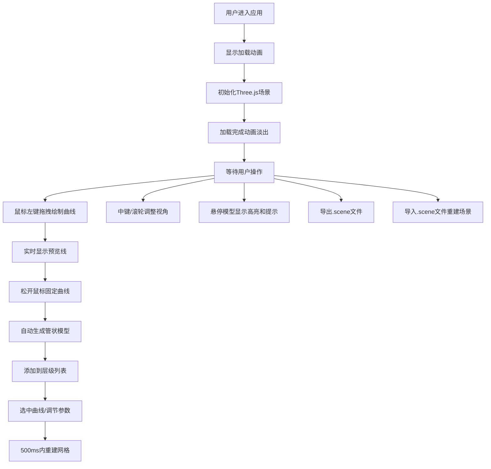

## 1. 产品概述

3D曲线管状建模器 - 帮助3D建模初学者和设计师在3D场景中实时绘制自由曲线，并基于曲线快速生成具有体积感的平滑管状网格模型（管道、绳索、藤蔓等）。通过直观的手绘交互和参数化调节，降低从抽象草图到3D模型的创作门槛。

## 2. 核心功能

### 2.1 功能模块

1. **3D曲线绘制模块**：鼠标拖拽绘制贝塞尔曲线，实时预览，控制点可视化，撤销操作
2. **管状网格生成模块**：基于曲线和参数动态生成TubeGeometry，自动法线计算
3. **层级管理模块**：曲线列表展示，选中高亮，重命名，删除
4. **参数调节模块**：半径、分段数、颜色、UV平铺实时调节
5. **场景交互模块**：OrbitControls视角控制，悬停高亮，工具提示
6. **导入导出模块**：JSON序列化场景数据，.scene文件上传下载

### 2.2 功能详情

| 模块名称 | 子功能 | 功能描述 |
|-----------|--------|----------|
| 曲线绘制 | 拖拽绘制 | 鼠标左键点击并拖拽，连续生成控制点组成贝塞尔曲线 |
| 曲线绘制 | 实时预览 | 绘制过程显示明亮青蓝色发光预览线（2像素线宽） |
| 曲线绘制 | 控制点标记 | 渐变色点状标记显示所有控制点位置 |
| 曲线绘制 | 撤销操作 | Ctrl+Z快捷键撤销最后一段曲线 |
| 曲线绘制 | 数量限制 | 最多同时支持10条独立曲线 |
| 管状生成 | 参数调节 | 管道半径(0.1-2.0步长0.1)、分段数(6-32整数)、颜色选择器、UV平铺(1-10) |
| 管状生成 | 动态重建 | 参数变更后500ms内重新生成网格，自动计算法线 |
| 层级管理 | 列表展示 | 名称、控制点数量、半径、颜色方块、删除按钮 |
| 层级管理 | 选中高亮 | 列表项选中时模型出现淡蓝色外发光轮廓(2px) |
| 层级管理 | 重命名 | 双击列表项进入重命名模式 |
| 场景交互 | 视角控制 | 中键拖拽平移，滚轮缩放，OrbitControls轨道控制 |
| 场景交互 | 悬停效果 | 材质亮度提升1.2倍并偏暖色调 |
| 场景交互 | 工具提示 | 显示模型名称、半径、分段数浮框 |
| 导入导出 | 导出 | 序列化为JSON，下载.scene后缀文件 |
| 导入导出 | 导入 | 上传.scene文件，自动重建所有曲线和模型 |

## 3. 核心流程

## 4. 用户界面设计

### 4.1 设计风格

- **整体风格**：深色科幻风格（Sci-Fi Dark Theme）
- **主背景色**：#1a1a2e
- **面板底色**：#16213e
- **文本色**：#e0e0e0
- **强调色**：渐变蓝色（#0f3460 → #1640a5）
- **预览线**：明亮青蓝色（#00e5ff），发光效果
- **选中轮廓**：淡蓝色外发光（#4da6ff，2px宽度）

**视觉元素**：
- 面板使用半透明毛玻璃效果（backdrop-filter: blur(8px)）
- 微弱银色边框（rgba(192,192,192,0.2)）
- 按钮渐变蓝色，悬停亮度提升+上浮阴影
- 所有切换动画ease-out，300ms
- 加载动画：旋转白色圆环

### 4.2 页面布局

| 区域 | 宽度 | 位置 | 内容 |
|------|------|------|------|
| 左侧层级列表 | 280px | 左侧固定 | 曲线列表（名称、点数、半径、颜色、删除） |
| 中央3D场景 | 自适应 | 中间填充 | Three.js渲染画布、加载动画、工具提示浮框 |
| 右侧参数面板 | 300px | 右侧固定 | 参数滑块（半径、分段、颜色、UV）、导入导出按钮 |

### 4.3 空间构图

采用经典的三栏式专业建模软件布局：
- 左右面板固定宽度，中间场景最大化
- 面板与场景交界处带微妙阴影分隔
- 顶部区域预留导入导出按钮组
- 加载动画居中显示，完成后淡出

### 4.4 3D场景指导

**环境与氛围**：
- 场景背景：深空蓝渐变（#1a1a2e → #0f0f1a）
- 无需HDRI，使用程序化光照

**光照设置**：
- 环境光：AmbientLight，强度0.4，颜色#ffffff
- 主平行光：DirectionalLight，强度0.8，位置(5, 10, 7)，投射阴影
- 补光：DirectionalLight，强度0.3，位置(-5, 5, -5)

**相机设置**：
- PerspectiveCamera，fov 60，aspect自适应
- 初始位置(0, 5, 15)，看向(0, 0, 0)
- OrbitControls启用，启用阻尼效果

**后处理效果**：
- UnrealBloomPass实现发光效果（预览线、选中轮廓）
- 强度适中，避免过度曝光

**交互动画**：
- 参数变化时网格morph过渡（或直接重建+淡入）
- 悬停时材质亮度/色调渐变过渡
- 列表选中时模型轮廓淡入

### 4.5 响应式

桌面端优先，保证1280×720以上分辨率正常工作。面板固定宽度，场景区自适应。

## 5. 性能要求

- 帧率 ≥ 30 FPS
- 单条曲线控制点 ≤ 20
- 同时存在曲线 ≤ 10
- 管状网格重建 ≤ 500ms
