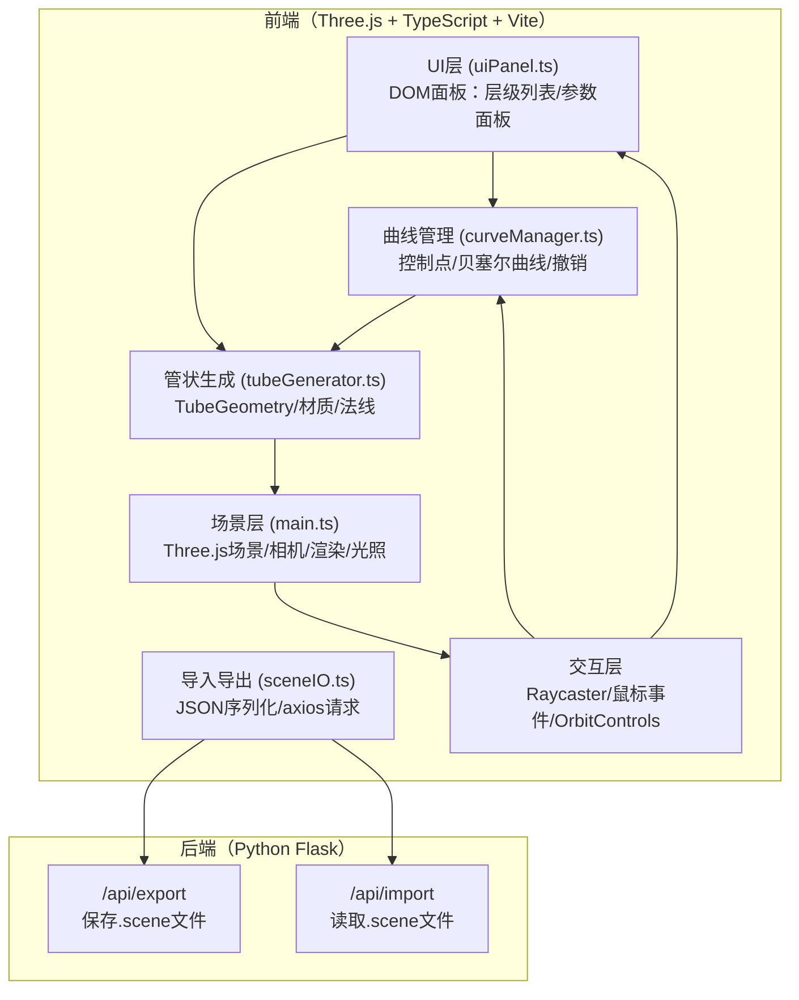

## 1. 架构设计



## 2. 技术说明

- **前端框架**：TypeScript 5.x + Vite 5.x（无React，原生DOM + Three.js）
- **3D引擎**：Three.js 0.160.x，含OrbitControls、TubeGeometry、CatmullRomCurve3
- **后处理**：UnrealBloomPass（实现发光效果）
- **HTTP库**：Axios 1.x（与后端通信）
- **UI辅助**：dat.gui（可选，用于颜色选择器参考；实际使用原生input[type=color]）
- **后端**：Python 3.9+ + Flask 3.x
- **开发服务器**：Vite（端口3000，HMR热更新）
- **构建工具**：Vite + TypeScript Compiler（严格模式）

## 3. 模块文件结构

```
auto98/
├── package.json
├── vite.config.js
├── tsconfig.json
├── index.html
├── src/
│   ├── main.ts              # 应用入口：场景初始化、相机、渲染循环、事件绑定
│   ├── curveManager.ts      # 曲线管理：绘制、撤销、控制点、曲线列表
│   ├── tubeGenerator.ts     # 管状生成：TubeGeometry、材质、重建
│   ├── uiPanel.ts           # UI面板：层级列表、参数面板、DOM事件
│   └── sceneIO.ts           # 导入导出：JSON序列化、axios请求
└── backend/
    └── app.py               # Flask后端：/api/export、/api/import
```

## 4. 核心数据模型

```typescript
interface ControlPoint {
    x: number;
    y: number;
    z: number;
}

interface TubeParams {
    radius: number;       // 0.1 - 2.0
    tubularSegments: number; // 6 - 32 (半径分段数)
    radialSegments: number;  // 径向分段数 (固定12，保证平滑)
    color: string;       // hex颜色，如"#c0c0c0"
    uvTiling: number;    // 1 - 10
}

interface CurveData {
    id: string;
    name: string;
    controlPoints: ControlPoint[];
    params: TubeParams;
}

interface SceneData {
    version: string;
    curves: CurveData[];
    exportTime: string;
}
```

## 5. API 定义（Flask 后端）

### 5.1 导出场景 POST /api/export

**Request Body (application/json):**
```json
{
    "version": "1.0",
    "curves": [...],
    "exportTime": "2026-06-17T10:00:00Z",
    "filename": "my_scene.scene"
}
```

**Response:**
```json
{
    "success": true,
    "filename": "export_xxx.scene",
    "downloadUrl": "/api/download/export_xxx.scene"
}
```

### 5.2 导入场景 POST /api/import

**Request (multipart/form-data):**
- file: .scene格式的JSON文件

**Response:**
```json
{
    "success": true,
    "data": {
        "version": "1.0",
        "curves": [...],
        "exportTime": "..."
    }
}
```

### 5.3 下载文件 GET /api/download/:filename

返回二进制文件流，Content-Type: application/json，Content-Disposition: attachment

## 6. Three.js 场景架构

```
Scene
├── AmbientLight (0.4)
├── DirectionalLight [主光] (0.8, pos 5,10,7, castShadow)
├── DirectionalLight [补光] (0.3, pos -5,5,-5)
├── GridHelper (100x100, 辅助网格)
├── Group [曲线组]
│   ├── Curve 1 Group
│   │   ├── Line (预览/已绘制曲线)
│   │   ├── Points (控制点标记)
│   │   ├── Mesh (管状模型)
│   │   └── OutlineMesh (选中轮廓，可选)
│   └── Curve 2 Group...
└── DrawingLine (当前正在绘制的预览线)
```

## 7. 关键算法说明

### 7.1 曲线绘制
- 使用 CatmullRomCurve3 作为插值曲线（curveType: 'catmullrom', tension: 0.5）
- 鼠标拖拽时，通过 Raycaster 与 y=0 平面求交获得世界坐标
- 每拖拽一定距离（>10px屏幕距离）新增一个控制点
- 插值节点数：用户设定值，实际为 tubularSegments 参数

### 7.2 管状网格生成
```
TubeGeometry(
    path: CatmullRomCurve3,
    tubularSegments: params.tubularSegments * controlPoints.length,
    radius: params.radius,
    radialSegments: 12,
    closed: false
)
```
- 使用 MeshStandardMaterial（金属度0.3，粗糙度0.4）
- UV平铺：修改geometry.attributes.uv，乘以uvTiling
- geometry.computeVertexNormals() 自动生成法线

### 7.3 选中高亮轮廓
- 克隆管状网格，使用 EdgesGeometry + LineBasicMaterial（#4da6ff）
- 或使用 OutlineEffect / 后处理的 SelectionPass

### 7.4 悬停检测
- Raycaster 对所有管状 Mesh 进行射线检测
- 命中时临时修改材质emissive/color，离开时恢复

## 8. 性能优化策略

1. **重建防抖**：参数滑块变化使用 300ms debounce，避免频繁重建
2. **几何复用**：控制点不变时仅更新材质，不重建Geometry
3. **LOD**：远处的管状模型可降低 tubularSegments（按需）
4. **渲染优化**：启用 frustumCulled，关闭不必要的阴影
5. **内存管理**：删除曲线时 dispose() Geometry 和 Material

## 9. 样式规范（CSS）

```css
:root {
    --bg-main: #1a1a2e;
    --bg-panel: #16213e;
    --text-primary: #e0e0e0;
    --text-secondary: #8892b0;
    --accent-start: #0f3460;
    --accent-end: #1640a5;
    --accent-glow: #00e5ff;
    --border-glass: rgba(192, 192, 192, 0.2);
    --panel-shadow: 0 8px 32px rgba(0, 0, 0, 0.4);
}

.panel-glass {
    background: rgba(22, 33, 62, 0.75);
    backdrop-filter: blur(8px);
    -webkit-backdrop-filter: blur(8px);
    border: 1px solid var(--border-glass);
    border-radius: 12px;
    box-shadow: var(--panel-shadow);
}

.btn-gradient {
    background: linear-gradient(135deg, var(--accent-start), var(--accent-end));
    transition: all 300ms ease-out;
}
.btn-gradient:hover {
    filter: brightness(1.2);
    transform: translateY(-2px);
    box-shadow: 0 6px 20px rgba(22, 64, 165, 0.5);
}
```
