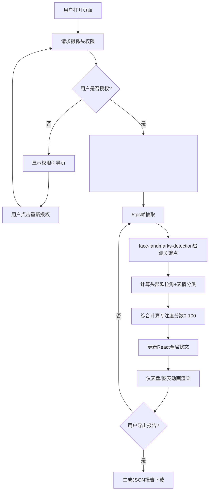

## 1. 产品概述

学生课堂专注度分析应用是一款基于Web的实时AI分析工具，通过浏览器摄像头捕捉学生面部表情与头部姿态，综合计算专注度分数，帮助教师实时了解课堂参与情况。

- 核心目标：解决传统课堂点名和问答无法全面覆盖学生专注状态的问题，提供客观、量化、实时的专注度监测
- 目标用户：K12及高校教师、在线教育平台讲师、教育研究人员
- 产品价值：提升教学效率，及时发现注意力分散学生，生成可追溯的课堂专注度报告

## 2. 核心功能

### 2.1 用户角色

| 角色 | 注册方式 | 核心权限 |
|------|---------|---------|
| 教师用户 | 无需注册，直接使用 | 启动摄像头、查看专注度实时数据、导出课堂报告 |

### 2.2 功能模块

1. **主分析页面**：摄像头取景框、表情指示器、头部朝向指示器、专注度分数、仪表盘、趋势图表、导出按钮
2. **权限引导页面**：摄像头授权引导、拒绝授权提示、重新授权按钮

### 2.3 页面详情

| 页面名称 | 模块名称 | 功能描述 |
|---------|---------|---------|
| 主分析页面 | 摄像头取景框 | 白色虚线边框呼吸动画，居中显示，引导用户面部对准 |
| 主分析页面 | 表情指示器 | 大号emoji展示当前识别表情（高兴😄、悲伤😢、惊讶😲、愤怒😠、恐惧😨、厌恶🤢、中性😐） |
| 主分析页面 | 头部朝向指示器 | 箭头方向显示头部姿态（←左转、→右转、↑仰头、↓低头、●正面） |
| 主分析页面 | 专注度分数显示 | 取景框右侧显示0-100实时分数，颜色随区间变化 |
| 主分析页面 | 圆形仪表盘 | 磨砂玻璃质感，指针平滑过渡，刻度0-100，三色区间显示 |
| 主分析页面 | 趋势曲线图 | 五分钟滚动窗口，每10秒均值，渐变填充，深色卡片背景 |
| 主分析页面 | 导出报告按钮 | 生成含时间戳的JSON报告，含分钟均值、表情分布、头部偏离时长 |
| 权限引导页面 | 授权提示 | 友好动画引导，重新授权按钮，摄像头图标示意 |

## 3. 核心流程

用户打开页面后，浏览器请求摄像头权限 → 用户授权后，隐藏<video>元素接收视频流 → 系统以5fps频率抽取帧 → FaceAnalyzer模块调用face-landmarks-detection获取468个面部关键点 → 计算头部欧拉角（yaw/pitch/roll）和面部动作单元强度 → 分类器输出七种表情概率和头部朝向类别 → 综合计算专注度分数（0-100） → 更新App全局状态 → 仪表盘和图表组件响应式渲染 → 用户点击导出按钮生成课堂报告JSON文件下载。

## 4. 用户界面设计

### 4.1 设计风格

- **主色调**：青蓝色 #00d4ff（科技感、信任）
- **警告色**：橙色 #ff6b35（低专注度警示）
- **背景色**：深海军蓝 #0f141e（沉浸式、护眼）
- **卡片色**：深蓝灰 #1a2332（层次感、磨砂玻璃）
- **三色区间**：高专注>80绿色 #00ff88，中专注40-80黄色 #ffcc00，低专注<40红色 #ff3366
- **按钮风格**：圆角12px，边框1px发光（rgba(0,212,255,0.2)），悬停时发光增强至0.5
- **字体**：主字体使用现代无衬线字体，标题加粗，正文常规
- **布局风格**：卡片式布局，桌面端左右分栏，移动端垂直堆叠
- **图标/emoji**：表情使用系统原生emoji，带弹性缩放动画；头部朝向使用CSS箭头符号

### 4.2 页面设计概述

| 页面名称 | 模块名称 | UI元素 |
|---------|---------|--------|
| 主分析页面 | 取景框 | 60%屏宽居中，白色虚线border，圆角8px，呼吸动画3s循环，4个角落强化标记 |
| 主分析页面 | 表情+姿态面板 | 取景框上方绝对定位，flex横向排列，emoji 48px+箭头 32px，弹性transform动画200ms |
| 主分析页面 | 分数面板 | 取景框右侧绝对定位，72px大号数字，颜色随区间，text-shadow发光效果 |
| 主分析页面 | 仪表盘卡片 | 半透明backdrop-filter: blur(12px)，SVG绘制刻度+指针，CSS transition 500ms旋转 |
| 主分析页面 | 趋势图卡片 | Recharts AreaChart，X轴时间HH:mm:ss，Y轴0-100，渐变area填充，网格线淡化 |
| 主分析页面 | 导出按钮 | 固定底部或卡片内，点击后气泡提示"报告已下载"，3秒自动消失 |
| 权限引导页 | 中央提示卡 | 摄像头SVG图标+脉冲动画，大标题"需要摄像头权限"，说明文案，主按钮"开启摄像头" |

### 4.3 响应式设计

采用桌面优先（Desktop-first）设计策略：

- **桌面端（>1024px）**：左侧60%区域为取景框居中，右侧40%为仪表盘和图表纵向排列
- **平板端（768-1024px）**：取景框占上半部分80%宽度居中，仪表盘和图表横向排列在下半部分
- **手机端（<768px）**：所有元素垂直堆叠，取景框满宽95%，控件字体缩小20%，触摸目标≥44px
- 所有过渡动画采用200ms ease-out，确保各尺寸下交互流畅

## 5. 性能约束

- 推理帧率：≥5fps，帧间隔200ms，使用requestAnimationFrame节流
- 均值计算耗时：每分钟专注度平均统计≤100ms
- 图表渲染流畅度：数据更新时FPS≥50，使用Recharts原生动画插值
- 内存占用：视频帧处理完立即释放，五分钟滚动窗口自动清理过期数据
