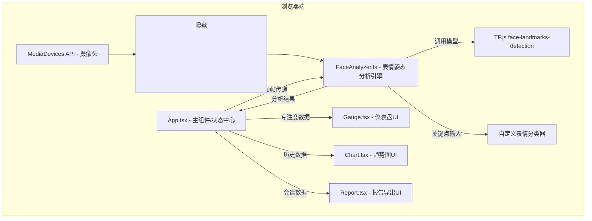

## 1. 架构设计

纯前端单页应用（SPA）架构，无后端服务，所有推理和数据计算在浏览器端完成。TensorFlow.js通过WebGL加速模型推理，摄像头视频流通过MediaDevices API获取。



## 2. 技术描述

- **前端框架**：React@18 + TypeScript@5 + Vite@5
- **构建工具**：Vite（端口3000，HMR热更新）
- **AI推理**：@tensorflow/tfjs@4 + @tensorflow-models/face-landmarks-detection@1.0.5（MediaPipe FaceMesh模型，468个3D面部关键点）
- **数据可视化**：recharts@2（React图表库，AreaChart用于趋势曲线）
- **图标库**：react-icons@5（摄像头、下载等功能图标）
- **状态管理**：React useState + useRef（无需引入Zustand，状态集中在App.tsx）
- **样式方案**：原生CSS（<style>标签）+ CSS变量，无Tailwind依赖
- **后端**：无，纯前端应用
- **数据库**：无，会话数据存储在React内存中，导出JSON文件持久化

## 3. 路由定义

单页应用，无多路由需求。

| 路由 | 用途 |
|------|------|
| / | 主应用页面（摄像头取景、实时分析、仪表盘、图表、报告导出） |

## 4. 核心数据结构与类型定义

### 4.1 FaceAnalyzer输出类型

```typescript
// 七种基本表情类型
type Expression = 'happy' | 'sad' | 'surprised' | 'angry' | 'fearful' | 'disgusted' | 'neutral';

// 头部朝向类型
type HeadOrientation = 'left' | 'right' | 'up' | 'down' | 'front';

// 单帧分析结果
interface FrameAnalysisResult {
  timestamp: number;           // 毫秒时间戳
  expression: Expression;      // 主表情
  expressionScores: Record<Expression, number>; // 各表情概率[0-1]
  headOrientation: HeadOrientation; // 头部朝向
  headAngles: {                // 头部欧拉角（度）
    yaw: number;               // 偏航（左右转，负为左）
    pitch: number;             // 俯仰（上下抬，负为低头）
    roll: number;              // 翻滚（侧倾，负为左倾）
  };
  faceActivity: number;        // 面部活动强度指数[0-1]
  focusScore: number;          // 综合专注度分数[0-100]
  faceDetected: boolean;       // 是否检测到人脸
}
```

### 4.2 App状态类型

```typescript
// 10秒均值数据点（用于趋势图5分钟滚动窗口=30个点）
interface TrendDataPoint {
  time: string;                // HH:mm:ss格式
  score: number;               // 0-100均值
}

// 分钟级统计（用于报告导出）
interface MinuteStats {
  minute: string;              // HH:mm格式
  avgFocus: number;            // 分钟平均专注度
  dominantExpression: Expression; // 主表情
  headDeviationSeconds: number;   // 头部偏离正面秒数
}

// 表情分布统计
interface ExpressionDistribution {
  happy: number;
  sad: number;
  surprised: number;
  angry: number;
  fearful: number;
  disgusted: number;
  neutral: number;
}

// 课堂报告完整结构
interface ClassReport {
  reportId: string;            // 时间戳ID
  sessionStart: string;        // ISO开始时间
  sessionEnd: string;          // ISO结束时间
  totalDurationMinutes: number;
  overallAvgFocus: number;
  minuteStats: MinuteStats[];
  expressionDistribution: ExpressionDistribution;
  headOrientationBreakdown: {
    front: number;    // 秒数
    left: number;
    right: number;
    up: number;
    down: number;
  };
}
```

## 5. 文件结构与调用关系

```
项目根目录/
├── package.json              # 依赖与启动脚本
├── vite.config.js            # Vite构建配置（端口3000）
├── tsconfig.json             # TypeScript严格模式配置
├── index.html                # 入口HTML（含隐藏<video>）
└── src/
    ├── App.tsx               # ★主组件：全局状态、摄像头初始化、帧调度
    │   调用关系：App.tsx → new FaceAnalyzer() → analyzeFrame()
    │   数据流向：video帧 → FaceAnalyzer → FrameAnalysisResult → useState
    │   子组件：<Gauge score /> <Chart data /> <Report onExport />
    │
    ├── faceAnalyzer.ts       # ★核心分析引擎（无React依赖，纯TypeScript类）
    │   职责：加载FaceMesh模型、提取关键点、计算欧拉角、
    │         规则式表情分类、综合计算专注度分数
    │   内部方法：
    │     - constructor() → init()
    │     - loadModel() → 加载face-landmarks-detection
    │     - detectLandmarks(video) → Keypoint[]
    │     - computeHeadAngles(keypoints) → {yaw,pitch,roll}
    │     - classifyExpression(keypoints) → Expression + scores
    │     - computeFocusScore(...) → number[0-100]
    │     - analyzeFrame(video) → FrameAnalysisResult
    │
    ├── Gauge.tsx             # 圆形仪表盘组件（纯展示组件）
    │   Props: { score: number }
    │   技术：SVG绘制刻度盘+指针，CSS变量控制颜色和旋转
    │
    ├── Chart.tsx             # 趋势曲线图表组件
    │   Props: { data: TrendDataPoint[] }
    │   技术：Recharts AreaChart + 渐变defs
    │
    └── Report.tsx            # 课堂报告导出组件
        Props: { getReportData: () => ClassReport }
        职责：触发JSON生成 + Blob下载 + 气泡提示
```

## 6. 专注度计算算法说明

专注度分数 = 100 - (头部偏离惩罚 + 表情不专注惩罚 + 人脸缺失惩罚)

具体规则：
1. **头部姿态（权重50%）**：yaw/pitch绝对值超过阈值线性扣分，偏离>25度扣满分50
2. **表情维度（权重30%）**：中性=不扣分，高兴/惊讶扣10%，悲伤/愤怒/恐惧/厌恶扣30%
3. **面部活动（权重20%）**：长时间无活动（10秒）累加扣分，活动适中不扣分
4. **人脸检测缺失**：连续3帧未检测到人脸，分数直接衰减至0-20区间

## 7. 性能优化策略

- **帧节流**：5fps处理，使用requestAnimationFrame + 时间戳判断跳过帧
- **模型预热**：组件挂载时提前加载模型并跑一帧空推理，避免首次卡顿
- **内存管理**：分析结果不存储全量帧数据，仅存10秒和1分钟聚合数据
- **WebGL加速**：TF.js默认使用WebGL后端，确保GPU加速
- **React优化**：子组件使用React.memo避免不必要重渲染，使用useRef存储频繁更新的临时数据
