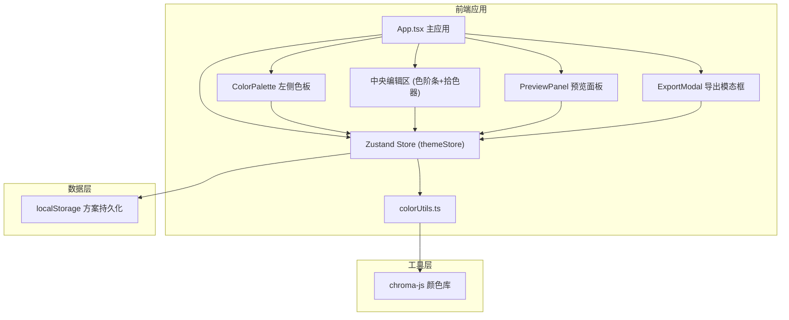

## 1. 架构设计



## 2. 技术描述

- **前端框架**：React 18 + TypeScript
- **构建工具**：Vite 5 + @vitejs/plugin-react
- **状态管理**：Zustand 4
- **颜色处理**：chroma-js 2
- **样式方案**：原生CSS + CSS变量，不使用Tailwind（按用户要求使用CSS变量实现主题切换）
- **图标库**：lucide-react
- **拖拽功能**：原生HTML5 Drag and Drop API

## 3. 项目结构

```
├── package.json
├── index.html
├── vite.config.ts
├── tsconfig.json
└── src/
    ├── main.tsx              # React挂载入口
    ├── App.tsx               # 主应用组件，三栏布局
    ├── store/
    │   └── themeStore.ts     # Zustand状态管理
    ├── utils/
    │   └── colorUtils.ts     # 颜色转换与变体生成
    ├── components/
    │   ├── ColorPalette.tsx  # 左侧色板组件
    │   ├── ColorPicker.tsx   # 颜色拾取器组件
    │   ├── PreviewPanel.tsx  # 实时预览面板
    │   ├── ColorScaleBar.tsx # 色阶条组件
    │   ├── SchemeList.tsx    # 方案列表组件
    │   └── ExportModal.tsx   # 导出模态框
    └── styles/
        └── global.css        # 全局样式
```

## 4. 核心数据结构

### 4.1 类型定义

```typescript
// 颜色层级
type ColorLevel = 'lightest' | 'light' | 'primary' | 'dark' | 'darkest';

// 单个颜色条目
interface ColorEntry {
  id: string;
  name: string;
  category: 'primary' | 'secondary' | 'background' | 'text';
  baseColor: string; // HEX格式
  variants: Record<ColorLevel, string>;
}

// 主题方案
interface ThemeScheme {
  id: string;
  name: string;
  createdAt: number;
  colors: ColorEntry[];
}

// Store状态
interface ThemeState {
  currentScheme: ThemeScheme;
  schemes: ThemeScheme[];
  selectedColorId: string | null;
  selectedVariantLevel: ColorLevel | null;
  isDarkPreview: boolean;
  showExportModal: boolean;
  
  // Actions
  updateBaseColor: (colorId: string, hex: string) => void;
  updateVariant: (colorId: string, level: ColorLevel, hex: string) => void;
  selectColor: (colorId: string | null) => void;
  selectVariant: (level: ColorLevel | null) => void;
  togglePreviewMode: () => void;
  saveScheme: (name: string) => void;
  loadScheme: (schemeId: string) => void;
  reorderSchemes: (fromIndex: number, toIndex: number) => void;
  deleteScheme: (schemeId: string) => void;
  toggleExportModal: () => void;
  exportCSS: () => string;
  exportJSON: () => string;
}
```

### 4.2 预设基础色

```typescript
const PRESET_COLORS = [
  { id: 'vermilion', name: '朱红', hex: '#E34234', category: 'primary' },
  { id: 'coral', name: '珊瑚', hex: '#FF6B6B', category: 'primary' },
  { id: 'amber', name: '琥珀', hex: '#FFB347', category: 'secondary' },
  { id: 'canary', name: '明黄', hex: '#FFE135', category: 'secondary' },
  { id: 'emerald', name: '翠绿', hex: '#50C878', category: 'secondary' },
  { id: 'teal', name: '青蓝', hex: '#20B2AA', category: 'secondary' },
  { id: 'sky', name: '天蓝', hex: '#87CEEB', category: 'primary' },
  { id: 'sapphire', name: '宝石蓝', hex: '#0F52BA', category: 'primary' },
  { id: 'violet', name: '紫罗兰', hex: '#7F00FF', category: 'secondary' },
  { id: 'rose', name: '玫瑰', hex: '#FF007F', category: 'secondary' },
];
```

## 5. 核心算法

### 5.1 颜色变体生成 (generateVariants)

输入基础色HEX值，生成5个层级的变体：
- lightest: 亮度 +30%, 饱和度 -10%
- light: 亮度 +15%, 饱和度 -5%
- primary: 原色
- dark: 亮度 -15%, 饱和度 +5%
- darkest: 亮度 -30%, 饱和度 +10%

### 5.2 HSL与RGB互转

使用chroma-js库提供的转换函数，确保计算在单帧内完成。

### 5.3 性能优化

- 颜色计算使用memoization缓存结果
- 拾色器拖动时使用requestAnimationFrame批量更新
- 使用Zustand的selector避免不必要的重渲染

## 6. 状态管理设计

Zustand store包含：
- 当前主题方案
- 已保存的方案列表
- 选中状态（颜色ID、变体层级）
- 预览模式开关
- 导出模态框状态

所有状态变更触发UI的300ms过渡动画。

## 7. 组件通信

- 所有组件通过Zustand store共享状态
- 颜色拾取器通过store更新颜色数据
- 预览面板订阅store中的颜色变化，实时更新
- 方案列表支持拖拽排序，通过HTML5 DnD API实现
