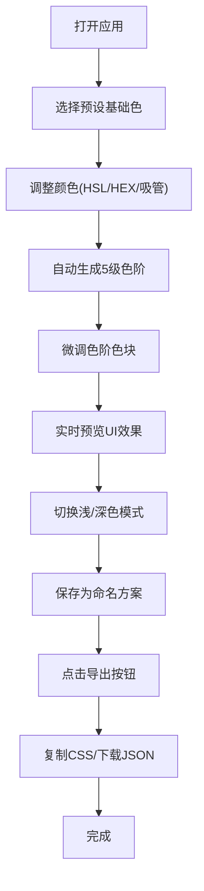

## 1. 产品概述

色彩主题生成工具是一款面向设计师和前端开发者的在线工具，帮助用户通过拖拽和配置快速生成并导出自定义色彩主题，包含主色、辅助色、背景色、文字色及对应的浅色/深色变体。解决设计师在项目初期需要在多个设计软件中反复调整色彩方案、缺乏实时预览和标准化变量导出的痛点。

- 目标用户：UI/UX设计师、前端开发者、产品经理
- 核心价值：快速生成专业级色彩系统，实时预览效果，一键导出标准化变量文件

## 2. 核心功能

### 2.1 用户角色
| 角色 | 注册方式 | 核心权限 |
|------|----------|----------|
| 普通用户 | 无需注册 | 使用所有编辑、预览、导出功能，本地保存方案 |

### 2.2 功能模块
1. **色彩方案编辑器**：左侧色板、中央色阶条、颜色拾取器
2. **实时预览面板**：微型UI界面预览、浅/深色模式切换
3. **主题配置导出**：CSS变量导出、JSON文件下载
4. **多方案管理**：方案保存、切换、拖拽排序

### 2.3 页面详情
| 页面名称 | 模块名称 | 功能描述 |
|----------|----------|----------|
| 主应用页面 | 左侧色板 | 展示10种预设基础色相，点击选中并弹出拾色器，下方展示方案列表 |
| 主应用页面 | 中央编辑区 | 展示选中颜色的5级色阶条，支持单独微调每个色块，顶部放置导出按钮 |
| 主应用页面 | 右侧预览面板 | 展示应用当前主题的微型UI，支持浅/深色背景切换 |
| 导出模态框 | 导出功能 | 展示CSS变量和JSON格式，支持一键复制和下载 |

## 3. 核心流程

用户打开应用 → 从左侧预设色板选择基础色 → 通过拾色器调整HSL/十六进制/吸管取色 → 自动生成5级色阶 → 单独微调色阶中的色块 → 右侧预览面板实时更新效果 → 切换浅/深色模式预览 → 保存当前配置为命名方案 → 点击导出按钮 → 复制CSS变量或下载JSON文件 → 完成。

## 4. 用户界面设计

### 4.1 设计风格
- **主色调**：深色主题，主背景#1a1a2e，辅助背景#16213e
- **配色编辑区**：半透明毛玻璃效果的浅色模态
- **按钮风格**：使用当前配置的主色，悬停时上浮效果(transform: translateY(-2px) + box-shadow)，圆角8px
- **字体**：现代无衬线字体，标题使用较粗字重，正文适中
- **布局风格**：三栏布局 - 左侧色板(240px固定) + 中央编辑区(弹性) + 右侧预览(360px固定)
- **动画**：所有交互300ms ease-in-out平滑过渡，色阶渐变动画，交叉淡入淡出

### 4.2 页面设计概述
| 页面名称 | 模块名称 | UI元素 |
|----------|----------|--------|
| 主应用页面 | 左侧色板 | 10个垂直排列的彩色方块，每个色块显示颜色名称，选中状态有高亮边框 |
| 主应用页面 | 中央色阶条 | 5个水平排列的色块，显示色阶名称(浅色变体、浅色、主色、深色、深色变体)，每个色块可点击 |
| 主应用页面 | 拾色器面板 | HSL三个滑块、十六进制输入框、吸管取色按钮、实时颜色预览 |
| 主应用页面 | 预览面板 | 包含按钮、标题、正文、卡片、输入框的微型UI，底部有切换开关 |
| 主应用页面 | 方案列表 | 可拖拽排序的方案卡片，显示名称和缩略色，从底部滑入动画 |
| 导出模态框 | 导出界面 | CSS代码块、JSON代码块、复制按钮(闪光反馈)、下载按钮 |

### 4.3 响应式
- 桌面端(≥1024px)：三栏布局，左侧240px + 中央弹性 + 右侧360px
- 平板/移动端(<1024px)：预览面板折叠到底部，变为上下布局，色板和编辑区保持左右布局
- 触控优化：增大点击区域，滑块支持触控拖动

### 4.4 视觉细节
- 毛玻璃效果：`backdrop-filter: blur(12px)` + 半透明背景
- 阴影层次：多层box-shadow营造深度感
- 色彩过渡：所有颜色变化使用300ms ease-in-out过渡
- 微交互：按钮悬停上浮，色块点击缩放反馈，复制成功闪光动画
