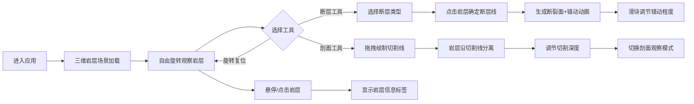

## 1. 产品概述

交互式地质断层与岩层构造展示应用，为地质教学、科研和科普提供沉浸式三维可视化工具，帮助用户直观理解岩层分布、断层类型和地质构造运动。

- 面向地质专业学生、教师、研究人员及地质爱好者
- 解决传统二维图示难以表达三维地质构造的痛点
- 核心价值：交互式、可视化、可探索的地质构造学习体验

## 2. 核心功能

### 2.1 用户角色
| 角色 | 注册方式 | 核心权限 |
|------|---------|----------|
| 普通用户 | 无需注册 | 浏览岩层、操作断层动画、使用剖面切割工具、查看岩层信息 |

### 2.2 功能模块
1. **主场景页面**：三维岩层可视化、轨道控制视角切换
2. **断层交互系统**：断层类型选择、断层线绘制、错动动画演示
3. **剖面切割工具**：任意方向切割、内部结构展示、深度调节
4. **信息展示系统**：岩层信息悬浮标签、图例面板、状态指示

### 2.3 页面详情
| 页面名称 | 模块名称 | 功能描述 |
|---------|---------|----------|
| 主场景页面 | 三维岩层渲染 | 多层半透明彩色岩层堆叠，带噪声凹凸纹理 |
| 主场景页面 | 轨道相机控制 | 平滑阻尼旋转、缩放、平移，略微俯视初始视角 |
| 主场景页面 | 图例面板 | 左上角固定显示岩层颜色对应关系及当前状态 |
| 主场景页面 | 悬浮标签 | 点击/悬停显示岩层名称、厚度、年代、矿物成分 |
| 断层交互系统 | 断层类型选择 | 正断层、逆断层、平移断层三种模式切换 |
| 断层交互系统 | 断层线绘制 | 点击岩层表面确定断层位置，红色虚线标识 |
| 断层交互系统 | 错动动画 | 3秒持续动画，粒子效果，滑块控制错动程度 |
| 剖面切割工具 | 切割线绘制 | 拖拽直线确定切割位置和方向 |
| 剖面切割工具 | 深度调节 | 滑块控制切割深度，实时更新剖面 |
| 剖面切割工具 | 观察模式切换 | 透视模式/剖面模式，剖面边缘光晕效果 |

## 3. 核心流程

用户打开应用后，首先看到三维岩层场景，可自由旋转观察。选择断层工具后点击岩层确定断层位置，系统自动生成断裂面并播放错动动画，过程中可通过滑块调节错动程度。切换剖面工具后，在岩层表面拖拽绘制切割线，岩层沿该线被切开，可旋转观察内部结构，切换剖面模式聚焦查看。整个过程中，悬停或点击任意岩层可查看详细地质信息。

## 4. 用户界面设计

### 4.1 设计风格
- **设计基调**：深色专业科学风格，营造沉浸式地质探索氛围
- **主背景色**：#0f0f1a 深空蓝黑
- **强调色**：#ff6b6b 断层红、#4ecdc4 剖面青、#ffe66d 交互高亮
- **岩层配色**：沉积岩暖黄(#d4a574)、火成岩灰红(#8b4513)、变质岩深绿(#2d5016)
- **按钮样式**：圆角矩形，半透明毛玻璃背景(backdrop-filter: blur(10px))，边框微弱发光
- **字体**：显示字体用 'Orbitron' 科技感字体，正文字体用 'JetBrains Mono' 等宽字体
- **布局**：左侧窄工具栏(60px宽)，右侧浮动画板(320px宽)，中间全宽3D场景
- **图标风格**：线性简约SVG图标，悬停时填充渐变

### 4.2 页面设计概述
| 页面名称 | 模块名称 | UI元素 |
|---------|---------|--------|
| 主场景页面 | 左侧工具栏 | 3个工具按钮（断层、剖面、复位），图标+文字提示，悬停过渡 |
| 主场景页面 | 右侧参数面板 | 断层类型单选、错动滑块、深度调节、模式切换，圆角滑块 |
| 主场景页面 | 左上角图例 | 彩色方块+岩层名称，当前断层类型和错动百分比 |
| 主场景页面 | 悬浮标签 | 渐变背景(从#1a1a2e到#16213e)，圆角，投影，指向箭头 |
| 主场景页面 | 断层线 | 红色虚线动画，边缘发光效果 |
| 主场景页面 | 剖面边缘 | 半透明青蓝色光晕，呼吸灯效果 |
| 主场景页面 | 汉堡菜单 | 窄屏时(<1024px)面板折叠，点击展开 |

### 4.3 响应式
- **桌面优先**：最低支持宽度1024px，标准分辨率1920×1080
- **窄屏适配**：宽度<1024px时，右侧面板折叠为汉堡菜单，工具栏保持可见
- **触控优化**：移动端支持双指缩放、单指旋转，按钮最小触控区域48px
- **动态适配**：面板宽度随屏幕宽度动态调整，最大不超过屏幕宽度的25%

### 4.4 3D场景指导
- **环境氛围**：深色星空背景，微弱雾效(fog: #0f0f1a, near: 200, far: 1500)
- **光照设置**：半球光(sky: #87ceeb, ground: #2d2d44, intensity: 0.6) + 两盏方向光(主光强度1.0，补光强度0.4)
- **相机设置**：PerspectiveCamera(fov: 60, near: 0.1, far: 5000)，初始位置(300, 250, 300)，lookAt(0, 0, 0)
- **轨道控制**：enableDamping: true, dampingFactor: 0.05, minDistance: 100, maxDistance: 800
- **岩层材质**：MeshPhysicalMaterial，透明(transparent: true)，opacity: 0.85，roughness: 0.7，metalness: 0.1
- **断层材质**：断裂面用 emissive 材质，微弱自发光，碎石粒子用 Points 系统
- **剖面材质**：切割面显示内部颜色，边缘用 LineSegments 绘制光晕
- **后处理**：轻微Bloom效果(strength: 0.3)，抗锯齿(MSAA 4x)
- **性能预算**：总三角形数<12000，draw call<20，FPS>30，粒子数<500

