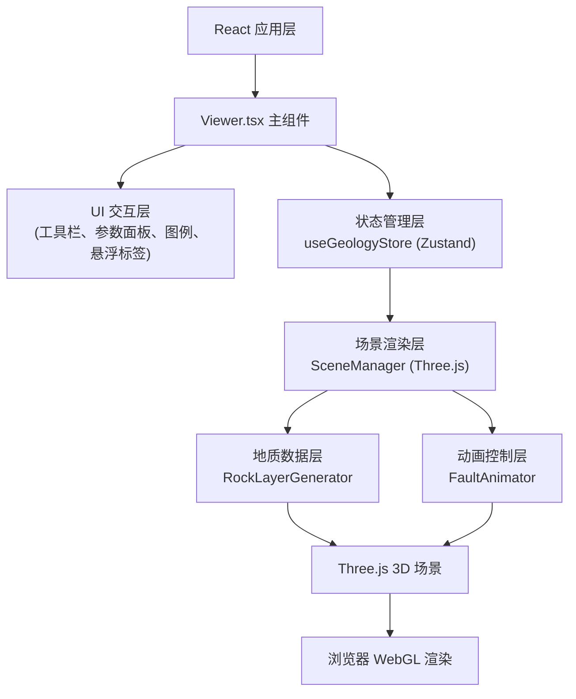

## 1. 架构设计



## 2. 技术描述

- **前端框架**: React 18 + TypeScript 5
- **构建工具**: Vite 5
- **3D引擎**: Three.js 0.160
- **状态管理**: Zustand 4
- **开发语言**: TypeScript (严格模式 strict: true)
- **样式方案**: CSS Modules + 内联样式
- **初始化方式**: 手动配置项目结构，不使用脚手架
- **后端**: 无后端，纯前端应用
- **数据来源**: 程序化生成地质数据（RockLayerGenerator）

## 3. 目录结构

```
auto103/
├── package.json
├── index.html
├── vite.config.ts
├── tsconfig.json
├── src/
│   ├── main.tsx
│   ├── components/
│   │   └── Viewer.tsx
│   ├── scene/
│   │   └── SceneManager.ts
│   ├── geology/
│   │   ├── RockLayerGenerator.ts
│   │   └── FaultAnimator.ts
│   └── store/
│       └── useGeologyStore.ts
└── .trae/
    └── documents/
        ├── PRD.md
        └── TECH-ARCHITECTURE.md
```

## 4. 核心模块职责

### 4.1 SceneManager.ts (场景管理器)
```typescript
class SceneManager {
  scene: THREE.Scene
  camera: THREE.PerspectiveCamera
  renderer: THREE.WebGLRenderer
  controls: OrbitControls
  raycaster: THREE.Raycaster
  mouse: THREE.Vector2
  
  init(container: HTMLElement): void
  animate(): void
  addLayer(mesh: THREE.Mesh): void
  removeLayer(mesh: THREE.Mesh): void
  getIntersects(event: MouseEvent): THREE.Intersection[]
  resetCamera(): void
  resize(): void
  dispose(): void
}
```

### 4.2 RockLayerGenerator.ts (岩层生成器)
```typescript
interface RockLayerConfig {
  type: 'sedimentary' | 'igneous' | 'metamorphic'
  thickness: number
  yPosition: number
  color: number
  size: { width: number; depth: number }
}

interface LayerData {
  geometry: THREE.BufferGeometry
  material: THREE.MeshPhysicalMaterial
  info: RockLayerInfo
}

class RockLayerGenerator {
  static generateLayers(count: number): LayerData[]
  static createLayerGeometry(config: RockLayerConfig): THREE.BufferGeometry
  static createLayerMaterial(type: string, color: number): THREE.MeshPhysicalMaterial
  static applyNoiseDisplacement(geometry: THREE.BufferGeometry, intensity: number): void
  static generateTexture(type: string): THREE.CanvasTexture
}
```

### 4.3 FaultAnimator.ts (断层动画器)
```typescript
type FaultType = 'normal' | 'reverse' | 'strike-slip'

interface FaultConfig {
  type: FaultType
  position: THREE.Vector3
  direction: THREE.Vector3
  displacement: number
}

class FaultAnimator {
  scene: THREE.Scene
  layers: THREE.Mesh[]
  faultLine: THREE.Line
  particles: THREE.Points
  isAnimating: boolean
  currentProgress: number
  
  createFaultLine(start: THREE.Vector3, end: THREE.Vector3): void
  startAnimation(duration: number, onComplete?: () => void): void
  setProgress(progress: number): void
  reset(): void
  createDebrisParticles(count: number): THREE.Points
  updateParticles(delta: number): void
}
```

### 4.4 useGeologyStore.ts (状态管理)
```typescript
interface GeologyState {
  activeTool: 'none' | 'fault' | 'section'
  faultType: 'normal' | 'reverse' | 'strike-slip'
  displacementAmount: number
  sectionMode: 'perspective' | 'section'
  sectionDepth: number
  layerVisibility: Record<string, boolean>
  hoveredLayer: string | null
  selectedFaultPosition: THREE.Vector3 | null
  sectionLine: { start: THREE.Vector2; end: THREE.Vector2 } | null
  isPanelCollapsed: boolean
  
  setActiveTool(tool: string): void
  setFaultType(type: string): void
  setDisplacementAmount(amount: number): void
  setSectionMode(mode: string): void
  setSectionDepth(depth: number): void
  toggleLayerVisibility(layerId: string): void
  setHoveredLayer(layerId: string | null): void
  setSelectedFaultPosition(pos: THREE.Vector3 | null): void
  setSectionLine(line: object | null): void
  togglePanel(): void
  resetAll(): void
}
```

### 4.5 Viewer.tsx (主组件)
```typescript
const Viewer: React.FC = () => {
  const containerRef = useRef<HTMLDivElement>(null)
  const sceneManager = useRef<SceneManager>(null)
  const faultAnimator = useRef<FaultAnimator>(null)
  const store = useGeologyStore()
  
  // 生命周期
  useEffect(() => {
    // 初始化场景
    // 生成岩层
    // 绑定事件
  }, [])
  
  // 事件处理
  const handleMouseMove = useCallback(...)
  const handleClick = useCallback(...)
  const handleToolSelect = useCallback(...)
  
  return (
    <div className="viewer-container">
      <div ref={containerRef} className="canvas-container" />
      <Toolbar />
      <ParameterPanel />
      <Legend />
      <FloatingLabel />
    </div>
  )
}
```

## 5. 数据模型

### 5.1 岩层数据模型
```typescript
interface RockLayerInfo {
  id: string
  type: 'sedimentary' | 'igneous' | 'metamorphic'
  name: string
  thickness: number
  age: string
  minerals: string[]
  color: number
}
```

### 5.2 断层数据模型
```typescript
interface FaultData {
  id: string
  type: 'normal' | 'reverse' | 'strike-slip'
  typeName: string
  startPoint: THREE.Vector3
  endPoint: THREE.Vector3
  dipAngle: number
  displacement: number
  hangingWall: string[]
  footWall: string[]
}
```

### 5.3 剖面数据模型
```typescript
interface SectionData {
  id: string
  startPoint: THREE.Vector2
  endPoint: THREE.Vector2
  depth: number
  cutLayers: string[]
}
```

## 6. 性能优化策略

1. **几何优化**：每层使用 PlaneGeometry(64, 64)，三角形数约8192/层，6层总计<50000
2. **实例化渲染**：碎石粒子使用 InstancedBufferGeometry
3. **材质复用**：同类型岩层共享材质实例
4. **视锥体剔除**：Three.js 自动视锥体剔除
5. **LOD控制**：远距离降低岩层细分
6. **事件节流**：鼠标移动事件使用 requestAnimationFrame 节流
7. **状态更新优化**：Zustand 使用 selector 避免不必要重渲染
8. **内存管理**：组件卸载时调用 dispose() 释放 Three.js 资源

## 7. 关键技术实现

### 7.1 噪声位移算法 (Simplex Noise)
```typescript
function applyNoiseDisplacement(geometry, intensity) {
  const positions = geometry.attributes.position
  for (let i = 0; i < positions.count; i++) {
    const x = positions.getX(i)
    const y = positions.getY(i)
    const z = positions.getZ(i)
    const noise = simplex.noise2D(x * 0.01, z * 0.01) * intensity
    positions.setY(i, y + noise)
  }
  positions.needsUpdate = true
  geometry.computeVertexNormals()
}
```

### 7.2 贝塞尔曲线缓动动画
```typescript
function easeInOutCubic(t) {
  return t < 0.5 ? 4 * t * t * t : 1 - Math.pow(-2 * t + 2, 3) / 2
}
```

### 7.3 剖面切割算法 (Stencil Buffer + CSG)
使用 Three.js 的 clippingPlanes 功能实现实时剖面切割，避免复杂的网格布尔运算。

