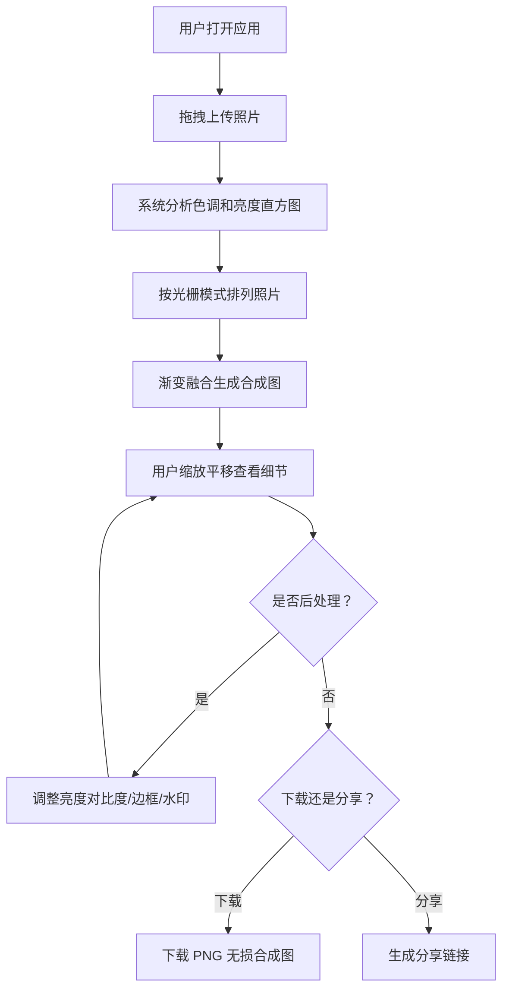

## 1. 产品概述

光栅相册是一个浏览器端的照片拼合工具，用户上传一组照片后，系统自动分析色调和亮度，按光栅模式排列并渐变融合，生成高分辨率合成图，支持在线分享和下载。

- 目标用户：摄影爱好者、设计师、社交媒体创作者
- 核心价值：将零散照片快速转化为一幅具有艺术感的光栅拼合作品，无需专业设计软件

## 2. 核心功能

### 2.1 用户角色

| 角色 | 注册方式 | 核心权限 |
|------|----------|----------|
| 普通用户 | 无需注册 | 上传照片、拼合、后处理、下载、分享 |

### 2.2 功能模块

1. **主页面**：照片上传、缩略图预览、光栅拼合、后处理、分享下载

### 2.3 页面详情

| 页面名称 | 模块名称 | 功能描述 |
|----------|----------|----------|
| 主页面 | 上传面板 | 拖拽区域上传照片（jpg/png/webp），每张显示缩略图和加载进度条，上传完成后右侧显示缩略图网格列表，点击单张预览大图（淡入动画） |
| 主页面 | 网格设置 | 滑块调节光栅行列数（2x2 到 6x6，默认 3x3），实时更新拼合布局 |
| 主页面 | Canvas 预览 | 渲染拼合合成图，鼠标滚轮缩放（跟随鼠标位置），拖拽平移画布（平滑滚动） |
| 主页面 | 后处理面板 | 调整整体亮度对比度、添加纯色/渐变色边框（宽度 10-50px）、添加水印文字（字体、大小、透明度、旋转角度），实时预览刷新 |
| 主页面 | 分享下载 | 一键下载 PNG 无损合成图，生成分享链接（URL 携带图片数据和参数配置） |

## 3. 核心流程

用户打开应用 → 拖拽上传照片 → 系统自动分析色调和亮度直方图 → 按光栅模式排列照片 → 渐变融合生成合成图 → 用户缩放平移查看细节 → 可选后处理（亮度对比度/边框/水印） → 下载或分享

## 4. 用户界面设计

### 4.1 设计风格

- 主色调：暖橙 #e94560 + 冷白 #f5f5f5
- 背景：深色模式，#1a1a2e 到 #16213e 渐变
- 按钮：柔角圆角 8px，悬停时轻微上浮阴影和颜色加深动画
- 弹出菜单/面板：缩放+淡入动画（0.25s ease-out）
- 字体：Display 选用 Orbitron（科技感几何风），Body 选用 Noto Sans SC
- 图标：lucide-react
- 布局：左侧上传+设置面板，中央 Canvas 预览区，右侧后处理面板

### 4.2 页面设计概览

| 页面名称 | 模块名称 | UI 元素 |
|----------|----------|---------|
| 主页面 | 上传面板 | 拖拽虚线框、缩略图网格（窄屏 2 列自适应）、进度条、大图预览弹窗（淡入动画） |
| 主页面 | 网格设置 | 行数/列数滑块（2-6）、当前值显示、实时预览 |
| 主页面 | Canvas 预览 | 深色背景画布、缩放提示、鼠标交互（滚轮/拖拽） |
| 主页面 | 后处理面板 | 亮度/对比度滑块、边框类型选择（纯色/渐变）、边框宽度滑块、水印文字输入、字体/大小/透明度/旋转角度控制 |
| 主页面 | 分享下载 | 下载按钮（PNG）、分享链接生成按钮、链接复制提示 |

### 4.3 响应式设计

- 桌面优先设计，三栏布局
- 窄屏下缩略图网格自动变为 2 列
- 面板可折叠，Canvas 预览区自适应宽度
- 触屏设备支持触摸缩放和拖拽

### 4.4 性能目标

- 200 张以内照片（每张 ≤ 5MB）上传后拼合操作响应时间 ≤ 3 秒
- 拼合后预览缩放拖拽保持 60fps
- 图像处理全部在浏览器端 Canvas API 完成，后端不存原始图
