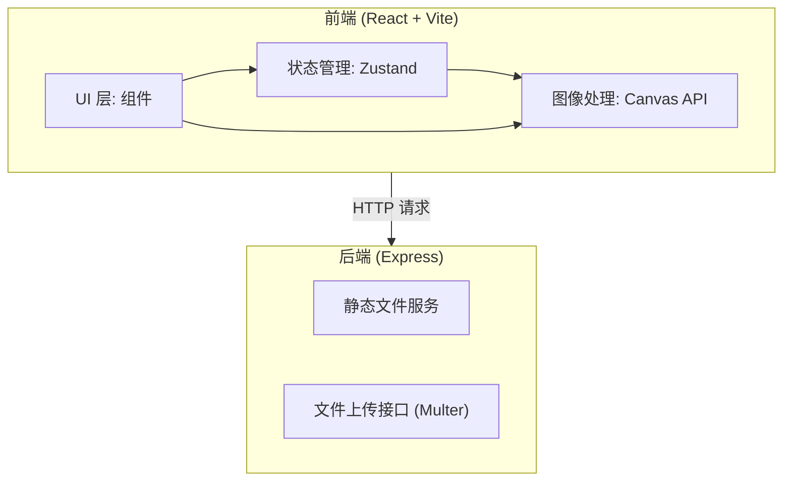

## 1. 架构设计



## 2. 技术说明

- 前端：React@18 + TypeScript + Vite + Tailwind CSS + Zustand
- 初始化工具：vite-init (react-express-ts 模板)
- 后端：Express@4 + Multer + CORS
- 图像处理：浏览器端 Canvas API（色调分析、直方图计算、拼合渲染、融合过渡、后处理滤镜）
- 无数据库：图片数据存储在客户端状态和 URL 参数中

## 3. 路由定义

| 路由 | 用途 |
|------|------|
| / | 主页面，包含上传、拼合、预览、后处理、分享下载 |

## 4. API 定义

| 接口 | 方法 | 用途 | 请求 | 响应 |
|------|------|------|------|------|
| /api/upload | POST | 上传图片文件 | multipart/form-data, file 字段 | { url: string, id: string } |

### TypeScript 类型定义

```typescript
interface PhotoItem {
  id: string
  file: File
  url: string
  thumbnail: string
  avgColor: [number, number, number]
  brightness: number
  histogram: number[][]
}

interface GridSettings {
  rows: number
  cols: number
}

interface PostProcessSettings {
  brightness: number
  contrast: number
  borderWidth: number
  borderType: 'solid' | 'gradient'
  borderColor: string
  borderGradientEnd: string
  watermarkText: string
  watermarkFont: string
  watermarkSize: number
  watermarkOpacity: number
  watermarkRotation: number
}

interface MosaicState {
  photos: PhotoItem[]
  gridSettings: GridSettings
  postProcess: PostProcessSettings
  compositeImage: ImageData | null
}
```

## 5. 项目文件结构

```
├── package.json
├── index.html
├── vite.config.ts
├── tsconfig.json
├── server/
│   └── index.ts
├── src/
│   ├── main.tsx
│   ├── App.tsx
│   ├── store/
│   │   └── photoStore.ts
│   ├── utils/
│   │   └── imageProcessor.ts
│   └── components/
│       ├── UploadPanel.tsx
│       ├── GridSettings.tsx
│       ├── CanvasPreview.tsx
│       ├── PostProcessingPanel.tsx
│       └── ShareDownload.tsx
```

## 6. 关键技术方案

### 6.1 图像处理流程

1. **色调分析**：将图片绘制到临时 Canvas，遍历像素计算平均 RGB 值
2. **亮度直方图**：计算每个像素亮度值 (0.299R + 0.587G + 0.114B)，统计 256 级直方图
3. **光栅排列**：按网格行列数将照片排列到合成 Canvas 上
4. **渐变融合**：相邻照片边缘 20px 区域，按距离权重混合两侧像素颜色
5. **纸张纹理**：叠加微弱噪声纹理，模拟印刷品质感
6. **后处理滤镜**：亮度对比度调整、边框绘制、水印文字渲染

### 6.2 性能优化

- 大图处理使用 OffscreenCanvas 或 Web Worker 避免阻塞 UI
- 缩放平移使用 requestAnimationFrame 确保 60fps
- 缩略图生成时限制尺寸，减少内存占用
- Canvas 渲染使用脏区域更新策略
