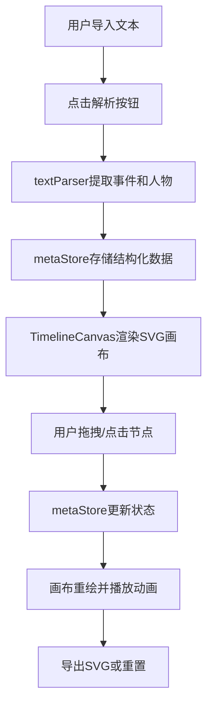

## 1. 产品概述

文本叙事时间线交互编辑器是一款面向文学爱好者的可视化工具，帮助用户在阅读长篇文本时，通过交互式时间线梳理关键事件、人物关系和情节脉络。

- 核心价值：将线性文本转化为可视化的时间线和关系图谱，降低长篇叙事作品的理解门槛
- 目标用户：文学爱好者、学生、作家、文学研究者
- 主要功能：文本导入与自动解析、时间线生成与编辑、人物关系图谱、节点标注、缩放导航、导出分享

## 2. 核心功能

### 2.1 功能模块

1. **文本导入与解析模块**：支持拖拽/点击上传txt/md文件、直接粘贴文本、关键词匹配与事件提取
2. **时间线编辑模块**：水平时间线展示、节点拖拽排序、弹性跟随动画、双击编辑弹窗
3. **人物关系图谱模块**：人物节点按参与度缩放、关系连线粗细表示共同事件次数、流动箭头动画、点击高亮联动
4. **画布导航模块**：滚轮缩放(0.5x-3x)、鼠标平移、时间范围标签跳转、文字自适应缩放
5. **导出与重置模块**：SVG图片导出、重置确认弹窗、动画过渡效果

### 2.2 页面详情

| 页面名称 | 模块名称 | 功能描述 |
|-----------|-------------|---------------------|
| 主编辑器页面 | 左侧控制面板 | 文本导入按钮、文本编辑区、事件卡片列表、配置参数滑块 |
| 主编辑器页面 | 中央SVG画布 | 时间线渲染、人物关系图切换、节点交互、缩放平移 |
| 主编辑器页面 | 右侧折叠面板 | 导出按钮、重置按钮、视图切换选项 |
| 主编辑器页面 | 编辑弹窗 | 节点标题编辑、关联人物管理、时间戳调整、保存/取消 |
| 主编辑器页面 | 确认弹窗 | 重置确认、删除确认、缩放弹入动画 |

## 3. 核心流程

用户导入或粘贴文本 → 点击解析按钮 → 文本解析模块提取事件与人物 → 状态管理存储结构化数据 → SVG画布渲染时间线 → 用户拖拽/点击交互 → 状态更新触发重绘 → 导出SVG或重置数据

## 4. 用户界面设计

### 4.1 设计风格

**色彩方案**：
- 主背景：米白色(#faf6f0)浅色渐变
- 画布背景：浅灰色(#f0ecec)
- 主色调：浅橙色(#e8a87c)、浅棕色(#8b7355)、暗红色(#8b4557)点缀
- 节点色：根据人物归属分配不同色相的柔和色系
- 文字：深灰(#3d3d3d)、次要文字(#6b6b6b)

**排版**：
- 字体：Segoe UI, Roboto, 无衬线系统字体
- 标题字号：18px-24px，正文：14px，标签：12px
- 行高：1.5-1.6，字重：标题600，正文400

**组件风格**：
- 按钮：圆角8px，悬停阴影加深，0.3s过渡
- 卡片：白色背景+微妙阴影，圆角12px
- 弹窗：毛玻璃半透明背景(backdrop-filter: blur(12px))，缩放弹入动画
- 节点：圆形30px直径，柔和阴影，人物标签半透明圆角矩形

**动画规范**：
- 通用过渡：CSS transition 0.3s ease
- 弹窗出现：缩放+淡入 0.25s
- 节点添加/删除：渐变动画 0.5s
- 拖拽跟随：弹性缓动效果
- 连线流动：箭头位移动画 1.5s循环

### 4.2 页面设计概览

| 页面名称 | 模块名称 | UI元素 |
|-----------|-------------|-------------|
| 主编辑器页面 | 左侧控制面板 | 固定宽度320px，浅色背景，垂直分隔线，滚动区域，事件卡片列表 |
| 主编辑器页面 | SVG画布 | 占满剩余空间，浅灰背景，时间轴，圆形节点，人物标签，关系连线 |
| 主编辑器页面 | 右侧面板 | 默认收起，悬停展开按钮，功能按钮垂直排列 |
| 主编辑器页面 | 编辑弹窗 | 居中显示，毛玻璃背景，表单输入，保存取消按钮 |

### 4.3 响应式设计

- **桌面端(≥1024px)**：左侧固定320px面板，中央画布，右侧可折叠面板
- **平板端(<1024px)**：左侧面板变为可折叠抽屉，画布占满剩余宽度
- **移动端(<768px)**：所有弹窗和菜单改为全屏覆盖，底部工具栏替代侧边面板
- **触摸优化**：节点点击区域≥44px，支持双指缩放和平移

### 4.4 视觉层次与动效

**页面加载动效**：
1. 画布背景淡入(0.5s)
2. 左侧面板从左滑入(0.4s ease-out)
3. 时间轴基线绘制动画(0.8s)
4. 节点按顺序弹性出现(每个延迟0.1s)
5. 人物标签淡入(0.3s延迟)

**交互动效**：
- 节点悬停：轻微放大(1.1x)+阴影加深
- 节点拖拽：透明度降至0.8，跟随光标
- 节点释放：弹性回归目标位置
- 人物高亮：非相关节点淡出至0.3透明度
- 连线流动：虚线箭头沿路径循环移动
