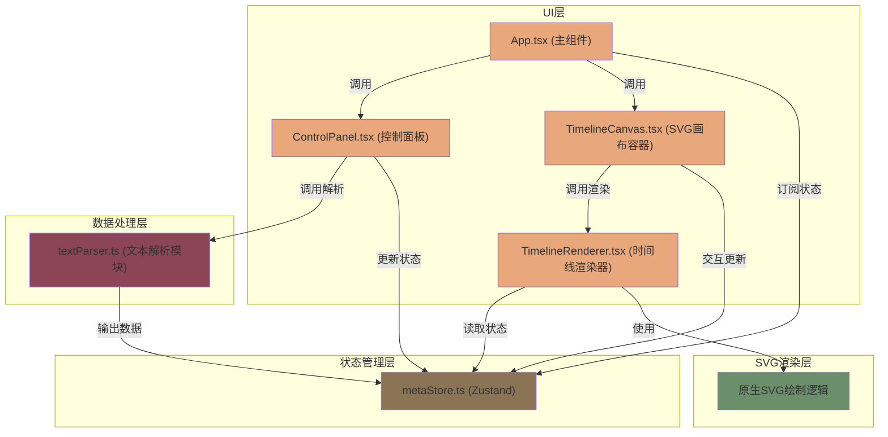
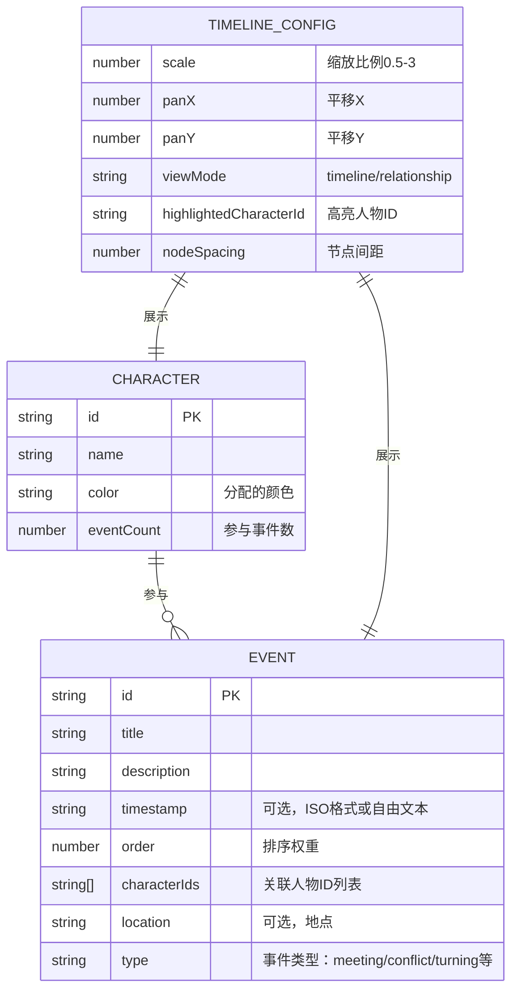

## 1. 架构设计



**数据流向**：
1. 用户输入文本 → ControlPanel → textParser解析 → metaStore存储
2. metaStore状态变化 → TimelineRenderer响应式重绘
3. 用户交互(拖拽/点击) → TimelineCanvas → metaStore更新 → 触发重绘

**文件调用关系**：
```
src/
├── main.tsx → 渲染App.tsx
├── App.tsx → 调用metaStore, TimelineRenderer, ControlPanel
├── modules/
│   └── textParser.ts → 纯函数模块，无依赖，供ControlPanel调用
├── stores/
│   └── metaStore.ts → Zustand store，供所有组件订阅
└── components/
    ├── ControlPanel.tsx → 调用textParser和metaStore actions
    ├── TimelineCanvas.tsx → 调用TimelineRenderer，处理交互
    └── TimelineRenderer.tsx → 订阅metaStore，SVG渲染逻辑
```

## 2. 技术描述

- **前端框架**：React@18 + TypeScript@5
- **构建工具**：Vite@5 + @vitejs/plugin-react@4
- **状态管理**：Zustand@4（轻量级，避免redux样板代码）
- **唯一ID生成**：uuid@9
- **不使用**：
  - 第三方NLP库（文本解析基于正则和关键词匹配）
  - 第三方图表库（使用原生SVG绘制）
  - UI组件库（自定义组件符合设计规范）

## 3. 数据模型

### 3.1 核心类型定义



### 3.2 TypeScript类型定义

```typescript
// src/types/index.ts
export interface Character {
  id: string;
  name: string;
  color: string;
  eventCount: number;
}

export interface EventNode {
  id: string;
  title: string;
  description: string;
  timestamp: string | null;
  order: number;
  characterIds: string[];
  location: string | null;
  type: 'default' | 'meeting' | 'conflict' | 'turning' | 'ending';
}

export interface Relationship {
  characterId1: string;
  characterId2: string;
  eventCount: number;
}

export interface TimelineConfig {
  scale: number;
  panX: number;
  panY: number;
  viewMode: 'timeline' | 'relationship';
  highlightedCharacterId: string | null;
  selectedEventId: string | null;
  nodeSpacing: number;
}

export interface ParseResult {
  events: EventNode[];
  characters: Character[];
  relationships: Relationship[];
}

export interface MetaState {
  rawText: string;
  events: EventNode[];
  characters: Character[];
  relationships: Relationship[];
  config: TimelineConfig;
  isParsing: boolean;
  parseError: string | null;
}
```

## 4. 模块职责与API

### 4.1 textParser模块 (src/modules/textParser.ts)

**纯函数模块，无副作用，无外部依赖**

```typescript
// 核心API
export function parseText(rawText: string): ParseResult

// 内部辅助函数
function extractDates(text: string): Array<{text: string, index: number}>
function extractCharacters(text: string, existing?: Character[]): Character[]
function extractEvents(text: string, characters: Character[]): EventNode[]
function extractRelationships(events: EventNode[]): Relationship[]
function assignColorToCharacter(index: number): string
```

**解析规则**：
- 时间匹配：正则匹配`(\d{4}年\d{1,2}月\d{1,2}日|第.{1,5}章|春|夏|秋|冬|清晨|傍晚|深夜)`等模式
- 人物匹配：匹配`"[\u4e00-\u9fa5]{2,4}(?:·[\u4e00-\u9fa5]{2,4})*"`加上称谓(先生/女士/小姐/伯爵/国王等)
- 事件触发词：`发生了|出现了|遇到|决定|开始|结束|因此|后来|与此同时`等
- 地点匹配：`在[\u4e00-\u9fa5]{2,10}(?:公园|城堡|森林|城市|村庄|宫殿)`

**性能约束**：文本长度<10000字时，解析时间<1000ms

### 4.2 metaStore模块 (src/stores/metaStore.ts)

```typescript
// Actions
export const useMetaStore = create<MetaState & Actions>((set, get) => ({
  // 文本操作
  setRawText: (text: string) => set({ rawText: text }),
  parseText: () => { /* 调用textParser，更新状态 */ },
  
  // 事件操作
  addEvent: (event: Omit<EventNode, 'id'>) => { /* 生成ID，添加 */ },
  updateEvent: (id: string, updates: Partial<EventNode>) => { /* 合并更新 */ },
  deleteEvent: (id: string) => { /* 删除事件，更新人物计数 */ },
  moveEvent: (id: string, newOrder: number) => { /* 重新排序 */ },
  
  // 人物操作
  addCharacter: (name: string) => { /* 去重，分配颜色 */ },
  updateCharacter: (id: string, updates: Partial<Character>) => { /* 更新 */ },
  deleteCharacter: (id: string) => { /* 删除，从事件中移除 */ },
  
  // 视图操作
  setScale: (scale: number) => { /* clamp在0.5-3 */ },
  setPan: (x: number, y: number) => set({ config: { ...get().config, panX: x, panY: y } }),
  setViewMode: (mode: 'timeline' | 'relationship') => set({ /* ... */ }),
  setHighlightedCharacter: (id: string | null) => set({ /* ... */ }),
  setSelectedEvent: (id: string | null) => set({ /* ... */ }),
  
  // 重置
  reset: () => set(initialState),
}))
```

### 4.3 TimelineRenderer模块 (src/components/TimelineRenderer.tsx)

**SVG渲染层，纯函数组件，订阅metaStore**

```typescript
// 内部渲染函数
function renderTimeline(events: EventNode[], characters: Character[], config: TimelineConfig): JSX.Element
function renderRelationshipGraph(characters: Character[], relationships: Relationship[], config: TimelineConfig): JSX.Element
function renderEventNode(event: EventNode, x: number, y: number, character: Character, scale: number): JSX.Element
function renderCharacterNode(character: Character, x: number, y: number, scale: number): JSX.Element
function renderRelationshipLine(rel: Relationship, x1: number, y1: number, x2: number, y2: number): JSX.Element
```

**坐标计算**：
- 时间线X坐标：`baseX + (event.order - minOrder) * nodeSpacing * scale`
- 时间线Y坐标：`baseY`（固定水平线）
- 关系图坐标：按圆形布局，`angle = 2π * index / count`

**动画实现**：
- 使用CSS transition属性：`transition: all 0.3s ease`
- 节点出现：`opacity: 0 → 1; transform: scale(0.5 → 1)`
- 节点删除：`opacity: 1 → 0; transform: scale(1 → 0)`
- 连线流动：`stroke-dasharray: 8 4; animation: flow 1.5s linear infinite`

## 5. 性能优化策略

### 5.1 渲染性能

- **Memoization**：使用`React.memo`包装TimelineRenderer和子组件
- **选择器优化**：使用Zustand的`useShallow`选择器，避免不必要重渲染
- **批量更新**：拖拽操作使用`requestAnimationFrame`节流
- **虚拟化**：事件卡片列表使用`IntersectionObserver`懒渲染

### 5.2 SVG性能

- **避免重绘**：使用`<g>`元素分组，只更新变化的节点
- **CSS动画优先**：transform和opacity动画由GPU加速
- **事件委托**：在SVG根元素上监听事件，通过`event.target`识别节点
- **离屏渲染**：复杂图形先绘制到DocumentFragment

### 5.3 解析性能

- **单次遍历**：文本只扫描一次，同时提取所有模式
- **正则预编译**：所有正则表达式在模块加载时编译
- **早期终止**：达到200个节点上限时停止解析
- **缓存机制**：相同文本不重复解析

## 6. 可访问性与国际化

- ARIA标签：所有交互元素添加`aria-label`和`role`
- 键盘导航：支持Tab切换节点，Enter编辑，Delete删除
- 颜色对比度：文本与背景对比度≥4.5:1
- 减少动画：支持`prefers-reduced-motion`媒体查询
