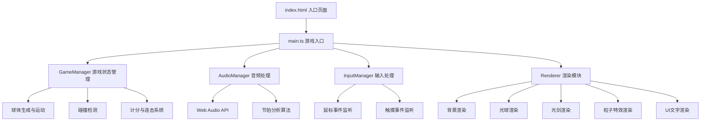

## 1. 架构设计



## 2. 技术描述

- **前端**：TypeScript + HTML5 Canvas + Vite
- **构建工具**：Vite 5.x
- **语言**：TypeScript 5.x（严格模式）
- **音频处理**：Web Audio API（AudioContext、AnalyserNode）
- **图形渲染**：HTML5 Canvas 2D API
- **输入处理**：原生鼠标事件 + 触摸事件

## 3. 项目结构

```
e:\solo\SoloAutoDemo\tasks\auto109\
├── package.json
├── index.html
├── vite.config.js
├── tsconfig.json
└── src/
    ├── main.ts      # 入口，初始化Canvas、加载音频、启动游戏循环
    ├── audio.ts     # 音频加载和节拍分析
    ├── game.ts      # GameManager类，游戏状态管理
    ├── renders.ts   # 渲染模块，绘制所有视觉元素
    └── input.ts     # 输入处理，鼠标/触摸事件监听
```

## 4. 核心模块设计

### 4.1 类型定义 (src/types.ts)

```typescript
// 游戏状态枚举
export enum GameState {
  MENU = 'menu',
  LOADING = 'loading',
  PLAYING = 'playing',
  GAME_OVER = 'game_over'
}

// 光球颜色与切割方向映射
export const COLORS: { color: string; direction: 'left' | 'right' | 'up' | 'down' }[] = [
  { color: '#ff3366', direction: 'left' },
  { color: '#ff9933', direction: 'right' },
  { color: '#ffee33', direction: 'up' },
  { color: '#33ff66', direction: 'down' },
  { color: '#33ffcc', direction: 'left' },
  { color: '#3399ff', direction: 'right' },
  { color: '#9933ff', direction: 'up' },
  { color: '#ff33cc', direction: 'down' },
  { color: '#ff6699', direction: 'left' },
  { color: '#66ffcc', direction: 'right' }
];

// 光球接口
export interface Ball {
  id: number;
  x: number;
  y: number;
  startX: number;
  startY: number;
  targetX: number;
  targetY: number;
  startTime: number;
  duration: number;
  radius: number;
  color: string;
  requiredDirection: string;
  sliced: boolean;
  sliceTime: number;
}

// 粒子接口
export interface Particle {
  x: number;
  y: number;
  vx: number;
  vy: number;
  life: number;
  maxLife: number;
  color: string;
  size: number;
}

// 光剑轨迹点接口
export interface TrailPoint {
  x: number;
  y: number;
  time: number;
}

// 节拍点接口
export interface BeatPoint {
  time: number;
  strength: number; // 0.5 for weak, 1.0 for strong
}
```

### 4.2 音频模块 (src/audio.ts)

核心功能：
- `loadAudio(file: File): Promise<void>` - 加载音频文件
- `analyzeBeats(): Promise<BeatPoint[]>` - 分析音频提取节拍点
- `getBPM(): number` - 获取计算出的BPM
- `play(): void` - 播放音频
- `stop(): void` - 停止音频
- `getCurrentTime(): number` - 获取当前播放时间

关键算法：
- 使用Web Audio API的`AnalyserNode`进行频谱分析
- 对低频能量进行峰值检测识别强拍
- 使用时间窗口平均算法识别弱拍
- 计算相邻节拍间隔得到BPM

### 4.3 输入模块 (src/input.ts)

核心功能：
- `getSwordPosition(): { x: number; y: number }` - 获取光剑当前位置
- `getSwordDirection(): { dx: number; dy: number; speed: number }` - 获取挥动方向和速度
- `getTrailPoints(): TrailPoint[]` - 获取光剑轨迹点
- `update(deltaTime: number): void` - 更新轨迹点生命周期

事件监听：
- `mousedown` / `touchstart` - 开始挥动
- `mousemove` / `touchmove` - 更新位置
- `mouseup` / `touchend` - 结束挥动

### 4.4 游戏模块 (src/game.ts) - GameManager类

核心方法：
- `constructor(canvas: HTMLCanvasElement)` - 构造函数
- `loadAudio(file: File): Promise<void>` - 加载音频
- `start(): void` - 开始游戏
- `update(deltaTime: number): void` - 游戏逻辑更新
- `spawnBall(beatTime: number): void` - 生成光球
- `checkCollision(ball: Ball): boolean` - 碰撞检测
- `calculateScore(combo: number): number` - 计算得分
- `gameOver(): void` - 游戏结束

碰撞检测算法：
- 计算光球中心到光剑路径线段的最小距离
- 距离 < 光球半径 * 0.8 判定为命中

### 4.5 渲染模块 (src/renders.ts) - Renderer类

核心方法：
- `constructor(canvas: HTMLCanvasElement)` - 构造函数
- `clear(): void` - 清除画布
- `drawBackground(pulseIntensity: number): void` - 绘制背景
- `drawBall(ball: Ball, currentTime: number): void` - 绘制光球
- `drawSword(trailPoints: TrailPoint[], direction: string): void` - 绘制光剑
- `drawParticles(particles: Particle[]): void` - 绘制粒子
- `drawUI(score: number, combo: number, missCount: number): void` - 绘制UI
- `drawMenu(titleProgress: number, subtitleProgress: number): void` - 绘制开始菜单
- `drawGameOver(finalScore: number, animationProgress: number): void` - 绘制结束界面

### 4.6 主入口 (src/main.ts)

核心流程：
1. 初始化Canvas和上下文
2. 实例化GameManager、Renderer、InputManager
3. 加载Orbitron字体
4. 初始化开始界面动画
5. 绑定开始按钮点击事件和文件选择
6. 启动requestAnimationFrame游戏循环
7. 处理游戏状态切换

## 5. 性能优化

- **帧率控制**：使用requestAnimationFrame，目标60FPS
- **对象池管理**：粒子和光球对象复用，避免频繁GC
- **最大数量限制**：光球峰值≤20个，单球爆散粒子≤30个
- **及时清理**：粒子生命周期结束立即从数组移除
- **离屏渲染**：静态背景使用离屏Canvas缓存
- **事件节流**：mousemove/touchmove事件使用requestAnimationFrame节流

## 6. 配置文件说明

### 6.1 package.json
- 依赖：typescript、vite
- 脚本：`npm run dev` 启动开发服务器

### 6.2 vite.config.js
- 配置开发服务器端口
- 开启sourcemap

### 6.3 tsconfig.json
- 严格模式：`strict: true`
- 目标ES版本：ES2020
- 模块系统：ESNext

### 6.4 index.html
- Canvas元素设置id
- UI元素（开始按钮、隐藏的file input）
- 内联样式设置深色主题背景
