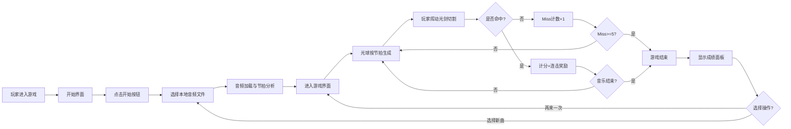

## 1. 产品概述

节奏光剑是一款基于Web的节奏动作游戏，玩家需要跟随音乐节拍挥动光剑切割飞来的光球，获取分数并保持连击。游戏融合了音乐节奏与动作元素，为玩家提供沉浸式的音游体验。

- **主要用途**：休闲娱乐、音乐节奏训练、反应速度锻炼
- **目标用户**：音乐游戏爱好者、休闲玩家
- **市场价值**：无需安装客户端，通过浏览器即可体验高品质节奏游戏

## 2. 核心功能

### 2.1 用户角色
| 角色 | 注册方式 | 核心权限 |
|------|----------|----------|
| 普通玩家 | 无需注册 | 选择本地音频文件进行游戏、查看得分和连击 |

### 2.2 功能模块
1. **开始界面**：游戏标题展示、开始按钮、文件选择
2. **音频处理**：音频文件加载、节拍分析、BPM计算
3. **游戏核心**：光球生成、光剑控制、碰撞检测、粒子特效
4. **计分系统**：得分计算、连击奖励、Miss计数
5. **UI展示**：分数显示、连击显示、光剑轨迹、背景脉冲效果
6. **结束界面**：成绩展示、重玩按钮、选择新曲按钮

### 2.3 页面详情
| 页面名称 | 模块名称 | 功能描述 |
|----------|----------|----------|
| 开始界面 | 标题模块 | 金色渐变发光标题"节奏光剑"，副标题打字机效果 |
| 开始界面 | 按钮模块 | 半透明圆角开始按钮，悬停扩散效果，点击缩放动画 |
| 开始界面 | 文件选择 | 系统文件选择器，支持mp3和wav格式 |
| 游戏界面 | 背景模块 | 深蓝到深紫渐变，节拍脉冲效果 |
| 游戏界面 | 光球模块 | 10种颜色随机，抛物线飞行，接近底部放大颤动 |
| 游戏界面 | 光剑模块 | 鼠标/触摸拖拽控制，彩色光带，粒子拖尾 |
| 游戏界面 | 切割模块 | 碰撞检测，光球切分动画，粒子爆散特效 |
| 游戏界面 | 计分模块 | 左上角绿色发光分数，右上角连击数，金色闪烁效果 |
| 游戏界面 | Miss模块 | 红色叉号闪烁动画，累计5次游戏结束 |
| 结束界面 | 成绩面板 | 毛玻璃背景，滚动数字动画 |
| 结束界面 | 操作按钮 | "再来一次"和"选择新曲"按钮 |

## 3. 核心流程

## 4. 用户界面设计

### 4.1 设计风格
- **主色调**：深蓝#0a0a2e渐变到深紫#1a0a2e
- **辅助色**：霓虹蓝#00d4ff、霓虹紫#ff00ff、霓虹粉#ff6b9d、金色#ffd700、绿色#00ff88
- **按钮风格**：半透明圆角矩形，悬停填充扩散，点击缩放回弹
- **字体**：Orbitron科幻风格无衬线字体
- **光效**：柔和霓虹发光效果，文字发光描边
- **布局**：Canvas居中，自适应窗口大小

### 4.2 页面设计概述
| 页面名称 | 模块名称 | UI元素 |
|----------|----------|----------|
| 开始界面 | 标题 | 金色渐变文字、发光描边、打字机副标题 |
| 开始界面 | 按钮 | 半透明背景、圆角、悬停扩散、点击缩放 |
| 游戏界面 | 背景 | 深色渐变、节拍脉冲亮度变化 |
| 游戏界面 | 光球 | 10种高饱和度颜色、半径30px、抛物线轨迹、接近时放大颤动 |
| 游戏界面 | 光剑 | 彩色光带、渐变色、粒子拖尾 |
| 游戏界面 | 分数 | 左上角、数字时钟风格、绿色发光、得分跳动放大 |
| 游戏界面 | 连击 | 右上角、弹跳动画、10+金色闪烁 |
| 游戏界面 | Miss | 红色叉号闪烁动画 |
| 结束界面 | 面板 | 半透明毛玻璃背景 |
| 结束界面 | 成绩 | 滚动数字动画从0到实际得分 |
| 结束界面 | 按钮 | 悬停放大、点击缩放 |

### 4.3 响应式设计
- **桌面端优先**：Canvas尺寸为window.innerWidth * 0.9和window.innerHeight * 0.85
- **水平垂直居中**：使用CSS flex布局居中
- **移动端兼容**：触摸事件与鼠标事件兼容，支持触摸拖拽切割
- **窗口自适应**：监听resize事件，动态调整Canvas尺寸

### 4.4 视觉动效
- **标题动效**：金色渐变+发光描边，副标题打字机效果逐字显示
- **按钮动效**：悬停时填充颜色从中心扩散，点击时缩小再弹回
- **背景动效**：节拍到达时亮度短暂提升到130%再恢复
- **光球动效**：接近底部时放大和颤动效果
- **分数动效**：每次得分数字跳动放大
- **连击动效**：轻微弹跳动画，10+金色闪烁
- **光剑动效**：流光效果，末端粒子拖尾逐渐缩小消失
- **切割动效**：光球切分飞散淡出，星状粒子爆散
- **Miss动效**：红色叉号闪烁动画
- **成绩动效**：滚动数字动画从0变化到实际得分
