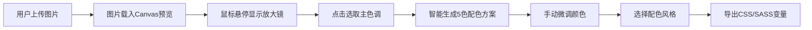

## 1. 产品概述

网页即时取色与配色方案生成器，帮助设计师和开发者从图片中快速提取颜色并生成专业配色方案，解决日常浏览网页时难以系统化保存和复现色彩搭配的问题。

- 核心价值：将视觉灵感转化为可复用的设计系统，提升设计效率
- 目标用户：UI设计师、前端开发者、平面设计师、色彩爱好者

## 2. 核心功能

### 2.1 用户角色

| 角色 | 注册方式 | 核心权限 |
|------|----------|----------|
| 普通用户 | 无需注册 | 上传图片、取色、生成配色、导出变量 |

### 2.2 功能模块

1. **图片导入与取色模块**：支持拖拽/点击上传图片，Canvas预览，放大镜取色
2. **智能配色生成模块**：基于主色自动生成5色方案，3种风格预设
3. **手动调色模块**：HSL滑块调节，十六进制输入，关联颜色联动更新
4. **方案导出模块**：CSS/SASS变量导出，一键复制到剪贴板

### 2.3 页面详情

| 页面名称 | 模块名称 | 功能描述 |
|----------|----------|----------|
| 主页面 | 图片预览区 | 左侧55%宽度，显示上传图片，支持鼠标悬停放大镜取色 |
| 主页面 | 配色展示区 | 右侧45%宽度，2行3列网格展示配色卡片，支持拖拽排序 |
| 主页面 | 风格切换栏 | 3个胶囊按钮切换配色风格（自然柔和、大胆对比、清新简约） |
| 主页面 | 导出菜单 | 右上角下拉菜单，选择CSS/SASS格式导出 |
| 主页面 | 颜色拾取器 | 点击颜色卡片弹出，支持HSL滑块和HEX输入 |

## 3. 核心流程

用户上传图片后，系统将图片渲染到Canvas。用户通过放大镜选取主色，系统基于色相轮和明度对比规则生成完整配色方案。用户可手动调整任意颜色，调整后主色的关联颜色会按规则自动偏移。最终可导出为CSS或SASS变量格式。

## 4. 用户界面设计

### 4.1 设计风格

- **主色调**：深蓝色渐变背景（#1a1a2e → #16213e）
- **强调色**：蓝色发光边框（#00d4ff）
- **文字色**：浅灰色（#e0e0e0）用于次要信息，白色用于主要信息
- **按钮风格**：胶囊形状，选中态蓝色填充，未选中透明边框
- **卡片风格**：圆角12px，轻微阴影，色块占60%高度
- **字体**：现代无衬线字体，标题加粗，正文常规字重
- **动效**：0.3s ease-out平滑过渡，0.4s渐入渐出配色切换

### 4.2 页面设计概述

| 页面名称 | 模块名称 | UI元素 |
|----------|----------|----------|
| 主页面 | 图片预览区 | Canvas画布、圆形放大镜（蓝色发光边框、十字准星）、RGB/HEX数值显示 |
| 主页面 | 配色展示区 | 2×3网格布局、配色卡片（色块+名称+HEX）、拖拽手柄、复制按钮 |
| 主页面 | 风格切换栏 | 三个横向排列胶囊按钮、选中态高亮 |
| 主页面 | 颜色拾取器 | HSL滑块组、HEX输入框、实时预览色块 |
| 主页面 | 导出菜单 | 下拉动画、CSS/SASS选项、复制成功toast提示 |

### 4.3 响应式设计

- **桌面端**（>768px）：左右布局，左侧55%图片区，右侧45%配色区，放大镜10倍放大
- **移动端**（≤768px）：上下布局，图片区在上，配色区在下，放大镜8倍放大
- **触摸优化**：增大点击热区，支持触摸拖拽排序

### 4.4 性能优化

- 颜色聚类算法处理800×600图片在500ms内完成
- 调色操作响应时间<50ms，使用requestAnimationFrame避免阻塞主线程
- Canvas图片缩放预处理，减少像素处理量
