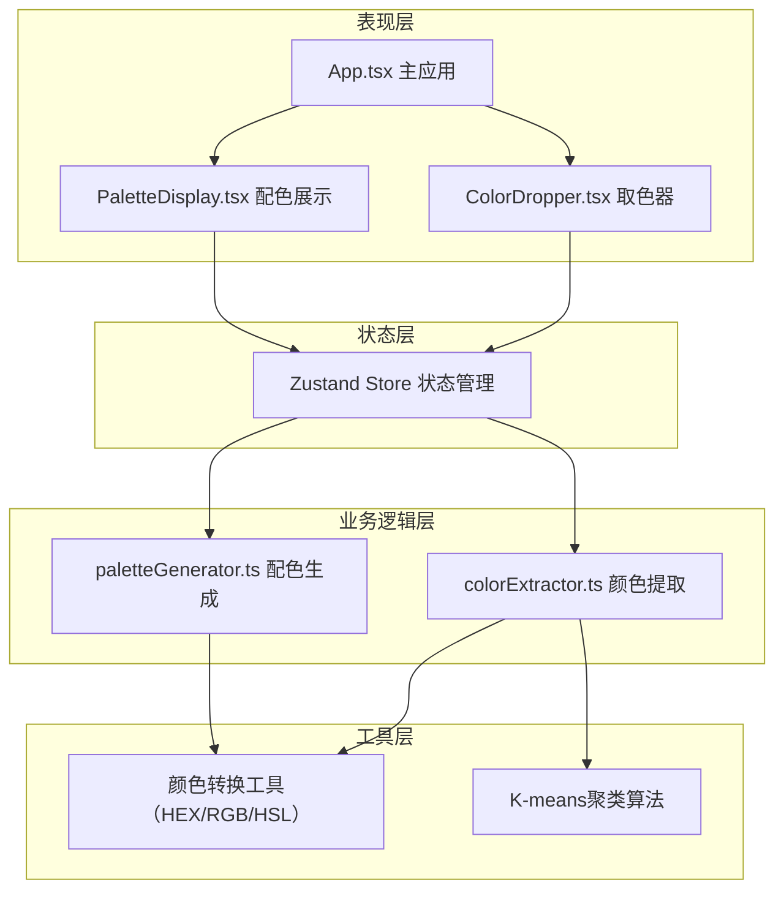

## 1. 架构设计



## 2. 技术描述

- **前端框架**：React@18 + TypeScript@5
- **构建工具**：Vite@5 + @vitejs/plugin-react@4
- **状态管理**：Zustand@4
- **不依赖第三方颜色库**：所有颜色算法自研实现

## 3. 项目结构

```
├── package.json
├── index.html
├── vite.config.js
├── tsconfig.json
└── src/
    ├── App.tsx                 # 主应用组件
    ├── main.tsx               # 入口文件
    ├── index.css              # 全局样式
    ├── store.ts               # Zustand状态管理
    ├── colorExtractor.ts      # 颜色提取模块（K-means）
    ├── paletteGenerator.ts    # 配色生成模块
    ├── colorUtils.ts          # 颜色转换工具
    ├── ColorDropper.tsx       # 取色器组件
    └── PaletteDisplay.tsx     # 配色展示组件
```

**调用关系与数据流向**：
1. `ColorDropper.tsx` → 用户取色 → `store.ts` → 更新selectedColors
2. `store.ts` → 触发 `paletteGenerator.ts` → 生成5色方案 → 更新palette
3. `PaletteDisplay.tsx` → 监听palette变化 → 渲染配色卡片
4. 用户调整颜色 → `PaletteDisplay.tsx` → `store.ts` → `paletteGenerator.ts` → 联动更新
5. 导出功能 → `App.tsx` → 读取store → 生成CSS/SASS → 复制到剪贴板

## 4. 核心数据模型

### 4.1 类型定义

```typescript
// 颜色表示
interface HSL {
  h: number; // 0-360
  s: number; // 0-100
  l: number; // 0-100
}

interface RGB {
  r: number; // 0-255
  g: number; // 0-255
  b: number; // 0-255
}

// 配色方案中的单个颜色
interface PaletteColor {
  id: string;
  name: string;           // Primary, Accent, etc.
  hex: string;            // #RRGGBB
  hsl: HSL;
  rgb: RGB;
  role: ColorRole;        // 适用场景
  usage: string[];        // 适用场景标签
}

// 配色方案
interface Palette {
  id: string;
  name: string;
  style: PaletteStyle;    // 风格预设
  colors: PaletteColor[]; // 5个颜色
}

// 配色风格
type PaletteStyle = 'natural' | 'bold' | 'minimal';

// 颜色角色
type ColorRole = 'primary' | 'secondary' | 'accent' | 'neutral' | 'background';

// Store状态
interface AppState {
  selectedColors: HSL[];      // 用户选取的主色（1-3个）
  palette: Palette | null;    // 生成的配色方案
  currentStyle: PaletteStyle; // 当前风格
  imageData: ImageData | null;
  setSelectedColors: (colors: HSL[]) => void;
  setPalette: (palette: Palette) => void;
  setStyle: (style: PaletteStyle) => void;
  generatePalette: () => void;
  updateColor: (id: string, hsl: HSL) => void;
  reorderColors: (fromIndex: number, toIndex: number) => void;
}
```

## 5. 核心算法说明

### 5.1 K-means颜色聚类

```typescript
// colorExtractor.ts
function extractColors(imageData: ImageData, k: number = 5): HSL[] {
  // 1. 像素数据采样（降采样提高性能）
  // 2. RGB转Lab颜色空间（更符合人眼感知）
  // 3. K-means聚类提取主色
  // 4. 按像素占比排序
}
```

### 5.2 配色生成算法

```typescript
// paletteGenerator.ts
function generatePalette(
  baseColors: HSL[],
  style: PaletteStyle
): Palette {
  // 1. 从baseColors中确定主色
  // 2. 基于色相轮计算：
  //    - 补色（180°）
  //    - 类似色（±30°）
  //    - 三角对比色（±120°）
  // 3. 根据风格调整明度和饱和度：
  //    - natural: 中低饱和度，中高明度
  //    - bold: 高饱和度，高对比度
  //    - minimal: 低饱和度，相近明度
  // 4. 分配颜色角色（主色、辅色、强调色、中性色、背景色）
}
```

### 5.3 颜色联动规则

```typescript
// 调整主色时：
// - 辅色：色相偏移量保持不变，明度饱和度按比例调整
// - 强调色：与主色的对比关系保持
// - 中性色：基于主色的灰度化处理
// - 背景色：与主色的明度差保持
```

## 6. 性能优化策略

1. **Web Worker**：K-means聚类在Web Worker中执行，避免阻塞UI
2. **像素降采样**：处理前将图片缩放到最大400px宽度，减少计算量
3. **防抖处理**：颜色滑块拖动使用防抖，减少重复计算
4. **记忆化缓存**：相同输入缓存配色结果，避免重复生成
5. **requestAnimationFrame**：放大镜渲染使用RAF，确保流畅
