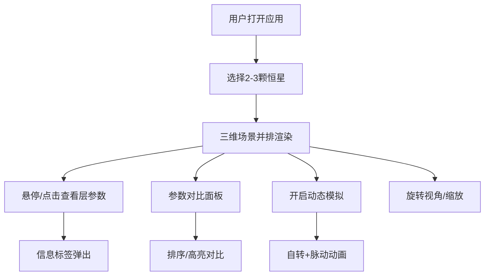

## 1. 产品概述

交互式恒星内部结构对比可视化应用，面向天文科普团队和天文爱好者，提供三维空间中多恒星剖面并排对比功能，让用户直观理解不同类型恒星（红矮星、黄矮星、蓝巨星、白矮星）从核心到外壳的分层结构差异。

- 解决天文科普中恒星内部结构难以直观展示的痛点
- 目标用户：天文科普工作者、天文爱好者、教育场景

## 2. 核心功能

### 2.1 功能模块

1. **三维恒星对比视图**：用户从预设恒星列表选择2-3颗，在3D场景中并排渲染半透明剖面球体，各层（核心、辐射层、对流层、光球层）以不同颜色区分
2. **分层交互与信息展示**：悬停任意层时高亮显示，弹出毛玻璃效果信息标签，展示温度、密度、成分等物理参数
3. **参数对比面板**：右侧边栏以表格形式并排展示选中恒星的层参数，支持排序和高亮
4. **3D交互操作**：鼠标拖拽旋转视角、滚轮缩放、半透明轴线辅助定位
5. **恒星内部动态模拟**：开启开关后各层自转，核心脉动动画
6. **响应式适配**：三栏布局 → 折叠布局 → 悬浮按钮组

### 2.2 页面详情

| 页面名称 | 模块名称 | 功能描述 |
|----------|----------|----------|
| 主页面 | 三维场景区 | Three.js渲染多颗恒星剖面并排对比，支持旋转/缩放/悬停交互，星空粒子背景 |
| 主页面 | 控制面板 | 恒星选择下拉框、模拟开关、参数调节滑块 |
| 主页面 | 参数对比面板 | 表格并排对比参数，支持按温度/密度排序，选中行列高亮 |

## 3. 核心流程

用户打开应用 → 从预设列表选择2-3颗恒星 → 三维场景并排渲染剖面球 → 鼠标悬停查看层参数 → 右侧面板对比参数 → 开启动态模拟观察内部运动 → 调整视角和缩放深入探索

## 4. 用户界面设计

### 4.1 设计风格

- **主题**：深空科幻风格，背景深蓝到紫黑渐变
- **主色**：霓虹蓝 #00d4ff（控件、按钮）
- **强调色**：亮紫 #7c3aed（选中状态）
- **背景色**：rgba(20,20,40,0.85)（面板背景）
- **按钮**：霓虹蓝边框，圆角8px，0.3s缓动过渡
- **字体**：Orbitron（标题）+ Source Sans Pro（正文）
- **布局**：三栏布局（控制面板 | 场景 | 参数面板）
- **恒星层色**：核心橙红渐变到光球层淡黄，层间发光边缘

### 4.2 页面设计概览

| 页面名称 | 模块名称 | UI元素 |
|----------|----------|--------|
| 主页面 | 三维场景区 | 深蓝渐变星空背景，半透明分层恒星球体，发光层边缘，毛玻璃信息标签，半透明轴线 |
| 主页面 | 控制面板 | 深色半透明背景，下拉选择框，霓虹蓝滑块，模拟开关按钮 |
| 主页面 | 参数对比面板 | 深色半透明背景表格，霓虹蓝表头阴影，悬停变色，选中行高亮 |

### 4.3 响应式适配

- **≥1024px**：左中右三栏布局（控制面板240px | 场景自适应 | 参数面板320px）
- **768-1024px**：参数面板折叠为底部抽屉，控制面板与场景并排
- **<768px**：控制面板变为悬浮按钮组，场景全屏，参数面板为底部抽屉

### 4.4 3D场景指导

- **环境**：深蓝色渐变星空，星星粒子随机闪烁
- **光照**：微弱环境光 + 各恒星自发光效果（核心区点光源）
- **相机**：透视相机，默认45°俯角，可旋转/缩放
- **构图**：选中的恒星等距并排，核心区偏亮
- **交互**：鼠标悬停高亮层、点击查看详情、拖拽旋转、滚轮缩放
- **动画**：各层极慢自转（10秒/圈），核心脉动（半径微幅缩放）
- **后处理**：层间边缘Bloom发光效果
- **性能预算**：60FPS（2颗星），≥30FPS（3颗星），悬停响应<100ms
