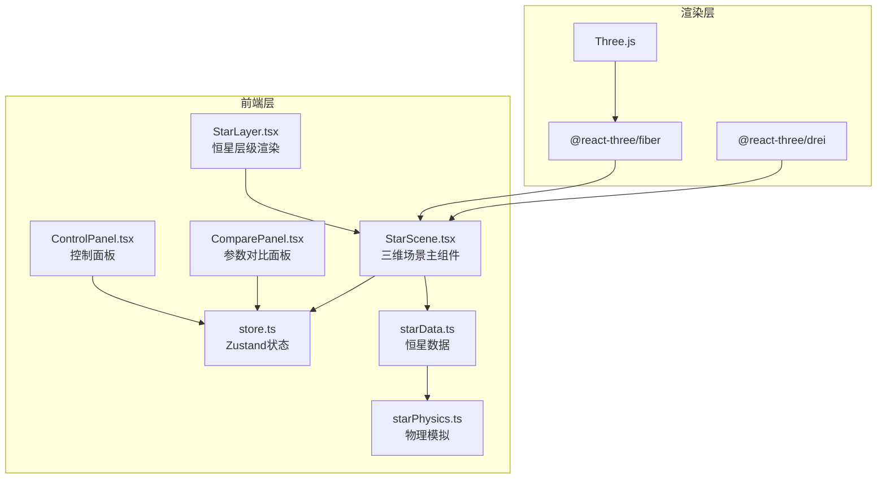

## 1. 架构设计



## 2. 技术说明

- **前端框架**：React 18 + TypeScript + Vite
- **3D渲染**：Three.js + @react-three/fiber + @react-three/drei
- **状态管理**：Zustand
- **样式方案**：CSS-in-JS (内联样式 + CSS变量)
- **后端**：无（纯前端应用）
- **数据来源**：本地模拟数据（starData.ts）

## 3. 路由定义

| 路由 | 用途 |
|------|------|
| / | 主页面，包含三维场景、控制面板和参数对比面板 |

## 4. 文件结构与调用关系

```
project/
├── index.html                          # 入口HTML，深空渐变背景
├── package.json                        # 依赖与脚本
├── vite.config.ts                      # Vite构建配置，路径别名
├── tsconfig.json                       # TypeScript严格模式
└── src/
    ├── main.tsx                        # React入口，挂载App
    ├── App.tsx                         # 主组件，布局容器
    ├── store.ts                        # Zustand状态管理
    ├── modules/
    │   ├── starData.ts                 # 恒星数据生成 ← 被StarScene调用
    │   └── starPhysics.ts              # 物理模拟计算 ← 被starData调用
    └── components/
        ├── StarScene.tsx               # 三维场景 ← 调用starData + StarLayer
        ├── StarLayer.tsx               # 层级渲染 ← 被StarScene调用
        ├── ControlPanel.tsx            # 控制面板 → 更新store
        └── ComparePanel.tsx            # 参数对比面板 ← 读取store
```

### 数据流向

1. **starPhysics.ts** → **starData.ts**：物理模拟函数被数据生成模块调用，计算温度梯度、密度分布
2. **starData.ts** → **StarScene.tsx**：恒星数据列表供场景组件消费
3. **ControlPanel.tsx** → **store.ts**：用户操作更新全局状态（选中恒星、模拟开关等）
4. **store.ts** → **StarScene.tsx**：场景组件订阅状态变化，重新渲染
5. **store.ts** → **ComparePanel.tsx**：对比面板读取选中恒星数据
6. **StarScene.tsx** → **StarLayer.tsx**：传入单颗恒星数据，渲染各层

## 5. 数据模型

### 5.1 核心类型定义

```typescript
interface StarLayerData {
  name: string;           // 层名称：核心/辐射层/对流层/光球层
  radiusFraction: number; // 半径占比 (0-1)
  temperature: number;    // 温度 (K)
  density: number;        // 密度 (g/cm³)
  composition: { element: string; percentage: number }[];
  color: string;          // 层颜色
}

interface StarData {
  id: string;
  name: string;           // 恒星名称
  type: string;           // 类型：红矮星/黄矮星/蓝巨星/白矮星
  radius: number;         // 相对太阳半径
  layers: StarLayerData[];
}

interface AppState {
  selectedStars: string[];      // 选中恒星ID列表
  simulationEnabled: boolean;   // 动态模拟开关
  highlightedLayer: string | null; // 高亮层
  comparePanelOpen: boolean;    // 对比面板开关
  sortBy: 'temperature' | 'density' | null;
  sortOrder: 'asc' | 'desc';
}
```

### 5.2 恒星预设数据

| 恒星 | 类型 | 相对半径 | 核心温度(K) | 核心密度(g/cm³) |
|------|------|----------|-------------|------------------|
| 红矮星 | M型主序星 | 0.2 | 5,000,000 | 50 |
| 黄矮星 | G型主序星 | 1.0 | 15,000,000 | 150 |
| 蓝巨星 | O/B型巨星 | 10.0 | 30,000,000 | 5 |
| 白矮星 | 致密星 | 0.01 | 20,000,000 | 1,000,000 |
