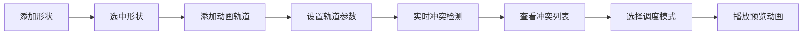

## 1. 产品概述

动画冲突检测与调度系统是一款面向前端设计师和开发者的可视化动画编辑工具。用户可在画布上创建多种几何形状，为其添加平移、旋转、缩放等多轨道动画，系统自动检测动画间的时间重叠与空间冲突，并提供智能调度方案，帮助用户优化动画序列、避免视觉干扰。

## 2. 核心功能

### 2.1 功能模块

1. **画布编辑区**：形状拖放添加、位置拖拽、选中高亮、属性显示
2. **动画轨道编辑器**：多轨道（平移/旋转/缩放）管理、关键帧参数设置、时间轴滑块预览
3. **冲突检测面板**：实时时间重叠检测、空间碰撞检测、冲突详情列表
4. **冲突调度引擎**：错峰调度、降级调度两种自动解决方案
5. **播放控制台**：播放/暂停/重置、速度调节（0.5x-2x）、当前时间指示线

### 2.2 页面详情

| 页面名称 | 模块名称 | 功能描述 |
|---------|---------|---------|
| 主工作台 | 画布区域（70%） | 拖放添加矩形/圆形/三角形，拖拽移动，选中高亮发光 |
| 主工作台 | 右侧属性面板（30%） | 形状列表、选中形状属性、轨道编辑区、冲突列表 |
| 主工作台 | 底部时间轴控件 | 水平时间轴滑块、当前时间指示线、播放控制条 |

## 3. 核心流程

用户拖放形状至画布 → 选中形状并添加动画轨道 → 设置轨道参数（时间、曲线、终值）→ 系统实时检测冲突 → 用户查看冲突详情 → 选择调度模式（错峰/降级）→ 点击播放预览动画效果

## 4. 用户界面设计

### 4.1 设计风格
- **主色调**：深色科技风
  - 背景：#1a1a2e
  - 卡片：#16213e
  - 高亮：#0f3460
  - 冲突标红：#e94560
  - 时间指示线：亮青色 #00d9ff
- **字体**：现代无衬线字体，层级清晰
- **布局**：左右分栏（70%画布 + 30%面板），底部固定时间轴
- **动效**：选中形状外发光、冲突条目抖动、平滑过渡动画

### 4.2 页面设计概览

| 页面名称 | 模块名称 | UI 元素 |
|---------|---------|---------|
| 主工作台 | 画布区域 | 深色背景、网格纹理、形状SVG、选中发光效果 |
| 主工作台 | 属性面板 | 卡片式形状列表、参数滑块、轨道增删按钮 |
| 主工作台 | 冲突列表 | 红色背景条目、抖动动画、点击跳转 |
| 主工作台 | 底部时间轴 | 水平轨道、亮青色指示线、播放控制按钮 |

### 4.3 响应式
桌面优先布局，支持窗口缩放自适应。
