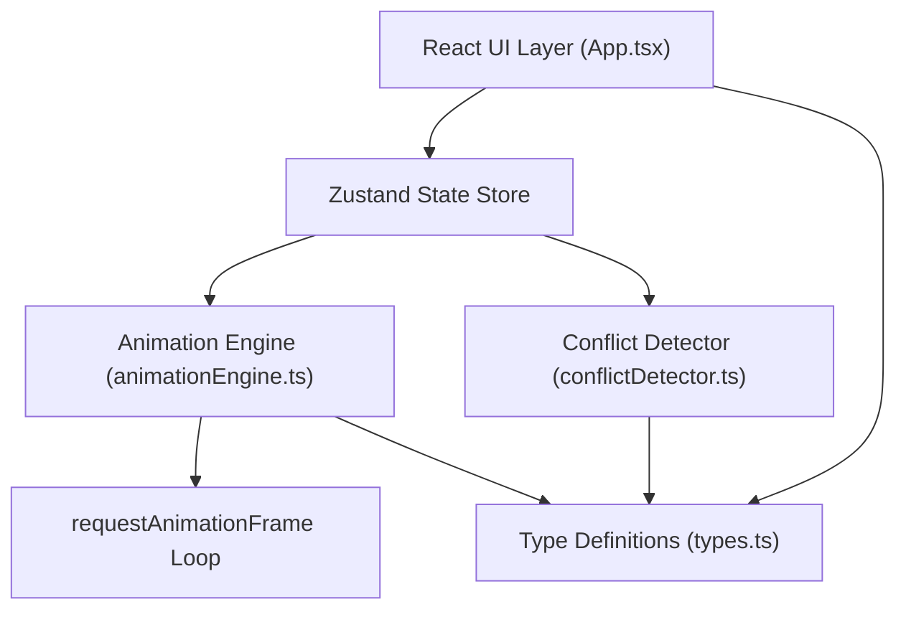
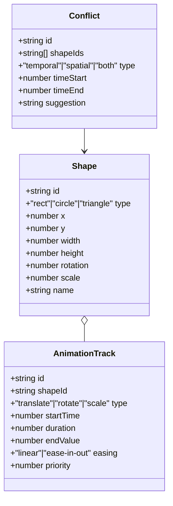

## 1. 架构设计



## 2. 技术描述

- **前端框架**：React 18 + TypeScript
- **构建工具**：Vite 5 + @vitejs/plugin-react
- **状态管理**：Zustand
- **唯一ID**：uuid
- **动画引擎**：requestAnimationFrame 自研实现
- **冲突检测**：时间轴快照扫描 O(n) 算法 + AABB 包围盒碰撞

## 3. 项目文件结构

```
auto119/
├── package.json
├── index.html
├── vite.config.ts
├── tsconfig.json
└── src/
    ├── types.ts           # 形状、动画、冲突类型定义
    ├── conflictDetector.ts # 冲突检测算法
    ├── animationEngine.ts  # 动画引擎与时间轴调度
    ├── store.ts           # Zustand 状态管理
    └── App.tsx            # 主组件（画布、面板、时间轴）
```

## 4. 核心数据模型



## 5. 关键算法

### 5.1 时间重叠检测（O(n log n)）
按 startTime 排序所有轨道 → 扫描线遍历 → 记录同时活动的轨道集合 → 输出重叠区间

### 5.2 空间碰撞检测
对每个时刻快照，计算形状 AABB 包围盒（考虑缩放和旋转外包矩形），判断矩形相交

### 5.3 动画插值
- linear: `v = start + (end - start) * t`
- ease-in-out: `t = t < 0.5 ? 2*t² : 1 - (-2*t+2)²/2`

### 5.4 调度策略
- **错峰调度**：对冲突轨道按优先级排序，依次后移 0.5s 最小间隔
- **降级调度**：暂停优先级低的轨道（isActive = false）
