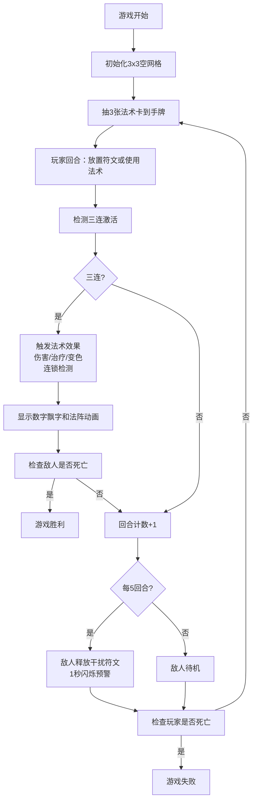

## 1. 产品概述
符文回响是一款基于3x3符文网格的卡牌构筑游戏，玩家通过放置不同元素的符文石触发法术，与骷髅法师敌人进行回合制对战。

- 核心玩法：在符文网格上放置风、火、水、土四色符文石，同色三连激活对应元素法术
- 目标用户：喜欢策略卡牌、消除类游戏的休闲玩家
- 产品价值：融合符文消除与卡牌构筑的创新玩法，提供丰富的连锁反应策略深度

## 2. 核心 Features

### 2.1 核心玩法模块

| 模块名称 | 功能描述 |
|---------|---------|
| 符文网格系统 | 3x3网格，支持放置四色符文石，检测行/列/对角线三连，触发连锁消除 |
| 法术卡牌系统 | 每回合获得3张法术卡，5张手牌上限，支持滑动浏览，卡面为卷轴样式 |
| 敌人AI系统 | 骷髅法师敌人，每5回合释放干扰符文，有血量和护盾 |
| 战斗系统 | 法术造成伤害/治疗，数字飘字显示，回合制流转 |

### 2.2 页面详情

| 页面名称 | 模块名称 | Feature description |
|---------|---------|--------------------|
| 游戏主界面 | 符文网格区 | 3x3浮雕效果格子，旋转符文徽记，放置弹跳动画，三连光芒喷涌 |
| 游戏主界面 | 敌人面板 | 右侧独立面板，像素风格骷髅法师，呼吸动画，血条护盾条，受击踉跄 |
| 游戏主界面 | 手牌区域 | 底部横向排列5张卷轴样式卡片，可左右滑动，点击使用动画 |
| 游戏主界面 | 游戏状态栏 | 回合计数、玩家血量显示 |

## 3. 核心流程



## 4. 用户界面设计

### 4.1 设计风格
- **主色调**：羊皮纸黄 (#d4c4a8) 为主色调，搭配暗红 (#8b2500) 和古铜色 (#b8860b) 装饰边线
- **符文颜色**：风-绿色 (#2e8b57)、火-红色 (#dc143c)、水-蓝色 (#4169e1)、土-褐色 (#8b4513)
- **交互元素**：所有按钮和卡片带有金色 (#ffd700) 描边，悬停时微弱发光
- **字体**：使用哥特式/中世纪风格字体，标题用装饰性字体，正文用清晰易读的衬线字体

### 4.2 动画效果
- 符文放置：从格子底部弹跳出现（0.4秒），落地后震波粒子（0.1秒）
- 三连激活：元素光芒喷涌，网格上方法阵旋转（1.5秒）
- 伤害/治疗：数字飘字向上移动（0.8秒淡出）
- 敌人受击：向后踉跄，红色闪烁
- 干扰符文：1秒闪烁预警后覆盖
- 卡牌使用：缩小飞向网格（0.5秒动画）

### 4.3 响应式设计
- 桌面优先设计，支持1080p和1440p分辨率自适应
- 网格和卡牌大小根据分辨率动态调整
- 保持60FPS以上的渲染性能

### 4.4 布局结构
```
┌─────────────────────────────────────────────────────┐
│  游戏标题: 符文回响        回合: X   玩家HP: ██████░│
├──────────────────────────────────┬──────────────────┤
│                                  │                  │
│       ┌───┬───┬───┐              │   骷髅法师       │
│       │   │   │   │              │   ┌────────┐     │
│       ├───┼───┼───┤              │   │ HP ████│     │
│       │   │   │   │              │   │ 盾 ██░░│     │
│       ├───┼───┼───┤              │   └────────┘     │
│       │   │   │   │              │                  │
│       └───┴───┴───┘              │   像素法师图     │
│                                  │                  │
├──────────────────────────────────┴──────────────────┤
│  <  卷轴卡1 | 卷轴卡2 | 卷轴卡3 | 卷轴卡4 | 卷轴卡5 > │
└─────────────────────────────────────────────────────┘
```
