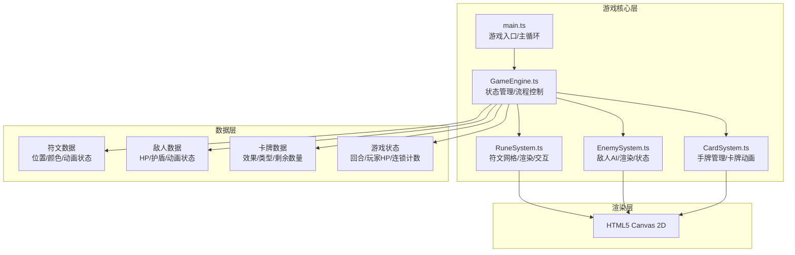

## 1. 架构设计



## 2. 技术描述

- **渲染引擎**：原生 HTML5 Canvas 2D API
- **开发语言**：TypeScript 5.x (严格模式)
- **构建工具**：Vite 5.x
- **性能目标**：60FPS 稳定运行
- **无外部游戏引擎**：完全自主实现渲染循环和游戏逻辑

## 3. 文件结构定义

```
project-root/
├── package.json          # 项目依赖: typescript, vite
├── index.html            # 入口页面，背景和UI文本容器
├── vite.config.js        # Vite构建配置
├── tsconfig.json         # TypeScript严格模式配置
└── src/
    ├── main.ts           # 游戏入口，初始化Canvas，启动主循环
    ├── GameEngine.ts     # 核心引擎，状态管理，流程调度
    ├── RuneSystem.ts     # 符文系统，网格渲染，三连检测，动画
    ├── EnemySystem.ts    # 敌人系统，AI行为，渲染，血条管理
    └── CardSystem.ts     # 卡牌系统，手牌管理，使用动画
```

## 4. 核心数据模型

### 4.1 符文数据模型
```typescript
type RuneElement = 'wind' | 'fire' | 'water' | 'earth';
type RuneState = 'empty' | 'appearing' | 'idle' | 'activating' | 'disappearing' | 'interference';

interface Rune {
  row: number;
  col: number;
  element: RuneElement | null;
  state: RuneState;
  animationTime: number;
  rotation: number;
}
```

### 4.2 敌人数据模型
```typescript
interface Enemy {
  hp: number;
  maxHp: number;
  shield: number;
  maxShield: number;
  state: 'idle' | 'hurt' | 'casting';
  animationTime: number;
  breathOffset: number;
}
```

### 4.3 卡牌数据模型
```typescript
type CardType = 'damage' | 'heal' | 'transform' | 'clear';

interface Card {
  id: string;
  name: string;
  type: CardType;
  description: string;
  element?: RuneElement;
  value: number;
  state: 'idle' | 'selected' | 'casting';
  animationTime: number;
}
```

### 4.4 游戏状态模型
```typescript
interface GameState {
  grid: Rune[][];
  hand: Card[];
  turn: number;
  playerHp: number;
  maxPlayerHp: number;
  enemy: Enemy;
  selectedCard: number | null;
  isPlayerTurn: boolean;
  isAnimating: boolean;
  particles: Particle[];
  floatingTexts: FloatingText[];
}
```

## 5. 核心算法

### 5.1 三连检测算法
- 检测所有行：3行，每行检查3个格子是否同色
- 检测所有列：3列，每列检查3个格子是否同色
- 检测对角线：2条对角线，每条检查3个格子是否同色
- 支持连锁：消除后新符文落下（或新放置）后重新检测

### 5.2 敌人AI算法
- 每5回合触发一次干扰符文
- 随机选择一个非空符文格子
- 闪烁1秒预警后覆盖为干扰符文
- 干扰符文可以被玩家消除

### 5.3 动画系统
- 基于requestAnimationFrame的主循环
- 所有动画使用deltaTime计算，帧率无关
- 粒子系统支持：震波、光芒、法阵特效
- 数字飘字系统支持伤害和治疗数值显示

## 6. 性能优化策略

1. **分层渲染**：背景层、网格层、符文层、特效层、UI层分离
2. **脏矩形**：仅重绘变化区域（如无全屏特效时）
3. **对象池**：粒子和飘字对象复用，避免频繁GC
4. **分辨率自适应**：使用DPR缩放，保证清晰渲染
5. **动画节流**：非关键动画可降低更新频率
