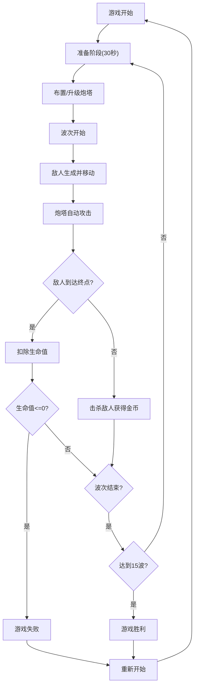

## 1. 产品概述

星港防御是一款太空主题的塔防游戏，玩家在太空站场景中布置炮塔抵御外星生物的入侵。通过策略性地放置和升级三种不同类型的炮塔，玩家需要阻止外星生物到达左侧终点，保卫太空站的安全。

- 核心玩法：塔防策略，资源管理，炮塔升级
- 目标用户：休闲游戏玩家，塔防游戏爱好者
- 产品价值：提供紧张刺激的策略体验，精美的太空科幻视觉效果

## 2. 核心功能

### 2.1 用户角色
本游戏为单用户游戏，无多角色区分。

### 2.2 功能模块
1. **游戏主界面**：Canvas游戏画布、HUD信息面板、炮塔选择菜单
2. **战斗系统**：炮塔攻击、敌人移动、碰撞检测、粒子特效
3. **波次系统**：敌人生成、波次进度、准备时间
4. **经济系统**：金币获取、炮塔购买、炮塔升级、炮塔拆除
5. **AI系统**：敌人路径规划、攻击行为、波次生成逻辑
6. **音效系统**：攻击音效、爆炸音效、升级音效、背景音乐
7. **结算系统**：胜利/失败判定、游戏统计、重新开始

### 2.3 页面详情
| 页面名称 | 模块名称 | 功能描述 |
|---------|---------|---------|
| 游戏主界面 | Canvas渲染层 | 实时渲染游戏场景、炮塔、敌人、弹道和粒子特效 |
| 游戏主界面 | HUD面板 | 显示金币、波次、生命值、波次进度条 |
| 游戏主界面 | 炮塔购买菜单 | 扇形展开动画，三种炮塔选择，价格显示 |
| 游戏主界面 | 炮塔升级菜单 | 升级按钮、拆除按钮、5秒冷却防误触 |
| 游戏主界面 | 波次准备界面 | 30秒倒计时，升级和建造提示 |
| 结算界面 | 失败界面 | 打字机效果文字，重新开始按钮 |
| 结算界面 | 胜利界面 | 游戏统计，烟花粒子特效，重新开始按钮 |

## 3. 核心流程

游戏开始后，玩家拥有初始金币，在准备时间内布置炮塔。每波敌人从右侧沿随机路径向左移动，炮塔自动锁定并攻击敌人。击杀敌人获得金币，用于建造或升级炮塔。敌人到达终点扣除生命值，生命值归零则游戏失败。撑过15波则获得胜利。

## 4. 用户界面设计

### 4.1 设计风格
- **主题配色**：深空蓝背景(#0a0e27)，科技蓝(#4fc3f7)，能量紫(#7c4dff)，警告红(#ff5252)
- **视觉效果**：半透明毛玻璃面板(backdrop-filter: blur 8px)，淡蓝色发光描边边框
- **按钮风格**：圆角矩形，悬浮缩放1.05倍，平滑过渡动画
- **字体**：无衬线字体Segoe UI，清晰易读
- **特效**：粒子爆炸、激光射线、电弧效果、烟花庆祝

### 4.2 页面设计概述
| 页面名称 | 模块名称 | UI元素 |
|---------|---------|---------|
| 游戏主界面 | HUD面板 | 左上角：金币(金色)、波次(白色)、生命值(红色条)；顶部：波次进度条 |
| 游戏主界面 | Canvas | 深空蓝背景，淡蓝色网格线，炮塔(三种造型)，敌人(三种类型带血条) |
| 游戏主界面 | 炮塔菜单 | 扇形展开(0.3秒)，悬浮显示价格和属性，点击购买 |
| 游戏主界面 | 升级面板 | 等级显示，升级按钮(脉冲动画)，拆除按钮(带冷却) |
| 结算界面 | 失败/胜利 | 打字机效果文字，统计数据，按钮缓动弹出 |

### 4.3 响应式设计
- 桌面端(640px以上)：Canvas全屏显示，HUD悬浮在左上角和顶部
- 移动端(640px以下)：HUD改为底部固定栏，适配触摸操作
- 触控优化：按钮最小尺寸44x44px，减少误触

### 4.4 动画与过渡
- 菜单展开：扇形0.3秒CSS transition
- 按钮悬浮：transform: scale(1.05) 0.2s ease
- 数字跳动：生命值损失抖动，金币获得放大动画
- 粒子效果：requestAnimationFrame实现流畅60FPS
- 打字机效果：逐字显示，配合光标闪烁

## 5. 性能要求
- 稳定60FPS运行
- 同屏最多40个单位时帧率不低于50FPS
- 粒子效果限制每帧最多30个
- 内存占用控制在200MB以内
