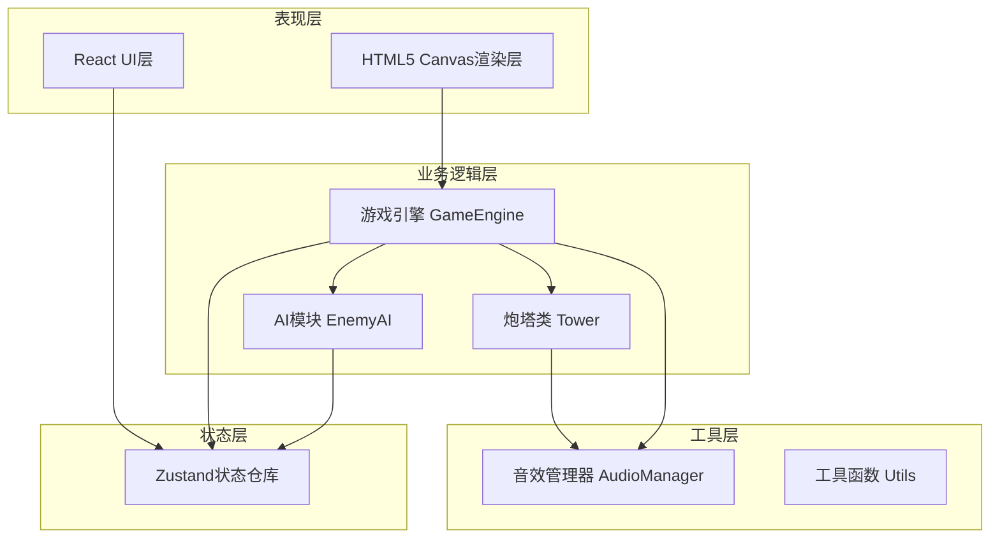

## 1. 架构设计



## 2. 技术描述
- **前端框架**：React 18 + TypeScript
- **构建工具**：Vite 5
- **状态管理**：Zustand
- **游戏渲染**：HTML5 Canvas 2D
- **音效引擎**：Howler.js
- **样式方案**：原生CSS + CSS Variables
- **开发服务器**：Vite Dev Server

## 3. 文件结构
```
├── package.json
├── index.html
├── vite.config.ts
├── tsconfig.json
├── src/
│   ├── main.tsx
│   ├── App.tsx
│   ├── game/
│   │   ├── GameEngine.ts
│   │   ├── EnemyAI.ts
│   │   ├── Tower.ts
│   │   └── types.ts
│   ├── components/
│   │   ├── GameCanvas.tsx
│   │   └── UIOverlay.tsx
│   ├── store/
│   │   └── gameStore.ts
│   ├── utils/
│   │   └── audioManager.ts
│   └── styles/
│       └── index.css
```

## 4. 核心模块设计

### 4.1 Zustand状态仓库 (gameStore.ts)
- **状态**：金币、分数、波次、生命值、炮塔列表、敌人列表、游戏状态
- **动作**：
  - `addGold(amount)`: 增加金币
  - `spendGold(amount)`: 花费金币
  - `addTower(tower)`: 添加炮塔
  - `upgradeTower(id)`: 升级炮塔
  - `sellTower(id)`: 出售炮塔
  - `takeDamage(amount)`: 扣除生命值
  - `nextWave()`: 进入下一波
  - `setGameState(state)`: 设置游戏状态

### 4.2 游戏引擎 (GameEngine.ts)
- **主循环**：requestAnimationFrame实现，固定时间步长更新
- **核心职责**：
  - 帧率管理和时间追踪
  - 实体更新（炮塔、敌人、子弹）
  - 碰撞检测
  - 粒子效果管理
  - Canvas渲染调度

### 4.3 敌人AI (EnemyAI.ts)
- **路径规划**：生成5-8个航点的随机路径，贝塞尔曲线平滑
- **波次生成**：根据波次决定敌人类型和数量
- **敌人类型**：
  - 小型侦查兵：速度快，血量低
  - 重甲兵：速度慢，血量高
  - 精英兵：带护盾，中等速度
- **行为**：沿路径移动，到达终点造成伤害

### 4.4 炮塔类 (Tower.ts)
- **三种炮塔**：
  - 激光炮：射程远，攻速快，单体伤害
  - 火箭炮：射程中等，攻速慢，范围伤害
  - 电磁炮：射程近，攻速中等，连锁伤害
- **属性**：伤害、射程、攻速、等级、位置
- **升级系统**：每级+20%伤害，+5%射程，最高3级
- **攻击逻辑**：自动锁定最近/最前敌人，发射对应弹道

### 4.5 音效管理器 (audioManager.ts)
- **基于Howler.js**：管理所有游戏音效
- **音效类型**：
  - 激光发射声
  - 火箭发射声
  - 电磁攻击声
  - 爆炸声
  - 升级音效
  - 金币获得音效
  - 生命损失音效

## 5. 数据模型定义

### 5.1 TypeScript类型定义
```typescript
// 位置坐标
interface Position {
  x: number;
  y: number;
}

// 炮塔类型
type TowerType = 'laser' | 'rocket' | 'electromagnetic';

// 敌人类型
type EnemyType = 'scout' | 'heavy' | 'elite';

// 游戏状态
type GameState = 'menu' | 'preparing' | 'playing' | 'paused' | 'victory' | 'defeat';

// 炮塔配置
interface TowerConfig {
  type: TowerType;
  name: string;
  cost: number;
  damage: number;
  range: number;
  fireRate: number;
  color: string;
  projectileType: string;
}

// 敌人配置
interface EnemyConfig {
  type: EnemyType;
  health: number;
  speed: number;
  reward: number;
  damage: number;
  color: string;
  hasShield?: boolean;
}

// 炮塔实例
interface Tower {
  id: string;
  type: TowerType;
  position: Position;
  gridX: number;
  gridY: number;
  level: number;
  damage: number;
  range: number;
  fireRate: number;
  lastFireTime: number;
  targetId: string | null;
}

// 敌人实例
interface Enemy {
  id: string;
  type: EnemyType;
  position: Position;
  health: number;
  maxHealth: number;
  speed: number;
  pathIndex: number;
  path: Position[];
  reward: number;
  damage: number;
  hasShield: boolean;
  shieldHealth: number;
}

// 子弹实例
interface Projectile {
  id: string;
  type: string;
  position: Position;
  targetId: string;
  damage: number;
  speed: number;
  color: string;
}

// 粒子实例
interface Particle {
  id: string;
  position: Position;
  velocity: Position;
  color: string;
  size: number;
  life: number;
  maxLife: number;
}

// 游戏统计
interface GameStats {
  totalKills: number;
  maxCombo: number;
  currentCombo: number;
  totalGoldEarned: number;
  totalDamageDealt: number;
}
```

## 6. 性能优化策略

### 6.1 渲染优化
- Canvas离屏渲染静态元素
- 只更新视口内的实体
- 粒子对象池复用，避免频繁GC
- 使用requestAnimationFrame而非setInterval

### 6.2 逻辑优化
- 空间分区网格，减少碰撞检测次数
- 炮塔目标缓存，避免每帧重新搜索
- 时间步长固定，保证物理一致性
- 限制同屏粒子数量(≤30)

### 6.3 内存优化
- 对象池模式复用子弹和粒子
- 及时清理死亡实体引用
- 避免闭包内存泄漏
- Web Audio资源预加载

## 7. 构建与部署

- **开发命令**：`npm run dev`
- **构建命令**：`npm run build`
- **预览命令**：`npm run preview`
- **输出目录**：`dist/`
