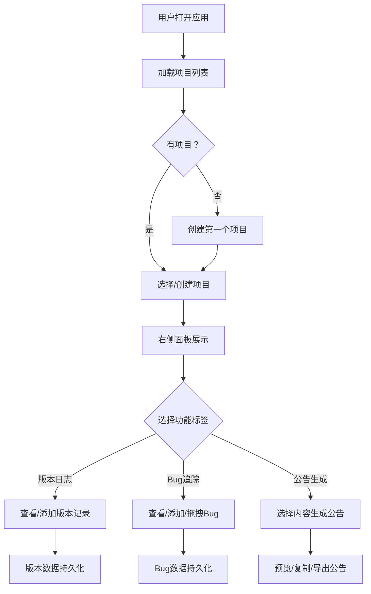

## 1. 产品概述

游戏项目版本日志管理与公告生成系统，面向独立游戏开发者团队，提供轻量级内部工具，用于管理多个游戏项目的版本发布日志、追踪Bug修复记录，并生成可对外发布的结构化更新公告。

- 解决独立游戏团队在多项目管理、版本追踪和公告发布方面的效率问题
- 目标用户：独立游戏开发者团队（3-10人），需一套无需部署数据库的轻量级工具

## 2. 核心功能

### 2.1 用户角色

| 角色 | 注册方式 | 核心权限 |
|------|----------|----------|
| 团队成员 | 无需注册，直接使用 | 项目管理、版本记录、Bug追踪、公告生成 |

### 2.2 功能模块

1. **项目管理模块**：创建/编辑/删除游戏项目，项目列表水平滚动展示，选中项目高亮并驱动右侧面板内容切换
2. **版本日志模块**：竖向时间线展示版本历史，支持版本节点的增删改查，展开/折叠动画
3. **Bug追踪模块**：Kanban看板三列（待修复/修复中/已关闭），拖拽切换状态，按标题关键词搜索
4. **公告生成模块**：从版本日志和已修复Bug中选择内容，自动按规则分段生成Markdown公告，打字机效果预览，支持复制和导出HTML

### 2.3 页面详情

| 页面名称 | 模块名称 | 功能描述 |
|----------|----------|----------|
| 主页面 | 项目列表（左侧栏） | 项目卡片水平滚动展示，显示图标和名称，点击切换当前项目，支持新增/删除项目，删除时折叠淡出动画0.4s |
| 主页面 | 项目详情面板（右侧） | 含编辑项目名称和描述的表单 |
| 主页面-版本日志标签 | 版本时间线 | 竖向时间线展示版本历史，每个节点显示版本号/日期/摘要，点击展开详细日志（0.3s），日志项支持编辑/删除（删除滑出淡出），底部添加新版本日志 |
| 主页面-Bug追踪标签 | Kanban看板 | 三列：待修复/修复中/已关闭，卡片显示标题/严重程度标签/报告人，支持拖拽切换状态（半透明投影+旋转），顶部搜索框按标题过滤 |
| 主页面-公告生成标签 | 公告生成器 | 从版本日志和已修复Bug中选择2-5项，生成结构化Markdown公告，预览区红色笔记风格，打字机逐字效果0.05s/字，复制和导出HTML按钮 |

## 3. 核心流程

**项目管理流程**：用户创建游戏项目 → 选择图标和填写名称/描述 → 项目出现在左侧列表 → 点击切换当前项目

**版本日志流程**：选择项目 → 切换到版本日志标签 → 底部添加新版本（版本号/日期/摘要） → 展开版本节点查看/编辑/删除日志项

**Bug追踪流程**：选择项目 → 切换到Bug追踪标签 → 添加Bug报告 → 拖拽卡片切换状态 → 搜索过滤Bug

**公告生成流程**：选择项目 → 切换到公告生成标签 → 从版本日志和已修复Bug中选择内容 → 点击生成公告 → 预览打字机效果 → 复制或导出HTML

## 4. 用户界面设计

### 4.1 设计风格

- **主色调**：深色模式 - 背景 #1a1a2e、侧边栏 #16213e、卡片 #0f3460、高亮 #e94560、强调 #533483
- **按钮风格**：圆角8px，悬停阴影加深上浮2px，点击下沉0.5px
- **字体**：标题使用 Rajdhani（游戏科技感），正文使用 Noto Sans SC（中文友好）
- **布局风格**：左右两栏，左侧固定280px项目列表，右侧标签页切换内容
- **图标风格**：SVG像素风格游戏图标（像素剑、魔法书、太空船、盾牌、骰子）
- **缓动函数**：cubic-bezier(0.4, 0, 0.2, 1)，状态切换200ms-400ms过渡

### 4.2 页面设计概览

| 页面名称 | 模块名称 | UI元素 |
|----------|----------|--------|
| 主页面 | 左侧项目列表 | 深色侧边栏，项目卡片水平滚动，图标+名称，选中高亮边框#e94560，删除折叠淡出动画 |
| 主页面 | 右侧面板头部 | 标签页切换（版本日志/Bug追踪/公告生成），水平滑动过渡0.4s |
| 主页面 | 版本日志 | 竖向时间线，元素图标节点，版本号/日期/摘要，展开动画0.3s，彩色类别标签（新增绿/修改蓝/修复橙/移除灰） |
| 主页面 | Bug追踪 | 三列Kanban，卡片悬停阴影，拖拽半透明+旋转，严重程度彩色标签，搜索框 |
| 主页面 | 公告生成 | 选择列表，红色笔记风格预览区，打字机效果，复制/导出按钮 |
| 主页面 | 骨架屏 | 加载状态占位骨架屏，空状态友好提示 |

### 4.3 响应式设计

- 桌面优先设计，768px以下Kanban板改为垂直堆叠
- 左侧项目列表在小屏幕下可折叠
- 所有卡片和组件保持圆角8px一致性

### 4.4 动画规范

- 项目删除：向左收缩折叠淡出0.4s
- 版本节点展开：0.3s展开动画
- 日志项删除：向左滑出淡出
- 版本节点出现：从底部向上展开0.5s
- 卡片拖拽：半透明投影+轻微旋转
- 标签页切换：水平滑动过渡0.4s
- 悬停高亮：0.3s过渡
- 打字机效果：0.05秒/字
