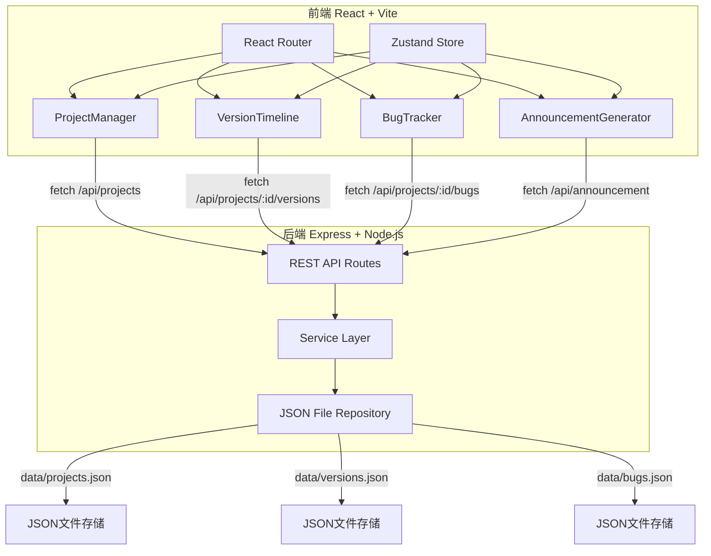
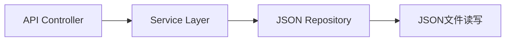
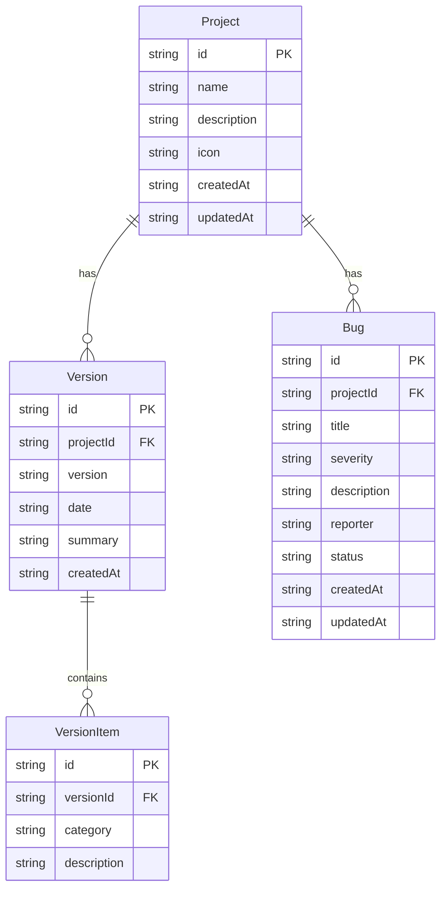

## 1. 架构设计



## 2. 技术说明

- **前端**：React@18 + TypeScript + Vite + TailwindCSS + Zustand
- **初始化工具**：vite-init（react-express-ts模板）
- **后端**：Express + TypeScript（ESM格式）
- **数据存储**：JSON文件持久化（data目录下）
- **拖拽**：@hello-pangea/dnd（react-beautiful-dnd的维护分支，支持React 18）
- **虚拟列表**：react-virtualized（长列表性能优化）
- **图标**：lucide-react

## 3. 路由定义

| 路由 | 用途 |
|------|------|
| / | 主页面，包含项目列表和内容区 |

说明：本项目为单页应用，所有模块通过标签页切换，无需多路由。

## 4. API定义

### 4.1 项目管理

| 方法 | 路径 | 请求体 | 响应 |
|------|------|--------|------|
| GET | /api/projects | - | Project[] |
| POST | /api/projects | { name, description, icon } | Project |
| DELETE | /api/projects/:id | - | { success: boolean } |

### 4.2 版本日志

| 方法 | 路径 | 请求体 | 响应 |
|------|------|--------|------|
| GET | /api/projects/:id/versions | - | Version[] |
| POST | /api/projects/:id/versions | { version, date, summary, items[] } | Version |
| DELETE | /api/versions/:id | - | { success: boolean } |

### 4.3 Bug追踪

| 方法 | 路径 | 请求体 | 响应 |
|------|------|--------|------|
| GET | /api/projects/:id/bugs | - | Bug[] |
| POST | /api/projects/:id/bugs | { title, severity, description, reporter } | Bug |
| PUT | /api/bugs/:id | { status, updatedAt } | Bug |
| DELETE | /api/bugs/:id | - | { success: boolean } |

### 4.4 公告生成

| 方法 | 路径 | 请求体 | 响应 |
|------|------|--------|------|
| POST | /api/announcement | { projectId, versionId, bugIds[], itemIds[] } | { markdown, html } |

### 4.5 TypeScript类型定义

```typescript
interface Project {
  id: string;
  name: string;
  description: string;
  icon: 'pixel-sword' | 'magic-book' | 'spaceship' | 'shield' | 'dice';
  createdAt: string;
  updatedAt: string;
}

interface Version {
  id: string;
  projectId: string;
  version: string;
  date: string;
  summary: string;
  items: VersionItem[];
  createdAt: string;
}

interface VersionItem {
  id: string;
  category: 'added' | 'modified' | 'fixed' | 'removed';
  description: string;
}

interface Bug {
  id: string;
  projectId: string;
  title: string;
  severity: 'critical' | 'medium' | 'minor';
  description: string;
  reporter: string;
  status: 'open' | 'in-progress' | 'closed';
  createdAt: string;
  updatedAt: string;
}
```

## 5. 服务端架构图



## 6. 数据模型

### 6.1 数据模型定义



### 6.2 数据存储

JSON文件存储结构：
- `server/data/projects.json` — 项目列表
- `server/data/versions.json` — 版本日志列表
- `server/data/bugs.json` — Bug记录列表

初始数据：预置一个示例游戏项目，包含2个版本日志和3条Bug记录。

## 7. 文件结构与调用关系

```
├── package.json                  # 依赖和启动脚本
├── index.html                    # 入口页面
├── vite.config.ts                # Vite配置（代理到后端API）
├── tsconfig.json                 # TypeScript严格模式配置
├── server/
│   ├── index.js                  # Express服务入口
│   └── data/                     # JSON数据存储目录
│       ├── projects.json
│       ├── versions.json
│       └── bugs.json
├── src/
│   ├── main.tsx                  # 应用入口 → 挂载Router → 初始化Store → 获取项目列表
│   ├── store/
│   │   └── useGameStore.ts       # Zustand全局状态 → 被所有组件调用
│   ├── components/
│   │   ├── ProjectManager.tsx    # 项目管理 → 调用store.setCurrentProject
│   │   ├── VersionTimeline.tsx   # 版本日志 → 调用store.addVersion
│   │   ├── BugTracker.tsx        # Bug追踪 → 调用store.addBugReport
│   │   └── AnnouncementGenerator.tsx # 公告生成 → 调用store.generateAnnouncement
│   └── types/
│       └── index.ts              # TypeScript类型定义 → 被所有模块引用
```

**数据流向**：
- 前端组件 → Zustand Store actions → fetch调用 → 后端REST API → JSON文件读写
- 后端响应 → Store更新 → 组件重渲染
