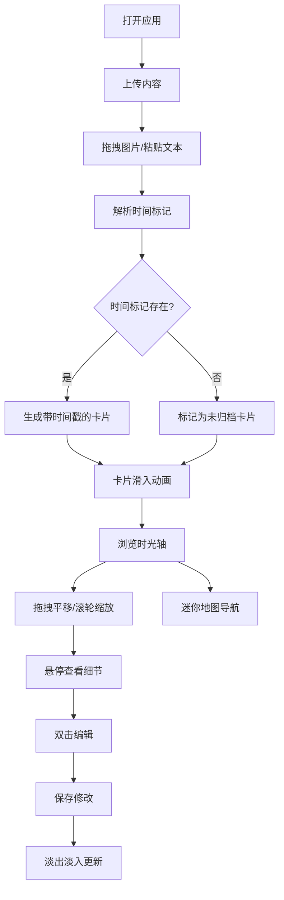

## 1. 产品概述

滚动时光轴是一个沉浸式的个人记忆管理工具，允许用户通过上传照片和文本片段，在水平滚动的时间轴画布上可视化展示人生重要时刻。通过流畅的交互动画和精美的深色主题设计，为用户创造一种穿越时光的视觉体验。

- 核心价值：将碎片化的记忆以时间维度重新组织，创造沉浸式的回忆浏览体验
- 目标用户：需要整理个人照片、日记、旅行记录等记忆内容的用户
- 解决问题：传统相册/笔记应用缺乏时间维度的沉浸式展示和流畅的交互体验

## 2. 核心功能

### 2.1 用户角色

| 角色 | 注册方式 | 核心权限 |
|------|----------|----------|
| 普通用户 | 无需注册，本地使用 | 创建、编辑、浏览时光轴卡片 |

### 2.2 功能模块

1. **时光轴主画布**：水平滚动展示所有卡片，支持拖拽平移、滚轮缩放、聚焦效果
2. **卡片上传模块**：拖拽上传图片、粘贴文本、自动解析时间标记
3. **卡片编辑器**：双击编辑标题、注释、时间戳，毛玻璃弹窗效果
4. **迷你导航地图**：底部缩略图展示全局视图，支持快速定位
5. **动画交互系统**：卡片滑入、悬停发光、缩放过渡、连线动画

### 2.3 页面详情

| 页面名称 | 模块名称 | 功能描述 |
|----------|----------|----------|
| 主页面 | 上传区域 | 顶部拖拽区域，支持图片拖拽上传和文本粘贴，自动识别时间标记 |
| 主页面 | 时光轴画布 | 占据主要视口，水平滚动，卡片按时间顺序排列，带发光连线 |
| 主页面 | 迷你地图 | 画布底部缩略图，显示所有卡片位置，支持拖拽导航 |
| 弹窗 | 卡片编辑器 | 双击卡片弹出，编辑标题、注释、时间戳，保存后平滑过渡 |

## 3. 核心流程

用户打开应用 → 拖拽图片或粘贴文本到上传区域 → 系统自动解析时间戳并生成卡片 → 卡片从左侧滑入动画出现 → 用户拖拽/缩放浏览时光轴 → 悬停卡片查看细节 → 双击卡片编辑内容 → 保存后卡片淡出淡入更新 → 通过迷你地图快速导航

## 4. 用户界面设计

### 4.1 设计风格

- **主色调**：深色主题，主背景 #1A1A2E，卡片背景 #16213E
- **文字颜色**：标题 #E2E8F0，注释 #A0AEC0
- **强调色**：连线 #4FD1C5（青色发光），聚焦卡片 #E8F5E9（淡绿），迷你地图视口 #FFA500（透明橙）
- **标签色**：预设10种柔和色，每张卡片随机分配
- **字体**：标题使用 Display 字体，正文使用 Sans-serif 字体
- **按钮风格**：圆角半透明，毛玻璃效果
- **阴影效果**：卡片悬浮阴影 0.2rem → 0.5rem 平滑过渡，叠加彩色外发光
- **布局风格**：卡片式布局，水平时间轴，卡片间发光连线连接

### 4.2 页面设计概览

| 页面名称 | 模块名称 | UI元素 |
|----------|----------|--------|
| 主页面 | 上传区域 | 半透明虚线边框，拖入时高亮提示，支持多种图片格式 |
| 主页面 | 时光轴画布 | 无限水平滚动，卡片按时间排列，中心聚焦淡绿色，边缘渐变灰白 |
| 主页面 | 迷你地图 | 底部缩略图，橙色透明视口框，拖拽同步滚动 |
| 弹窗 | 卡片编辑器 | 毛玻璃背景，圆角边框，从卡片位置放大出现 |
| 交互 | 悬停效果 | 阴影放大，彩色外发光，高分辨率细节弹窗 |
| 交互 | 动画效果 | 卡片滑入（0.3s弹性缓动），缩放平滑过渡，保存淡出淡入 |

### 4.3 响应式

- 桌面端优先设计，支持平板适配
- 触摸操作支持：双指缩放、滑动平移
- 最小支持宽度：1024px

### 4.4 性能要求

- 所有动画帧率稳定在 55fps 以上
- 使用 CSS transform 和 opacity 实现动画，避免重排重绘
- 图片使用适当的压缩和缓存策略
- 时间线渲染使用原生 DOM 操作，不依赖第三方滚动库
