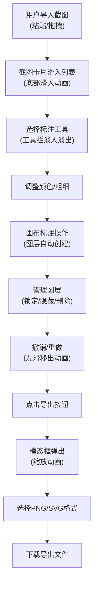

## 1. 产品概述

网页端截图即时标注与批注工具，为团队协作提供轻量、可定制且离线可用的标注解决方案。解决日常办公中截图分享讨论需要依赖外部服务、功能单一的痛点。

- **核心目标**：提供快速、离线的截图标注能力，支持多种标注工具和图层管理
- **目标用户**：办公协作场景下的团队成员、设计师、产品经理、开发人员
- **市场价值**：替代付费截图工具，提供开源可定制的本地标注解决方案

## 2. 核心功能

### 2.1 用户角色

| 角色 | 注册方式 | 核心权限 |
|------|----------|----------|
| 普通用户 | 无需注册，直接使用 | 导入截图、标注编辑、图层管理、导出图片 |

### 2.2 功能模块

1. **标注画布**：Canvas绘制、多图层渲染、鼠标交互
2. **工具面板**：画笔、直线、箭头、矩形、圆形、文字标签
3. **截图管理**：剪贴板粘贴、文件拖拽、截图列表、重命名、删除
4. **图层管理**：图层列表、锁定/隐藏/删除、撤销/重做（20步）
5. **导出功能**：PNG合并导出、SVG矢量导出

### 2.3 页面详情

| 页面名称 | 模块名称 | 功能描述 |
|---------|----------|----------|
| 主应用页面 | 顶部导航栏 | 应用Logo、清空所有截图按钮 |
| 主应用页面 | 左侧截图面板 | 截图列表、导入区域、展开/收起动画 |
| 主应用页面 | 中央标注画布 | Canvas绘图区域、底图显示、十字准星光标 |
| 主应用页面 | 右侧工具栏 | 工具选择、调色板（12色+取色器）、粗细滑块 |
| 主应用页面 | 底部图层面板 | 图层列表、锁定/隐藏/删除、撤销重做按钮 |
| 主应用页面 | 导出模态框 | 格式选择（PNG/SVG）、下载功能、缩放动画 |

## 3. 核心流程

### 用户操作流程

用户通过Ctrl+V粘贴或拖拽导入截图 → 选择标注工具并调整参数 → 在画布上进行标注操作 → 查看和管理图层（可选） → 导出标注结果

## 4. 用户界面设计

### 4.1 设计风格

- **主色调**：深暗色主题，主背景 `#1e1e2e`，卡片背景 `#2a2a3e`，画布背景 `#2d2d2d`
- **文字颜色**：柔和白色 `#e0e0e0`
- **按钮风格**：圆角8px，悬停时轻微上浮和亮度提升
- **字体**：使用 JetBrains Mono 作为等宽字体，搭配 Inter 作为界面字体
- **布局风格**：三栏布局，左侧可收起边栏 + 中央画布 + 右侧工具栏
- **图标风格**：使用 Phosphor Icons 线性图标风格

### 4.2 页面设计概述

| 页面名称 | 模块名称 | UI元素 |
|---------|----------|--------|
| 主应用页面 | 顶部导航栏 | 深色渐变背景、Logo文字、清空按钮、阴影分隔 |
| 主应用页面 | 左侧截图面板 | 卡片式列表、底部滑入动画、拖拽区域虚线边框 |
| 主应用页面 | 中央画布 | 深灰背景、十字准星光标、平滑缩放 |
| 主应用页面 | 右侧工具栏 | 垂直工具按钮、激活状态高亮、调色板色块网格、滑块控件 |
| 主应用页面 | 底部图层面板 | 水平图层卡片、锁定/隐藏图标、删除按钮 |
| 主应用页面 | 导出模态框 | 半透明遮罩、中心缩放动画、格式选择卡片 |

### 4.3 响应式设计

- **桌面优先**：1280px及以上分辨率完整布局
- **1280px以下**：左侧面板自动收起为浮动按钮，点击后浮动展开
- **触控优化**：按钮最小尺寸44x44px，支持触控操作
- **所有过渡动画**：CSS transition 实现，缓动函数使用 cubic-bezier(0.4, 0, 0.2, 1)

### 4.4 动画设计

- **截图导入**：卡片从底部滑入（translateY + opacity），持续0.3秒
- **截图删除**：向中心收缩并淡出（scale + opacity），持续0.25秒
- **工具切换**：工具栏内容淡入淡出（opacity），持续0.15秒
- **撤销动画**：图层向左滑动移出，持续0.2秒
- **模态框**：中心缩放弹出（scale 0.8 → 1），持续0.3秒
- **侧边栏展开**：宽度48px → 260px，持续0.25秒缓动
