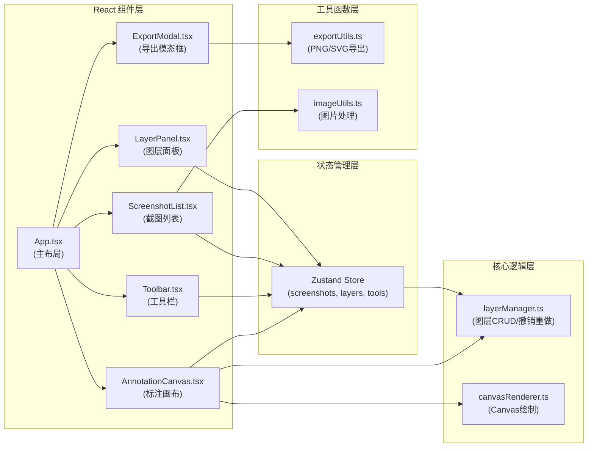

## 1. 架构设计



## 2. 技术栈描述

- **前端框架**：React 18 + TypeScript 5
- **构建工具**：Vite 5 + @vitejs/plugin-react 4
- **状态管理**：Zustand 4
- **唯一标识**：uuid 9
- **样式方案**：CSS Modules + CSS Variables（不使用 Tailwind）
- **无需后端**：纯前端应用，数据存储在内存中

## 3. 目录结构

```
├── package.json
├── index.html
├── vite.config.ts
├── tsconfig.json
├── src/
│   ├── main.tsx              # React应用入口
│   ├── App.tsx               # 主布局组件
│   ├── index.css             # 全局样式
│   ├── store/
│   │   └── useStore.ts       # Zustand状态管理
│   ├── components/
│   │   ├── AnnotationCanvas.tsx   # 标注画布
│   │   ├── Toolbar.tsx            # 工具栏
│   │   ├── ScreenshotList.tsx     # 截图列表
│   │   ├── LayerPanel.tsx         # 图层面板
│   │   └── ExportModal.tsx        # 导出模态框
│   ├── utils/
│   │   ├── layerManager.ts        # 图层管理
│   │   ├── exportUtils.ts         # 导出工具
│   │   └── imageUtils.ts          # 图片处理
│   └── types/
│       └── index.ts               # TypeScript类型定义
```

## 4. 数据模型

### 4.1 类型定义

```typescript
// 标注工具类型
type ToolType = 'brush' | 'line' | 'arrow' | 'rectangle' | 'circle' | 'text';

// 图层基础接口
interface BaseLayer {
  id: string;
  type: ToolType;
  x: number;
  y: number;
  color: string;
  strokeWidth: number;
  visible: boolean;
  locked: boolean;
  createdAt: number;
}

// 自由绘制图层
interface BrushLayer extends BaseLayer {
  type: 'brush';
  points: { x: number; y: number }[];
}

// 直线/箭头图层
interface LineLayer extends BaseLayer {
  type: 'line' | 'arrow';
  endX: number;
  endY: number;
}

// 矩形图层
interface RectangleLayer extends BaseLayer {
  type: 'rectangle';
  width: number;
  height: number;
}

// 圆形图层
interface CircleLayer extends BaseLayer {
  type: 'circle';
  radiusX: number;
  radiusY: number;
}

// 文字图层
interface TextLayer extends BaseLayer {
  type: 'text';
  content: string;
  fontSize: number;
}

type Layer = BrushLayer | LineLayer | RectangleLayer | CircleLayer | TextLayer;

// 截图数据
interface Screenshot {
  id: string;
  name: string;
  imageData: string; // base64
  width: number;
  height: number;
  layers: Layer[];
  createdAt: number;
}

// 历史记录（用于撤销重做）
interface HistoryState {
  past: Layer[][];
  future: Layer[][];
}

// 应用状态
interface AppState {
  screenshots: Screenshot[];
  activeScreenshotId: string | null;
  activeTool: ToolType;
  toolColor: string;
  strokeWidth: number;
  selectedLayerId: string | null;
  sidebarExpanded: boolean;
  showExportModal: boolean;
  history: HistoryState;
}
```

## 5. 核心模块说明

### 5.1 Zustand Store (useStore.ts)

负责全局状态管理，包含：
- 截图列表的增删改查
- 当前激活截图和图层
- 工具状态（类型、颜色、粗细）
- 撤销重做历史管理
- UI状态（侧边栏、模态框）

### 5.2 Layer Manager (layerManager.ts)

独立模块，负责：
- 图层的CRUD操作
- 撤销/重做逻辑（最多20步历史）
- 图层可见性、锁定状态切换
- 纯函数设计，便于测试

### 5.3 AnnotationCanvas.tsx

核心画布组件，负责：
- Canvas初始化和尺寸适配
- 鼠标事件处理（按下、移动、释放）
- 实时绘制预览（正在绘制的图形）
- 图层渲染循环（requestAnimationFrame）
- 文字输入交互

### 5.4 Toolbar.tsx

工具栏组件，负责：
- 工具切换（6种工具）
- 调色板渲染（12色预设 + 自定义取色器）
- 粗细滑块（1-20px）
- 激活工具的参数面板

### 5.5 导出模块 (exportUtils.ts)

- **PNG导出**：创建离屏Canvas，先绘制底图，再绘制所有可见图层，最后toBlob下载
- **SVG导出**：生成SVG字符串，包含base64底图和矢量标注元素，转换为Blob下载

## 6. 性能优化策略

### 6.1 Canvas渲染优化
- 使用双层Canvas：一层绘制底图，一层绘制标注图层
- 仅在图层变化时重绘，而非每帧重绘
- 正在绘制的图形使用单独的预览Canvas

### 6.2 状态更新优化
- Zustand使用selectors避免不必要重渲染
- 图层操作使用immer或不可变更新
- 历史记录限制20步防止内存溢出

### 6.3 动画优化
- 所有UI动画使用CSS transform和opacity
- 列表动画使用FLIP技术
- 使用 will-change 提升动画性能

## 7. 键盘快捷键

| 快捷键 | 功能 |
|--------|------|
| Ctrl + V | 粘贴剪贴板图片 |
| Ctrl + Z | 撤销 |
| Ctrl + Shift + Z / Ctrl + Y | 重做 |
| B | 切换画笔工具 |
| L | 切换直线工具 |
| A | 切换箭头工具 |
| R | 切换矩形工具 |
| C | 切换圆形工具 |
| T | 切换文字工具 |
| Delete / Backspace | 删除选中图层 |
| Escape | 取消当前绘制 |
