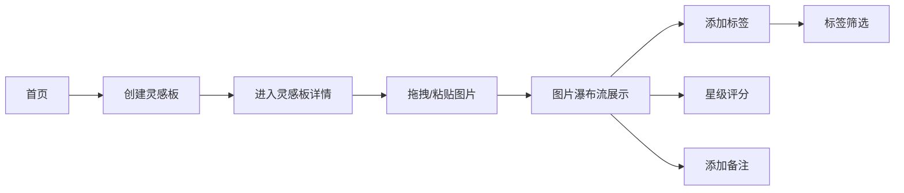

## 1. 产品概述

灵感集市是一个为插画师和设计师打造的线上作品灵感收集与分享空间，支持用户从网络收集图片素材、进行标签管理和评分，并将图片组合成灵感板。

- 核心目标：提供一个轻量、美观、高交互体验的灵感管理工具
- 目标用户：插画师、设计师、创意工作者
- 产品价值：帮助用户高效收集、整理和检索灵感素材

## 2. 核心功能

### 2.1 功能模块

1. **灵感板管理**：创建、查看灵感板，灵感板卡片以底部上滑动画出现
2. **图片收集**：通过拖拽本地图片或粘贴图片URL添加素材
3. **瀑布流展示**：图片以两列瀑布流布局自动排列
4. **图片评分**：1-5星评分系统，带有烟火粒子动效
5. **标签系统**：彩色胶囊标签，支持按标签筛选
6. **备注功能**：每张图片可添加最多200字的可展开备注

### 2.2 页面详情

| 页面名称 | 模块名称 | 功能描述 |
|---------|---------|---------|
| 主页面 | 顶部导航栏 | Logo、菜单按钮、响应式汉堡菜单 |
| 主页面 | 灵感板区域 | 展示灵感板卡片列表，支持创建新板 |
| 灵感板详情 | 上传区域 | 拖拽上传或粘贴图片URL |
| 灵感板详情 | 瀑布流容器 | 两列瀑布流布局展示图片 |
| 图片卡片 | 评分模块 | 1-5星评分，烟火粒子效果 |
| 图片卡片 | 标签模块 | 彩色胶囊标签，点击筛选 |
| 图片卡片 | 备注模块 | 可展开的备注输入区 |

## 3. 核心流程

用户打开应用 → 查看灵感板列表 → 创建新灵感板（底部上滑动画）→ 进入灵感板 → 拖拽或粘贴图片URL → 图片加载（中心扩散淡入）→ 添加标签（彩色胶囊自动配色）→ 评分星星（烟火粒子）→ 展开备注输入 → 点击标签筛选同标签图片

## 4. 用户界面设计

### 4.1 设计风格

- **主色调**：奶油白（#FFFDF7）、浅灰（#F5F3EE）
- **强调色**：琥珀色（#FF8C42）用于按钮、激活状态、星标
- **卡片间距**：16px
- **交互过渡**：所有操作均有微妙过渡动画
- **卡片悬停**：上浮3px并加深阴影
- **按钮效果**：按下回弹效果

### 4.2 页面设计概述

| 页面名称 | 模块名称 | UI元素 |
|---------|---------|--------|
| 主页面 | 灵感板卡片 | 圆角卡片、阴影、0.35s上滑+0.15s弹性动画 |
| 灵感板详情 | 图片卡片 | 中心扩散淡入（0.5s）、悬停上浮3px |
| 图片卡片 | 评分星标 | 悬浮右上角、点击依次亮起、烟火粒子 |
| 图片卡片 | 标签 | 彩色圆角胶囊、色相循环自动配色 |
| 图片卡片 | 备注区 | 浅色背景、圆角边框、0.2s平滑展开 |
| 导航栏 | 汉堡菜单 | 三线变叉号、0.3s旋转过渡 |

### 4.3 响应式设计

- 桌面端：双列瀑布流，完整导航栏
- 平板端：双列瀑布流，紧凑导航
- 手机端：单列瀑布流，汉堡菜单折叠导航
- 触控优化：所有点击区域≥44px

### 4.4 性能要求

- 图片超过30张时保持60fps滚动帧率
- 图片懒加载
- 瀑布流计算使用requestAnimationFrame优化
