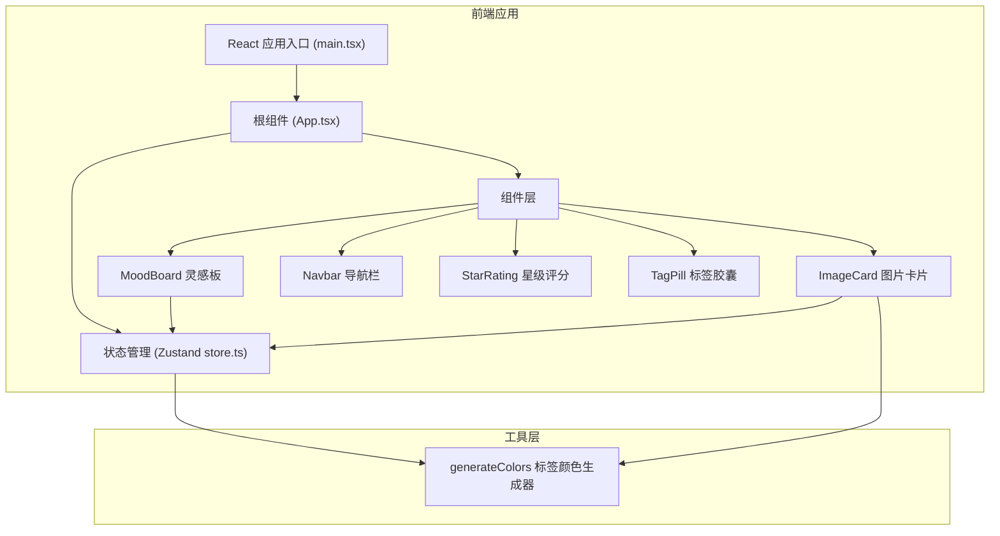
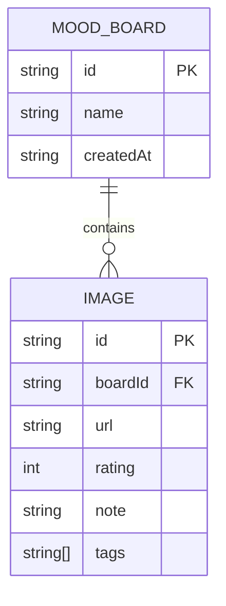

## 1. 架构设计



## 2. 技术描述

- **前端框架**：React 18 + TypeScript
- **构建工具**：Vite 5 + @vitejs/plugin-react
- **状态管理**：Zustand 4
- **唯一ID生成**：uuid
- **样式方案**：CSS Modules / 内联样式（CSS变量）

## 3. 路由定义

| 路由 | 用途 |
|------|------|
| / | 首页，展示灵感板列表 |
| /board/:id | 灵感板详情页 |

## 4. 数据模型

### 4.1 数据模型定义



### 4.2 TypeScript 类型定义

```typescript
interface MoodBoard {
  id: string;
  name: string;
  createdAt: number;
}

interface ImageItem {
  id: string;
  boardId: string;
  url: string;
  rating: number;
  note: string;
  tags: string[];
}

interface AppState {
  boards: MoodBoard[];
  images: ImageItem[];
  activeBoardId: string | null;
  activeTagFilter: string | null;
  addBoard: (name: string) => void;
  removeBoard: (id: string) => void;
  addImage: (boardId: string, url: string) => void;
  removeImage: (id: string) => void;
  updateImageRating: (id: string, rating: number) => void;
  updateImageNote: (id: string, note: string) => void;
  addImageTag: (imageId: string, tag: string) => void;
  removeImageTag: (imageId: string, tag: string) => void;
  setActiveBoard: (id: string | null) => void;
  setActiveTagFilter: (tag: string | null) => void;
}
```

## 5. 文件结构

```
e:\solo\SoloAutoDemo\tasks\auto128\
├── package.json
├── index.html
├── vite.config.ts
├── tsconfig.json
└── src/
    ├── main.tsx
    ├── App.tsx
    ├── store.ts
    ├── components/
    │   ├── MoodBoard.tsx
    │   ├── ImageCard.tsx
    │   ├── StarRating.tsx
    │   ├── TagPill.tsx
    │   └── Navbar.tsx
    ├── utils/
    │   └── generateColors.ts
    └── styles/
        └── index.css
```

## 6. 性能优化策略

1. **瀑布流渲染优化**：使用 CSS `column-count` 实现基础瀑布流，避免 JS 计算
2. **图片懒加载**：原生 `loading="lazy"` + IntersectionObserver
3. **虚拟列表（可选）**：图片超过 50 张时启用虚拟滚动
4. **动画优化**：使用 CSS `transform` 和 `opacity` 实现 GPU 加速动画
5. **状态管理**：Zustand 自动订阅优化，避免不必要的重渲染
6. **防抖节流**：拖拽、滚动等高频事件使用节流
