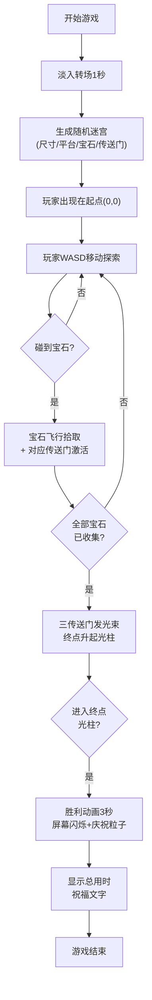

## 1. 产品概述

幻象阶梯是一款沉浸式3D迷宫解谜游戏，玩家在不断旋转的阶梯迷宫中收集宝石、激活传送门，最终抵达终点完成挑战。

- **核心玩法**：3D空间导航 + 收集解谜 + 传送门激活机制
- **目标用户**：休闲游戏爱好者，解谜游戏玩家，喜欢视觉体验的玩家
- **市场价值**：轻量化Web端3D游戏，无需下载即开即玩，具有艺术观赏性和可玩性

## 2. 核心功能

### 2.1 功能模块

1. **迷宫生成系统**：随机生成5x5-8x8大小的阶梯迷宫，包含平台高度差、起点终点、宝石与传送门布局
2. **玩家控制系统**：WASD键盘移动 + AD视角旋转，碰撞检测与反弹效果，粒子拖尾特效
3. **宝石收集系统**：3种颜色宝石（红/蓝/绿），拾取时飞行吸附动画与拖尾
4. **传送门激活系统**：对应颜色传送门激活，光晕效果与旋转过渡动画
5. **胜利判定系统**：全部宝石收集后传送门开启，终点光柱升起，进入终点触发胜利动画
6. **UI界面系统**：宝石收集进度、计时器、淡入转场、胜利提示、响应式布局、虚拟摇杆

### 2.2 功能详情

| 模块名称 | 子功能 | 功能描述 |
|-----------|--------|----------|
| 迷宫生成 | 随机尺寸 | 每次游戏随机5x5到8x8网格大小 |
| 迷宫生成 | 高度阶梯 | 平台间随机高度差形成立体阶梯 |
| 迷宫生成 | 元素分布 | 3颗不同颜色宝石 + 3个对应传送门随机分布 |
| 玩家控制 | WASD移动 | 前后左右移动，支持阶梯上下移动 |
| 玩家控制 | 视角控制 | AD键或鼠标拖动控制相机视角 |
| 玩家控制 | 碰撞检测 | 无平台区域碰撞反弹，红光闪烁提示 |
| 玩家控制 | 粒子特效 | 发光球体 + 拖尾粒子 + 地板光晕反馈 |
| 宝石收集 | 吸附动画 | 靠近时0.3秒飞向玩家，带拖尾效果 |
| 宝石收集 | 状态管理 | 记录已收集颜色，更新UI图标 |
| 传送门激活 | 激活过渡 | 收集对应宝石后0.5秒从静止到匀速旋转 |
| 传送门激活 | 光晕效果 | 边缘对应颜色发光，激活后增强亮度 |
| 胜利判定 | 光束指引 | 全部激活后传送门发出光束指向终点 |
| 胜利判定 | 终点光柱 | 终点平台升起光柱，提示玩家进入 |
| 胜利判定 | 胜利动画 | 屏幕闪烁 + 庆祝粒子3秒 + 总用时展示 |
| UI界面 | 宝石计数 | 左上角显示3颗宝石图标，已收集高亮 |
| UI界面 | 计时器 | 右上角从0开始计时，结束时停止 |
| UI界面 | 转场效果 | 开始时1秒淡入，胜利时缩放祝福文字 |
| UI界面 | 响应式 | 适配1920x1080/2560x1440，移动端虚拟摇杆 |

## 3. 核心流程

## 4. 用户界面设计

### 4.1 设计风格

- **主色调**：深空蓝紫色 `#0a0e27` → `#1a1a4e` 渐变背景
- **平台色**：半透明蓝白色 `rgba(120,180,255,0.25)`，霓虹光边 `#6ccfff`
- **宝石色**：红 `#ff4d6d`、蓝 `#4dd2ff`、绿 `#4dff88` 高饱和发光
- **玩家色**：柔和白金光晕 `#fff8e7`
- **字体**：Orbitron（标题）+ Rajdhani（正文），科幻感无衬线字体
- **视觉风格**：赛博朋克 + 深空幻境，粒子与光晕营造梦幻氛围

### 4.2 页面布局

| 区域 | 元素 | 设计说明 |
|------|------|----------|
| 3D场景 | 旋转迷宫 | 整体缓慢Z轴旋转，平台上下浮动动画 |
| 左上UI | 宝石图标组 | 3颗圆形宝石图标，未收集灰色半透明，已收集高亮发光 |
| 右上UI | 计时器 | `00:00.0` 格式，等宽字体，蓝白色发光 |
| 屏幕中央 | 胜利文字 | "恭喜通关！"大字缩放动画，下方显示总用时 |
| 屏幕底层 | 全屏Canvas | 响应式铺满，背景深空渐变 |
| 移动端 | 虚拟摇杆 | 左下角摇杆区域，控制移动方向 |

### 4.3 响应式设计

- **桌面优先**：1920x1080为基准，2560x1440按比例缩放
- **平板适配**：UI元素按屏幕宽度等比缩放
- **移动适配**：检测触摸设备启用虚拟摇杆，UI按钮尺寸放大
- **Canvas自适应**：`resize` 事件监听，保持相机aspect比例

### 4.4 3D场景指导

- **环境氛围**：深空粒子背景（50-80个慢速浮动星点），无HDRI使用纯色渐变fog
- **灯光设置**：AmbientLight(0.3) + DirectionalLight(0.8, 蓝白色) + 3个PointLight跟随宝石/玩家
- **相机参数**：PerspectiveCamera fov=60，初始位置俯视45°，跟随玩家smooth阻尼
- **构图焦点**：玩家球体为视觉中心，宝石/传送门发光突出，终点光柱引导视线
- **动画系统**：使用useFrame实现平台float、场景rotate、玩家trail、宝石bobing动画
- **后期效果**：Bloom发光效果（阈值0.8，强度0.6），无其他后处理保证性能
- **性能预算**：粒子≤200，总面数≤30000，移动端≥30fps
