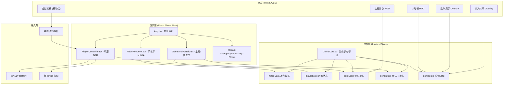

## 1. 架构设计



## 2. 技术描述

- **前端框架**: React@18 + TypeScript@5 严格模式
- **3D渲染**: three@0.160 + @react-three/fiber@8 + @react-three/drei@9
- **状态管理**: zustand@4 (游戏逻辑与渲染层解耦)
- **构建工具**: vite@5 + @vitejs/plugin-react@4
- **后期效果**: @react-three/postprocessing@2 (Bloom发光)
- **样式方案**: 内联CSS变量 + styled-components风格的React内联样式
- **初始化方式**: 手动搭建目录结构，精确控制依赖版本

## 3. 目录结构

```
src/
├── main.tsx              # React入口，挂载App + StrictMode
├── App.tsx               # 场景根组件：Canvas + 相机 + 灯光 + 子组件组合
├── GameCore.ts           # Zustand Store：迷宫生成算法 + 全部游戏状态 + Actions
├── MazeRenderer.tsx      # R3F组件：遍历迷宫数组渲染阶梯平台Group
├── PlayerController.tsx  # R3F组件：发光球体玩家 + 输入处理 + 碰撞 + 粒子拖尾
├── GemsAndPortals.tsx    # R3F组件：宝石拾取动画 + 传送门激活动画 + 光束
└── styles.css            # 全局样式：HUD布局 + 转场动画 + 响应式媒体查询
```

## 4. 核心数据模型

### 4.1 TypeScript类型定义

```typescript
type GemColor = 'red' | 'blue' | 'green';

interface Platform {
  x: number;
  z: number;
  height: number;     // Y轴高度，形成阶梯
  isStart: boolean;
  isEnd: boolean;
}

interface Gem {
  id: string;
  color: GemColor;
  position: [number, number, number]; // 世界坐标
  collected: boolean;
  flying: boolean;     // 拾取飞行动画中
}

interface Portal {
  id: string;
  color: GemColor;
  position: [number, number, number];
  activated: boolean;
  rotationSpeed: number; // 0→1过渡动画
}

interface Player {
  gridX: number;
  gridZ: number;
  worldPos: [number, number, number];
  targetPos: [number, number, number];
  isMoving: boolean;
  hitFlash: number;     // 碰撞红光闪烁剩余时间
}

interface GameState {
  phase: 'fadeIn' | 'playing' | 'won';
  mazeSize: number;
  platforms: Platform[][];
  player: Player;
  gems: Gem[];
  portals: Portal[];
  elapsedTime: number;
  allGemsCollected: boolean;
  cameraAngle: number;  // Y轴旋转角度
  // Actions
  generateMaze: () => void;
  movePlayer: (dx: number, dz: number) => void;
  updateTimer: (dt: number) => void;
  rotateCamera: (delta: number) => void;
  setPhase: (p: GameState['phase']) => void;
}
```

## 5. 关键算法

### 5.1 迷宫生成算法
```
1. size = randomInt(5, 8)
2. 生成 size×size 平台矩阵，每格height = PerlinNoise(x,z)*2 取整
3. 标记 (0,0) 为 isStart，(size-1, size-1) 为 isEnd
4. 随机选取3个非起终点不重复位置放置宝石（红/蓝/绿各1）
5. 随机选取另外3个与宝石位置距离≥2的格子放置对应颜色传送门
6. BFS验证起点可到达所有宝石和终点，否则重新生成
```

### 5.2 玩家移动与碰撞
```
输入方向 → 旋转到世界坐标(考虑cameraAngle) → 目标格子
→ 检查platforms存在 → 是：Lerp插值移动(0.25s) → 更新高度
→ 否：反弹(回退0.3格) + hitFlash=0.2s + 红光闪烁
```

### 5.3 宝石拾取检测
```
每帧：遍历未收集宝石 → 计算与玩家距离
→ < 1.2格时 flying=true → Lerp 0.3s飞到玩家位置
→ 到达后 collected=true → 对应颜色portal activated=true, rotationSpeed从0→1 0.5s
→ allGemsCollected = gems.every(collected)
```

## 6. 性能优化策略

| 优化项 | 方案 |
|--------|------|
| 平台几何体复用 | 共享1个BoxGeometry实例，Mesh复用材质 |
| 粒子池管理 | 预创建200个Points对象，对象池复用而非创建销毁 |
| 动画帧节流 | 玩家拖尾每2帧才添加1个粒子点 |
| 矩阵更新 | 平台浮动使用Group整体旋转减少矩阵计算 |
| 碰撞检测 | 网格坐标直接查询数组O(1)，非射线检测 |
| 渲染层级 | 宝石/传送门使用frustumCulled=false，平台开启视锥剔除 |
| 后处理限制 | 仅使用Bloom，无SSAO/SSR/DOF等昂贵效果 |
