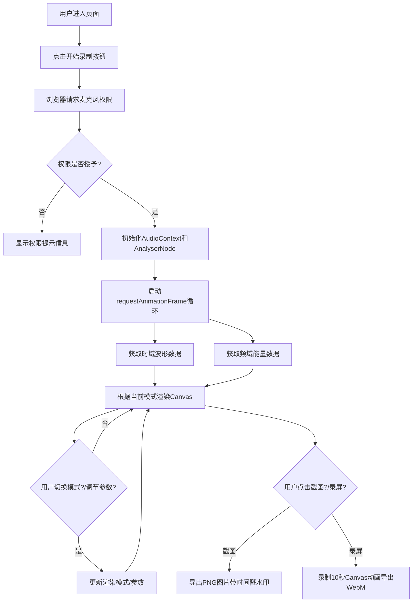

## 1. 产品概述

声纹可视化器是一款基于浏览器的实时音频可视化工具，将用户麦克风输入转化为动态艺术化的波形和频谱图案。面向音乐爱好者、视觉艺术家和直播创作者，提供沉浸式的音频视觉体验。

- 核心价值：将声音转化为可观赏的动态视觉艺术，支持多种可视化风格切换
- 目标用户：音乐创作者、直播主播、视觉艺术爱好者、教育工作者
- 市场定位：轻量级、高性能、艺术化的Web端音频可视化工具

## 2. 核心功能

### 2.1 功能模块

1. **音频采集模块**：麦克风权限获取、实时音频流处理、时域频域分析
2. **可视化渲染模块**：波形流动模式、粒子爆炸模式、混合叠加模式
3. **交互控制模块**：模式切换、参数调节、截图录屏
4. **导出模块**：PNG截图导出、WebM视频录制

### 2.2 页面详情

| 页面名称 | 模块名称 | 功能描述 |
|---------|---------|----------|
| 主页面 | 全屏Canvas画布 | 实时渲染波形/频谱/粒子可视化效果 |
| 主页面 | 右侧控制面板 | 模式切换按钮、参数调节滑块、截图录屏按钮 |
| 主页面 | 录制状态指示器 | 左上角闪烁红点 + 旋转光环 |
| 主页面 | 响应式导航栏 | 移动端底部折叠导航栏 |

## 3. 核心流程

## 4. 用户界面设计

### 4.1 设计风格

**赛博朋克风格**

- **主色调**：深紫 (#1a0a2e) → 暗蓝 (#0d1b3e) 径向渐变背景
- **强调色**：荧光绿 (#00ff9d)、电光蓝 (#00d4ff)
- **辅助色**：霓虹粉 (#ff00aa)、琥珀橙 (#ffaa00)
- **按钮风格**：荧光描边、半透明填充、圆角8px、脉冲光晕点击动画
- **字体**：标题使用 Orbitron（科幻字体），正文使用 JetBrains Mono（等宽字体）
- **布局风格**：全屏Canvas + 浮动右侧控制面板 + 左上角状态指示
- **图标风格**：线性霓虹风格，发光效果

### 4.2 页面设计概览

| 页面名称 | 模块名称 | UI元素 |
|---------|---------|--------|
| 主页面 | Canvas画布 | 全屏、深色径向渐变背景、动态波形/粒子效果 |
| 主页面 | 控制面板 | 右侧浮动、半透明玻璃拟态、荧光描边、垂直排列控件 |
| 主页面 | 录制按钮 | 居中或顶部、旋转光环动画、脉冲效果 |
| 主页面 | 参数滑块 | 自定义轨道、荧光填充、数值浮标实时显示 |
| 主页面 | 状态指示 | 左上角闪烁红点、REC文字 |
| 主页面 | 移动端导航 | 底部固定、图标导航、折叠展开动画 |

### 4.3 响应式设计

- **桌面端（1440p及以上）**：右侧悬浮控制面板，Canvas全屏
- **平板端**：控制面板半透明覆盖在画布上方右侧
- **移动端竖屏**：控件折叠为底部导航栏，波形频谱自动缩放，控制面板点击展开
- **触摸优化**：按钮最小44px触摸区域，滑块增加触摸热区

### 4.4 动画与交互

- **模式切换**：0.5秒淡入淡出过渡
- **按钮点击**：脉冲光晕扩散动画
- **录音状态**：外圈旋转光环 + 闪烁红点
- **滑块拖拽**：数值浮标跟随显示
- **频谱柱状图**：从底部升起的呼吸动画
- **波形线条**：渐变色填充，粗细随振幅变化
- **粒子效果**：根据频谱能量向四周扩散，颜色从暖色到冷色渐变
