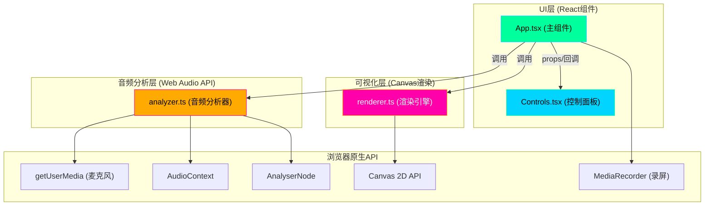

## 1. 架构设计



## 2. 技术栈描述

- **前端框架**：React@18 + TypeScript@5
- **构建工具**：Vite@5 + @vitejs/plugin-react@4
- **样式方案**：CSS Modules / 内联样式 + CSS变量
- **音频处理**：Web Audio API (AudioContext, AnalyserNode)
- **图形渲染**：Canvas 2D API
- **录屏功能**：MediaRecorder API + canvas.captureStream()
- **响应式设计**：CSS Media Queries + React Hooks

## 3. 模块职责定义

### 3.1 analyzer.ts - 音频分析模块

**职责**：独立封装Web Audio API，提供归一化的音频数据

| 方法/属性 | 类型 | 描述 |
|---------|------|------|
| `init()` | `Promise<void>` | 初始化AudioContext，请求麦克风权限 |
| `start()` | `void` | 启动音频分析 |
| `stop()` | `void` | 停止音频分析 |
| `getWaveform()` | `Float32Array` | 获取时域波形数据（归一化 -1~1） |
| `getFrequency()` | `Uint8Array` | 获取频域能量数据（归一化 0~255） |
| `isInitialized` | `boolean` | 是否已初始化 |
| `isRunning` | `boolean` | 是否正在运行 |

### 3.2 renderer.ts - 可视化渲染引擎

**职责**：根据音频数据和当前模式在Canvas上绘制可视化效果

| 方法/属性 | 类型 | 描述 |
|---------|------|------|
| `setCanvas(canvas: HTMLCanvasElement)` | `void` | 设置画布实例 |
| `setMode(mode: 'wave' \| 'particle' \| 'mix')` | `void` | 设置可视化模式 |
| `setParams(params: RenderParams)` | `void` | 设置渲染参数 |
| `renderFrame(waveform: Float32Array, frequency: Uint8Array)` | `void` | 渲染一帧画面 |
| `resize(width: number, height: number)` | `void` | 调整画布尺寸 |

**RenderParams 类型**：
```typescript
interface RenderParams {
  colorSensitivity: number;  // 颜色敏感度 0-100
  particleDensity: number;   // 粒子密度 0-100
  waveThickness: number;     // 波形粗细 0-100
}
```

### 3.3 App.tsx - 主组件

**职责**：组件生命周期管理、状态管理、模块协调

**状态管理**：
- `isRecording: boolean` - 录音状态
- `mode: 'wave' | 'particle' | 'mix'` - 可视化模式
- `params: RenderParams` - 渲染参数
- `isRecordingScreen: boolean` - 录屏状态

**核心逻辑**：
- `useEffect` 初始化/清理资源
- `requestAnimationFrame` 驱动渲染循环
- 事件回调处理（模式切换、参数变化、截图、录屏）

### 3.4 Controls.tsx - 控制面板组件

**职责**：UI渲染与用户交互事件分发

**Props**：
```typescript
interface ControlsProps {
  isRecording: boolean;
  mode: 'wave' | 'particle' | 'mix';
  params: RenderParams;
  isRecordingScreen: boolean;
  onToggleRecording: () => void;
  onModeChange: (mode: 'wave' | 'particle' | 'mix') => void;
  onParamsChange: (params: Partial<RenderParams>) => void;
  onScreenshot: () => void;
  onRecordScreen: () => void;
}
```

## 4. 文件结构

```
/
├── package.json
├── index.html
├── vite.config.ts
├── tsconfig.json
└── src/
    ├── main.tsx          # React入口
    ├── App.tsx           # 主组件
    ├── Controls.tsx      # 控制面板组件
    ├── Controls.module.css # 控制面板样式
    ├── App.module.css    # 主组件样式
    ├── analyzer.ts       # 音频分析模块
    └── renderer.ts       # 可视化渲染引擎
```

## 5. 性能优化策略

### 5.1 渲染性能
- 使用 `requestAnimationFrame` 保证60fps
- Canvas使用 `devicePixelRatio` 适配高清屏
- 粒子对象池复用，避免频繁GC
- 离屏Canvas预渲染静态元素

### 5.2 内存管理
- 及时释放 AudioContext 和 MediaStream
- 粒子系统使用对象池模式
- 录屏完成后释放 blob 资源
- 组件卸载时清理所有定时器和事件监听

### 5.3 响应式性能
- Canvas尺寸使用 ResizeObserver 监听
- 移动端降低粒子数量和波形精度
- 使用 `will-change` 优化动画性能

## 6. 关键技术实现要点

### 6.1 波形流动效果
- 使用滚动缓冲数组存储历史波形数据
- 线条渐变色使用 createLinearGradient
- 线宽随振幅动态变化

### 6.2 粒子爆炸效果
- 粒子位置基于频谱能量分布
- 粒子速度/颜色/大小与频率相关
- 粒子生命周期管理与回收

### 6.3 模式切换过渡
- 使用双缓冲Canvas实现淡入淡出
- 过渡时长0.5秒，使用 ease-in-out 缓动

### 6.4 录屏功能
- 使用 `canvas.captureStream(30)` 捕获画布流
- `MediaRecorder` 录制为 WebM 格式
- 录制10秒后自动停止并触发下载
