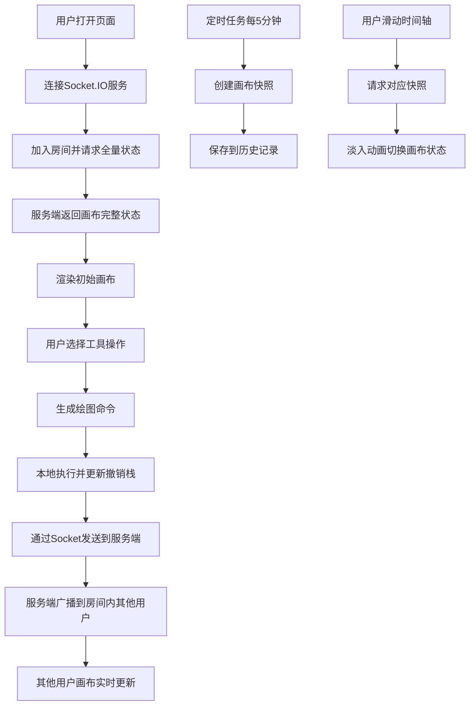

## 1. 产品概述

在线协作白板系统，支持团队成员在共享画布上实时绘图、添加便签和贴纸，并支持历史版本回溯。解决远程团队协作沟通效率低、创意表达不直观的问题，为设计评审、头脑风暴、远程教学等场景提供可视化协作工具。

## 2. 核心功能

### 2.1 用户角色
| 角色 | 注册方式 | 核心权限 |
|------|----------|----------|
| 协作用户 | 匿名加入房间 | 绘图、添加便签贴纸、撤销重做、查看历史版本 |

### 2.2 功能模块
1. **画布绘图模块**：铅笔工具、橡皮擦、几何图形（椭圆/矩形/直线）、颜色选择、粗细调节
2. **便签贴纸模块**：便签添加编辑、贴纸选择拖拽、元素拖动缩放旋转
3. **实时协作模块**：多用户同步、命令广播、新用户状态同步
4. **历史版本模块**：自动快照、时间轴、版本回溯、状态恢复
5. **图层管理模块**：元素列表、可见性切换、删除、拖拽排序

### 2.3 页面详情
| 页面名称 | 模块名称 | 功能描述 |
|----------|----------|----------|
| 白板主页面 | 顶部工具栏 | 画笔、橡皮擦、几何图形、便签、贴纸、Undo/Redo按钮 |
| 白板主页面 | 中央画布 | 全屏Canvas、网格背景、支持缩放平移 |
| 白板主页面 | 左侧图层面板 | 元素列表、可见性切换、删除、拖拽排序 |
| 白板主页面 | 右侧历史面板 | 快照时间轴、缩略图预览、版本回溯 |
| 白板主页面 | 贴纸面板 | 10种表情贴纸选择、拖拽到画布 |

## 3. 核心流程

用户打开页面 → 自动加入默认房间 → 同步当前画布状态 → 选择工具进行绘图/添加元素 → 操作实时同步到其他用户 → 系统每5分钟自动保存快照 → 用户可通过时间轴回溯历史版本

## 4. 用户界面设计

### 4.1 设计风格
- **主色调**：#4A90D9（清爽蓝）
- **辅助色**：#F5A623（暖橙，用于强调）
- **背景色**：#F8F9FA（浅灰白）
- **文字色**：#333333（深灰）
- **按钮风格**：圆角8px、悬停缩放1.05倍、光晕效果
- **工具栏**：半透明玻璃态、backdrop-filter: blur(15px)
- **字体**：采用现代无衬线字体，标题16px、正文14px、小字12px

### 4.2 页面设计概述
| 页面名称 | 模块名称 | UI元素 |
|----------|----------|--------|
| 白板主页面 | 顶部工具栏 | 玻璃态背景、图标按钮、选中态底部指示条动画、悬停光晕 |
| 白板主页面 | 中央画布 | 浅灰网格背景（20px间隔、0.5px线宽）、元素选中边框 |
| 白板主页面 | 左侧图层面板 | 卡片式列表、眼睛图标切换可见性、垃圾桶删除按钮 |
| 白板主页面 | 右侧历史面板 | 垂直时间轴、快照缩略图、时间戳标签 |
| 白板主页面 | 贴纸面板 | 底部浮动面板、表情网格、拖拽预览 |

### 4.3 响应式
- **桌面端（≥768px）**：左右面板固定显示、工具栏图标40x40px
- **移动端（<768px）**：左右面板折叠为底部抽屉、工具栏图标32x32px、支持触摸手势

### 4.4 动画效果
- 工具栏按钮悬停：scale(1.05) + box-shadow光晕，0.2s过渡
- 选中按钮：底部指示条从中心向两侧展开，0.2s动画
- 历史版本切换：opacity 0→1淡入，0.3s过渡
- 面板展开/收起：translateX滑动过渡，0.3s
