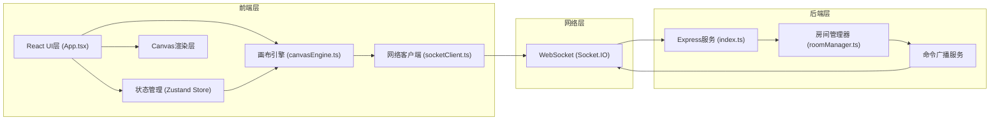

## 1. 架构设计



## 2. 技术描述
- **前端**：React@18 + TypeScript@5 + Vite@5 + Zustand@4 + Socket.IO-Client@4
- **后端**：Node.js + Express@4 + Socket.IO@4 + UUID@9
- **构建工具**：Vite，支持React HMR和WebSocket代理
- **状态管理**：Zustand管理UI状态，canvasEngine独立管理绘图状态

## 3. 目录结构
```
project/
├── package.json
├── index.html
├── vite.config.ts
├── tsconfig.json
├── client/
│   └── src/
│       ├── App.tsx
│       ├── canvasEngine.ts
│       ├── socketClient.ts
│       └── store/
│           └── useBoardStore.ts
└── server/
    ├── index.ts
    └── roomManager.ts
```

## 4. 核心模块设计

### 4.1 画布引擎 (canvasEngine.ts)
```typescript
// 命令类型定义
interface DrawCommand {
  id: string;
  type: 'line' | 'rect' | 'ellipse' | 'sticky' | 'sticker' | 'erase';
  userId: string;
  timestamp: number;
  data: DrawData;
}

// 核心类
class CanvasEngine {
  private commandQueue: DrawCommand[];
  private undoStack: DrawCommand[];
  private redoStack: DrawCommand[];
  private elements: CanvasElement[];
  
  executeCommand(cmd: DrawCommand): void;
  undo(): DrawCommand | null;
  redo(): DrawCommand | null;
  serialize(): string;
  deserialize(data: string): void;
  render(ctx: CanvasRenderingContext2D): void;
}
```

### 4.2 网络客户端 (socketClient.ts)
```typescript
class SocketClient {
  private socket: Socket;
  private roomId: string;
  private userId: string;
  
  connect(): void;
  joinRoom(roomId: string): void;
  sendCommand(cmd: DrawCommand): void;
  onCommand(callback: (cmd: DrawCommand) => void): void;
  onSync(callback: (state: CanvasState) => void): void;
  requestSnapshot(timestamp: number): void;
}
```

### 4.3 房间管理器 (roomManager.ts)
```typescript
class RoomManager {
  private rooms: Map<string, Room>;
  
  createRoom(roomId: string): Room;
  joinRoom(roomId: string, userId: string, socket: Socket): void;
  leaveRoom(roomId: string, userId: string): void;
  broadcastCommand(roomId: string, cmd: DrawCommand, excludeId?: string): void;
  getFullState(roomId: string): CanvasState;
  createSnapshot(roomId: string): void;
  getSnapshots(roomId: string): Snapshot[];
}
```

## 5. API 定义

### 5.1 Socket.IO 事件
```typescript
// 客户端→服务端
'join:room' { roomId: string; userId: string }
'command:send' { roomId: string; command: DrawCommand }
'snapshot:list' { roomId: string }
'snapshot:restore' { roomId: string; timestamp: number }

// 服务端→客户端
'room:joined' { success: boolean; state: CanvasState }
'command:receive' { command: DrawCommand }
'snapshot:list' { snapshots: Snapshot[] }
'snapshot:restored' { state: CanvasState }
'user:join' { userId: string }
'user:leave' { userId: string }
```

### 5.2 数据模型
```typescript
interface Point { x: number; y: number }

interface CanvasElement {
  id: string;
  type: 'line' | 'rect' | 'ellipse' | 'sticky' | 'sticker';
  visible: boolean;
  zIndex: number;
  transform: { x: number; y: number; scale: number; rotation: number };
}

interface LineElement extends CanvasElement {
  points: Point[];
  color: string;
  width: number;
}

interface StickyElement extends CanvasElement {
  text: string;
  fontSize: number;
  bgColor: string;
  width: number;
  height: number;
}

interface StickerElement extends CanvasElement {
  emoji: string;
  size: number;
}

interface Snapshot {
  timestamp: number;
  state: CanvasState;
  thumbnail: string;
}

interface CanvasState {
  elements: CanvasElement[];
  version: number;
}
```

## 6. 性能优化策略
1. **Canvas渲染优化**：requestAnimationFrame批量渲染、脏矩形局部重绘
2. **命令合并**：连续绘制点合并为单个命令发送，减少网络IO
3. **增量同步**：新用户只同步差异，减少初始加载数据量
4. **虚拟列表**：图层列表超过50项时采用虚拟滚动
5. **Web Worker**：快照生成和缩略图处理在Worker中执行
