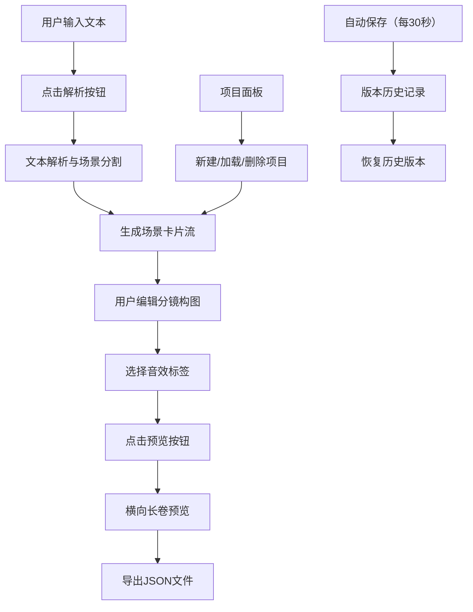

## 1. 产品概述

本产品是一款连环画分镜脚本自动生成工具，帮助文字创作者和漫画爱好者快速将叙事文本转化为视觉分镜草稿。

- 主要功能：文本解析、场景分割、分镜生成、构图编辑、音效配置、预览导出、项目管理、版本历史
- 目标用户：小说作者、漫画创作者、编剧、视觉设计师、内容创作者
- 产品价值：降低分镜创作门槛，提升叙事可视化效率，保留创作灵感的即时性

## 2. 核心功能

### 2.1 用户角色
| 角色 | 注册方式 | 核心权限 |
|------|----------|----------|
| 普通用户 | 无需注册，本地使用 | 完整使用所有功能，数据存储于本地浏览器 |

### 2.2 功能模块
1. **文本解析模块**：文本输入、句法分析、场景分割、情绪识别、打字机动画
2. **分镜编辑模块**：构图模板匹配、Canvas分镜绘制、元素拖拽调整、音效标签选择
3. **预览导出模块**：横向长卷画布、缩略卡片排列、悬停放大弹窗、JSON导出下载
4. **项目管理模块**：项目列表展示、新建/加载/删除项目、版本历史查看、版本切换恢复
5. **自动保存模块**：30秒间隔自动快照、历史版本列表、恢复提示

### 2.3 页面详情
| 页面名称 | 模块名称 | 功能描述 |
|----------|----------|----------|
| 主界面 | 左侧项目面板 | 项目列表展示（名称、时间、场景数），右键删除，左键加载，历史版本展开 |
| 主界面 | 右侧编辑区 | 文本输入框、解析按钮、场景卡片流、预览按钮、导出按钮 |
| 主界面 | 场景卡片 | 打字机文本展示、情绪标签徽章、分镜示意图、音效选择下拉菜单 |
| 预览模态框 | 横向长卷画布 | 旧报纸纹理背景、卡片缩略排列、虚线箭头连接、悬停放大弹窗 |
| 顶部提示条 | 版本提示 | 黄色提示条显示当前为历史版本，可点击返回最新版本 |

## 3. 核心流程

### 3.1 主流程
用户输入文本 → 点击解析按钮 → 系统分割场景并生成卡片（打字机效果） → 用户编辑分镜构图和音效 → 点击预览查看长卷效果 → 导出JSON文件 → 自动保存项目

### 3.2 项目管理流程
打开应用 → 加载本地项目列表 → 选择现有项目或新建项目 → 编辑内容（自动保存） → 查看历史版本 → 恢复或继续编辑

## 4. 用户界面设计

### 4.1 设计风格
- 书卷复古风格，柔和米白为主色调
- 主色：米白 #F5F0E1，文字色：深灰蓝 #3A4A5C，强调色：暖橙 #D97A3E
- 情绪标签色：紧张=暗红 #B23A48，温馨=暖黄 #E8B84A，悬疑=深紫 #5B4B8A
- 按钮风格：圆角8px，暖橙底色，悬停微微上移2px（0.2秒过渡）
- 卡片风格：圆角8px，淡灰阴影0.4px，悬停阴影加深至0.6px
- 字体：标题使用"Noto Serif SC"衬线体，正文使用"Noto Sans SC"无衬线体
- 徽章设计：情绪标签带对应emoji（紧张=🔥、温馨=🌿、悬疑=👁️）

### 4.2 页面设计概述
| 页面名称 | 模块名称 | UI元素 |
|----------|----------|--------|
| 主界面 | 左侧项目面板 | 280px宽度，项目卡片列表，历史版本展开区，深色侧栏背景 |
| 主界面 | 右侧编辑区 | 顶部文本输入区（5000字限制），解析按钮，中部卡片流，底部操作栏 |
| 场景卡片 | 卡片内容 | 打字机文本区，情绪徽章，分镜Canvas，音效下拉菜单，展开/收起箭头 |
| 预览画布 | 长卷展示 | 旧报纸纹理背景，浅米色底，淡灰网格线，卡片缩略150px宽，虚线箭头连接 |
| 悬停弹窗 | 放大预览 | 从卡片中心弹性放大（0.3秒），显示高清分镜图和音效标签 |

### 4.3 响应式设计
- 桌面端优先设计，适配≥1200px屏幕
- 屏幕宽度<900px时，左侧面板收起为图标按钮，点击展开为覆盖层
- 场景卡片在移动端自适应宽度，保持纵向流布局
- 触摸设备优化拖拽操作，支持触控手势

### 4.4 动画与过渡
- 打字机效果：0.8秒完成，逐个字符输出，ease-in-out曲线
- 卡片展开：0.3秒高度过渡，内容淡入
- 元素拖拽：0.2秒惯性缓动效果
- 悬停弹窗：0.3秒弹性过渡（cubic-bezier(0.34, 1.56, 0.64, 1)）
- 版本切换：0.5-0.6秒淡出淡入过渡
- 所有过渡统一使用ease-in-out曲线，时长0.2-0.8秒

## 5. 性能要求
- 5000字文本解析与卡片展开≤2秒
- Canvas渲染帧率≥30fps
- 自动保存操作不阻塞UI
- 响应式切换流畅无卡顿
- 首屏加载时间<3秒
