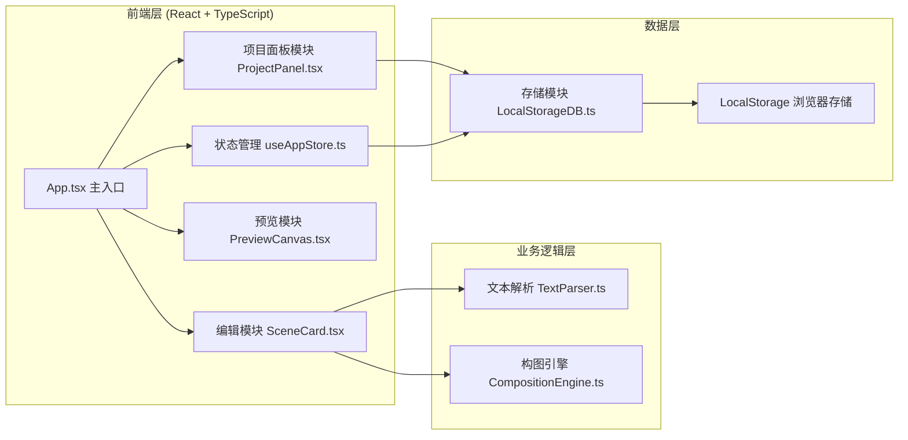

## 1. 架构设计



## 2. 技术描述

- **前端框架**：React 18 + TypeScript 5 + Vite 5
- **状态管理**：Zustand 4（轻量级，支持订阅和中间件）
- **构建工具**：Vite 5（热更新、快速构建）
- **样式方案**：CSS Modules + CSS Variables（无需额外CSS框架）
- **图标方案**：emoji + SVG 内联（无需图标库）
- **唯一ID生成**：uuid 9
- **后端**：无后端，纯前端应用
- **数据存储**：浏览器 LocalStorage（JSON序列化）

## 3. 目录结构

```
├── package.json
├── index.html
├── vite.config.ts
├── tsconfig.json
└── src/
    ├── App.tsx
    ├── main.tsx
    ├── store/
    │   └── useAppStore.ts
    ├── modules/
    │   ├── editor/
    │   │   ├── TextParser.ts
    │   │   ├── CompositionEngine.ts
    │   │   ├── SceneCard.tsx
    │   │   └── PreviewCanvas.tsx
    │   ├── storage/
    │   │   └── LocalStorageDB.ts
    │   └── project/
    │       └── ProjectPanel.tsx
    ├── types/
    │   └── index.ts
    └── styles/
        └── variables.css
```

## 4. 数据模型

### 4.1 核心类型定义

```mermaid
erDiagram
    PROJECT ||--o{ SCENE : contains
    PROJECT ||--o{ VERSION_HISTORY : has
    SCENE ||--|| COMPOSITION : has
    SCENE ||--|| EMOTION_TAG : has
    SCENE ||--|| SOUND_EFFECT : has

    PROJECT {
        string id PK
        string name
        number createdAt
        number updatedAt
        string rawText
        Scene[] scenes
        boolean isHistorical
        number? historicalTimestamp
    }

    SCENE {
        string id PK
        string text
        number sentenceCount
        EmotionTag emotion
        number compositionTemplateIndex
        Composition composition
        SoundEffect soundEffect
        boolean isExpanded
    }

    COMPOSITION {
        number width
        number height
        CompositionElement[] elements
    }

    COMPOSITION_ELEMENT {
        string id
        string type
        number x
        number y
        number width
        number height
        number rotation
    }

    EMOTION_TAG {
        string type
        string color
        string emoji
    }

    SOUND_EFFECT {
        string id
        string name
        string icon
    }

    VERSION_HISTORY {
        number timestamp PK
        string projectId
        Project snapshot
    }
```

### 4.2 TypeScript 类型定义

```typescript
export type EmotionType = 'tension' | 'warm' | 'mystery';

export interface EmotionTag {
  type: EmotionType;
  color: string;
  emoji: string;
}

export interface CompositionElement {
  id: string;
  type: 'character' | 'object' | 'background' | 'frame';
  x: number;
  y: number;
  width: number;
  height: number;
  rotation: number;
}

export interface Composition {
  width: number;
  height: number;
  elements: CompositionElement[];
  templateIndex: number;
}

export interface SoundEffect {
  id: string;
  name: string;
  icon: string;
}

export interface Scene {
  id: string;
  text: string;
  sentenceCount: number;
  emotion: EmotionTag;
  composition: Composition;
  soundEffect: SoundEffect;
  isExpanded: boolean;
  typingProgress: number;
}

export interface Project {
  id: string;
  name: string;
  createdAt: number;
  updatedAt: number;
  rawText: string;
  scenes: Scene[];
  isHistorical?: boolean;
  historicalTimestamp?: number;
}

export interface VersionSnapshot {
  timestamp: number;
  project: Project;
}

export interface StorageInterface {
  saveProject: (project: Project) => Promise<void>;
  loadProject: (id: string) => Promise<Project | null>;
  deleteProject: (id: string) => Promise<void>;
  getAllProjects: () => Promise<Project[]>;
  saveVersion: (project: Project) => Promise<void>;
  getVersionHistory: (projectId: string) => Promise<VersionSnapshot[]>;
  restoreVersion: (projectId: string, timestamp: number) => Promise<Project | null>;
}
```

## 5. 模块接口定义

### 5.1 存储模块接口 (LocalStorageDB.ts)

```typescript
// 保存项目
saveProject(project: Project): Promise<void>

// 加载项目
loadProject(id: string): Promise<Project | null>

// 删除项目
deleteProject(id: string): Promise<void>

// 获取所有项目列表
getAllProjects(): Promise<Project[]>

// 保存版本快照
saveVersion(project: Project): Promise<void>

// 获取项目版本历史（最近5个）
getVersionHistory(projectId: string): Promise<VersionSnapshot[]>

// 恢复指定版本
restoreVersion(projectId: string, timestamp: number): Promise<Project | null>
```

### 5.2 文本解析模块接口 (TextParser.ts)

```typescript
// 解析文本为场景列表
parseText(text: string): Scene[]

// 识别情绪标签
detectEmotion(sentences: string[]): EmotionTag

// 匹配构图模板索引
matchCompositionTemplate(text: string, emotion: EmotionType): number
```

### 5.3 构图引擎模块接口 (CompositionEngine.ts)

```typescript
// 根据模板索引生成构图数据
generateComposition(templateIndex: number): Composition

// 获取所有构图模板
getTemplates(): CompositionTemplate[]

// 渲染Canvas分镜图
renderCanvas(
  ctx: CanvasRenderingContext2D,
  composition: Composition,
  width: number,
  height: number
): void

// 更新元素位置（带缓动）
updateElementPosition(
  element: CompositionElement,
  targetX: number,
  targetY: number,
  easing: number
): CompositionElement
```

### 5.4 状态管理 (useAppStore.ts)

```typescript
interface AppState {
  currentProjectId: string | null;
  projects: Project[];
  scenes: Scene[];
  versionHistory: VersionSnapshot[];
  isPreviewMode: boolean;
  sidebarCollapsed: boolean;
  isHistoricalMode: boolean;
  
  // Actions
  setCurrentProject: (id: string | null) => void;
  createNewProject: (name: string) => Project;
  parseAndSetScenes: (text: string) => void;
  updateScene: (id: string, updates: Partial<Scene>) => void;
  toggleSceneExpand: (id: string) => void;
  updateCompositionElement: (sceneId: string, elementId: string, updates: Partial<CompositionElement>) => void;
  updateSoundEffect: (sceneId: string, soundEffect: SoundEffect) => void;
  saveCurrentProject: () => Promise<void>;
  loadProject: (id: string) => Promise<void>;
  deleteProject: (id: string) => Promise<void>;
  restoreVersion: (timestamp: number) => Promise<void>;
  returnToLatest: () => void;
  togglePreviewMode: () => void;
  toggleSidebar: () => void;
  exportJSON: () => void;
  autoSave: () => void;
}
```

## 6. 关键技术实现点

### 6.1 打字机效果实现
- 使用 `useState` 跟踪打字进度 `typingProgress`
- `requestAnimationFrame` 驱动逐字符显示
- 每个场景0.8秒完成，按字符数分配时间片
- 场景间依次触发，形成流水效果

### 6.2 Canvas 分镜绘制
- 50个预设构图模板数据（JSON格式）
- 火柴人绘制函数（头、身体、四肢简化）
- 元素拖拽使用 Pointer Events 统一处理鼠标/触摸
- 拖拽缓动使用 lerp 线性插值算法
- `useRef` 管理 Canvas 上下文，避免重绘闪烁

### 6.3 惯性缓动效果
```typescript
function lerp(start: number, end: number, t: number): number {
  return start + (end - start) * t;
}

// 拖拽时每帧调用，t=0.2实现0.2秒缓动
element.x = lerp(element.x, targetX, 0.2);
element.y = lerp(element.y, targetY, 0.2);
```

### 6.4 自动保存机制
- `useEffect` + `setInterval` 实现30秒间隔
- 防抖处理，避免频繁保存
- 版本历史保留最近5个快照
- 使用 `queueMicrotask` 避免阻塞UI

### 6.5 动画过渡实现
- 卡片淡入淡出：`opacity` + `transform` 过渡
- 版本切换：双缓冲渲染，先淡出再淡入
- 悬停弹窗：`scale` 弹性动画，使用 `cubic-bezier(0.34, 1.56, 0.64, 1)`

### 6.6 响应式布局
- CSS `@media (max-width: 900px)` 断点
- 侧栏收起使用 `transform: translateX(-100%)`
- 覆盖层使用 `position: fixed` + `z-index`

## 7. 性能优化策略

1. **虚拟滚动**：场景卡片超过20个时启用虚拟滚动
2. **Canvas 离屏渲染**：分镜图使用 OffscreenCanvas 预渲染
3. **状态订阅优化**：Zustand 使用 `shallow` 比较减少重渲染
4. **memo 包裹**：SceneCard 组件使用 `React.memo`
5. **防抖节流**：输入解析、拖拽更新使用防抖
6. **LocalStorage 异步化**：使用 Promise 包装避免阻塞主线程
7. **Canvas 脏矩形**：只重绘变化的元素区域

## 8. 配置文件说明

### package.json 依赖
- react: ^18.2.0
- react-dom: ^18.2.0
- zustand: ^4.5.0
- uuid: ^9.0.0
- typescript: ^5.4.0
- vite: ^5.2.0
- @vitejs/plugin-react: ^4.2.0
- @types/uuid: ^9.0.0

### vite.config.ts
```typescript
import { defineConfig } from 'vite';
import react from '@vitejs/plugin-react';

export default defineConfig({
  plugins: [react()],
  server: {
    port: 3000,
    open: true
  }
});
```

### tsconfig.json
```json
{
  "compilerOptions": {
    "target": "ES2020",
    "lib": ["DOM", "DOM.Iterable", "ES2020"],
    "module": "ESNext",
    "strict": true,
    "esModuleInterop": true,
    "skipLibCheck": true,
    "forceConsistentCasingInFileNames": true,
    "jsx": "react-jsx",
    "moduleResolution": "bundler",
    "resolveJsonModule": true,
    "isolatedModules": true,
    "noEmit": true
  },
  "include": ["src"]
}
```
