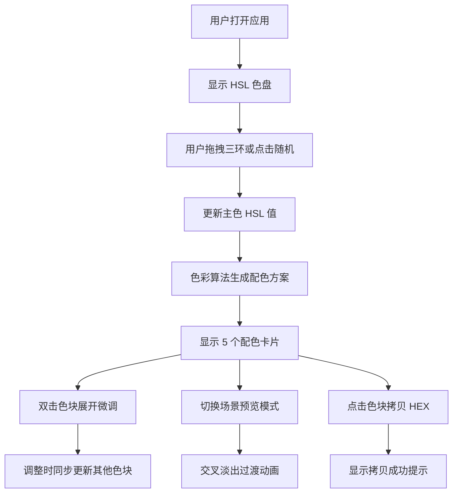

## 1. 产品概述

色彩色谱是一款互动色彩探索与配色方案生成应用，帮助设计师、开发者和创意工作者通过直观的交互式色盘快速探索色彩并生成专业级配色方案。

- 核心价值：降低配色门槛，通过科学的色彩算法自动生成协调的配色方案，并提供多场景实时预览
- 目标用户：UI/UX 设计师、前端开发者、平面设计师、室内设计师及创意爱好者

## 2. 核心功能

### 2.1 用户角色
| 角色 | 注册方式 | 核心权限 |
|------|----------|----------|
| 普通用户 | 无需注册 | 完整使用所有配色功能，拷贝色值，浏览预设 |

### 2.2 功能模块
1. **色盘页面**：HSL 三环联动色盘、主色块实时预览、随机预设跳转、色值显示
2. **方案页面**：配色卡片流、色块微调面板、色值拷贝、动画过渡
3. **预设页面**：5 组经典色系预设方案快速选择

### 2.3 页面详情
| 页面名称 | 模块名称 | 功能描述 |
|----------|----------|----------|
| 色盘页面 | HSL 三色环 | 色相、饱和度、明度三环联动，拖拽响应≤16ms |
| 色盘页面 | 主色预览块 | 实时显示当前选中色，同步显示 HEX 值 |
| 色盘页面 | 随机按钮 | 一键跳转至 5 组经典预设配色之一 |
| 方案页面 | 配色卡片流 | 横向展示 5 个色块：主色、主色深、主色浅、点缀色、背景色 |
| 方案页面 | 微调面板 | 双击色块展开调色板，调整时其他色块按算法自动更新 |
| 方案页面 | 色值拷贝 | 点击色块拷贝 HEX 值到剪贴板，显示成功提示 |
| 方案页面 | 场景预览 | 三种模式切换：网页 UI、海报、室内墙面，交叉淡出过渡 0.6s |
| 预设页面 | 预设列表 | 展示 5 组经典色系，点击快速应用 |
| 全局 | 底部导航 | 色盘/方案/预设三个标签页，下划线滑入动画 0.3s |

## 3. 核心流程

### 3.1 主要用户流程
用户打开应用 → 通过 HSL 色盘拖拽选择主色（或点击随机按钮）→ 系统自动生成完整配色方案 → 在方案页面微调色块 → 切换场景预览效果 → 点击色块拷贝色值 → 应用到实际项目中

### 3.2 流程图

## 4. 用户界面设计

### 4.1 设计风格
- **整体风格**：极简主义，白色主背景，干净通透
- **色彩基调**：纯白色背景 (#FFFFFF)，色块区域采用磨砂玻璃效果（backdrop-filter: blur + 半透明背景）
- **按钮风格**：圆润胶囊形按钮，低饱和度，hover 时轻微放大
- **字体选择**：
  - 标题：Playfair Display（优雅衬线字体，提升设计感）
  - 正文：Satoshi（现代无衬线字体，清晰易读）
- **布局风格**：居中对称布局，大量留白，卡片式设计
- **动效风格**：柔和流畅的过渡，淡入淡出为主，避免生硬动画

### 4.2 页面设计概览

| 页面名称 | 模块名称 | UI 元素 |
|----------|----------|----------|
| 色盘页面 | HSL 三色环 | 渐变环带布满屏幕中心，直径约 480px，三环间距 24px，拖拽点带发光效果 |
| 色盘页面 | 主色预览块 | 右侧 200x200px 方形，圆角 16px，阴影，下方显示 HEX 与 HSL 数值 |
| 色盘页面 | 数值显示器 | 三个环带下方各显示当前数值，等宽字体，右对齐 |
| 色盘页面 | 随机按钮 | 底部居中，胶囊形，背景半透明毛玻璃，文字"随机配色" |
| 方案页面 | 配色卡片流 | 横向排列 5 个卡片，每个 120x160px，圆角 12px，磨砂玻璃背景，间距 16px |
| 方案页面 | 微调面板 | 双击卡片后从底部滑入，高度 200px，包含 HSL 滑块 |
| 方案页面 | 场景预览区 | 卡片流下方，宽度 100%，高度 400px，圆角 16px，磨砂玻璃边框 |
| 方案页面 | 模式切换 | 预览区顶部三个标签按钮，选中时下划线从左侧滑入 |
| 全局 | 底部导航 | 固定底部，高度 64px，三个标签（色盘/方案/预设），图标+文字，选中时下划线滑入动画 0.3s |

### 4.3 响应式设计
- **设计原则**：Desktop-first，移动端自适应
- **断点**：1024px（平板）、768px（手机）
- **移动端适配**：
  - 色盘直径缩小至 320px
  - 配色卡片改为纵向排列或可横向滚动
  - 底部导航图标隐藏文字
  - 场景预览高度缩小至 280px
- **触摸优化**：增大拖拽热区至 44x44px，支持触摸拖拽

### 4.4 场景预览细节

#### 网页 UI 预览
- 模拟简约着陆页，包含导航栏、Hero 区域、特性卡片、CTA 按钮
- 配色映射：导航栏（背景色）、Hero 标题（主色）、按钮（主色+点缀色）、卡片边框（主色浅）

#### 海报预览
- A4 比例画布（210:297），白色底
- 包含大标题、副标题、三个几何装饰元素（圆形、三角形、方形）
- 配色映射：标题（主色深）、装饰元素（主色、点缀色、主色浅）

#### 室内墙面预览
- 3D 透视房间俯视图
- 包含四面墙、沙发、茶几、装饰画、落地灯
- 配色映射：墙面（背景色）、沙发（主色）、装饰元素（点缀色、主色浅）

## 5. 性能与交互规范

### 5.1 性能要求
- 色盘拖拽响应时间 ≤ 16ms（60FPS）
- 模式切换动画流畅无卡顿（GPU 加速）
- 首次加载时间 ≤ 2s
- 无内存泄漏

### 5.2 交互动效
- 色块淡入淡出动画：0.4s，ease-out
- 场景切换交叉淡出：0.6s，ease-in-out
- 底部导航下划线滑入：0.3s，cubic-bezier(0.4, 0, 0.2, 1)
- 卡片 hover：轻微上浮 4px，阴影加深
- 拷贝成功提示：从色块上方滑入，停留 1.5s 后淡出
